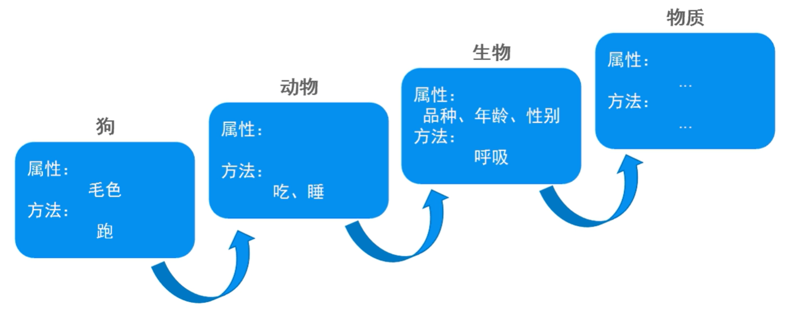

## 面向对象三大特性：封装、继承、多态

### 封装

#### 什么是封装
- 概念：尽可能隐藏对象的内部实现细节，控制对象的修改及访问权限
- 访问修饰符：`private` （可将属性修饰为私有，仅本类可见）
```java
public class Test{
    public static void main(String[] args){
        Student s1 = new Student();
        s1.setAge(2000);
        System.out.println(s1.getAge());
    }

}

class Student{
    String name;
    private int age; // 私有属性，仅本类可见
    String sex;
    double score;

    public void setAge(int age){
        if (age > 0 && age <= 253>){
            this.age = age;
        } else{
            // 抛出异常
        }
    }

    public int getAge(){
        return this.age;
    }
}
```
> 提供公共访问方法，以保证数据的正常录入

### 继承
- 语法： `class 子类 extends 父类`  //定义子类时，显示继承父类
- 应用：产生继承关系后，子类可以使用父类中的属性和方法，也可以定义子类独有的属性和方法
- 好处：提高代码的复用性，又提高代码的可扩展性

- 特点：java为单继承，一个类只能有一个直接父类，但可以多级继承，属性和方法逐级叠加



#### 生活中的继承
- 施予方的一种赠予，受方的一种获得
- 将一方所拥有的东西给予另一方

#### 程序中的继承
- 类与类之间**特征**和**行为**的一种赠予或获得
- 两个类之间的继承关系，必须满足“is”的关系
> a is b --- 存在继承

#### 父类的选择
- 现实生活中，很多类别之间都存在继承关系
- 狗是一种动物、狗是一种生物、狗是一种物质
- 多个类别都可作为“狗”的父类，需要从中选择出最合适的父类
- 功能越精细，重合点越多，越接近直接父类
- 功能越粗略，重合点越少，越接近`Object`类 --- 万物皆对象

#### 父类的抽象
- 实战：可根据程序需要使用到的多个具体类，进行共性抽取，进而定义父类

在一组相同或相似的类中，抽取出共性的特征和行为，定义在父类中，实现重用。


