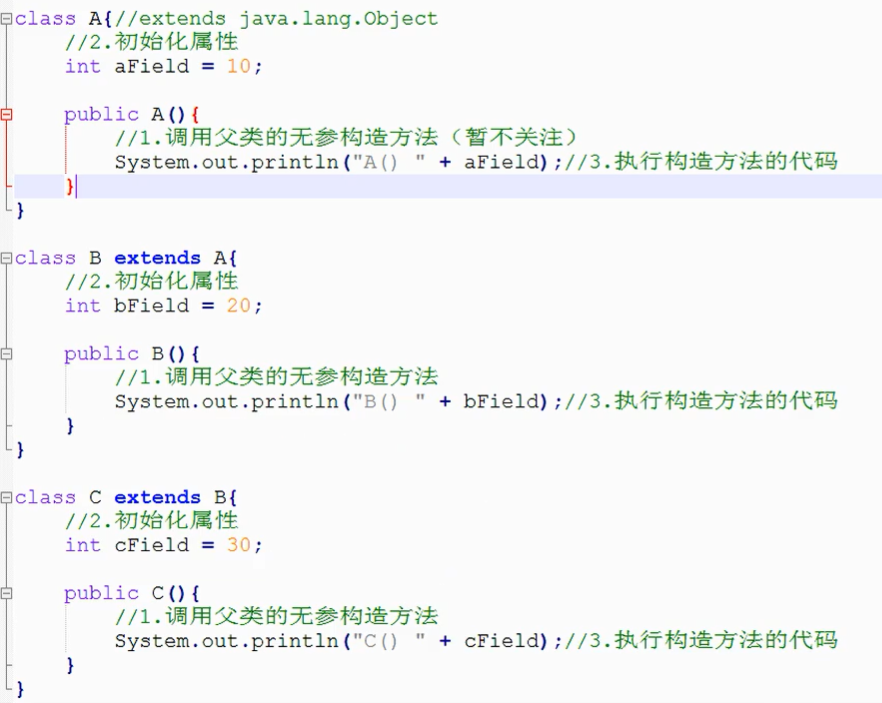
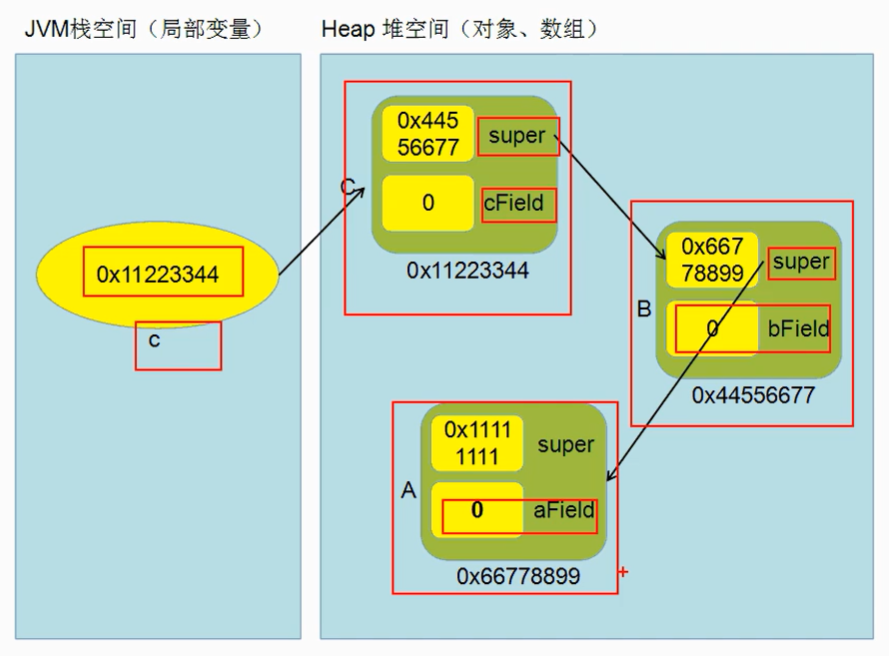
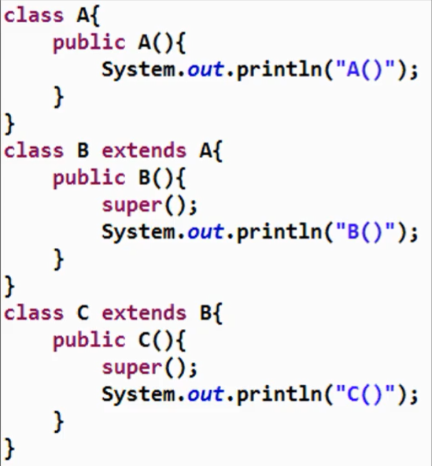

### 访问修饰符：public、protected、default、private

| 作用域 | 当前类（父类） | 同包 | 子类 | 其他 |
| :- |:-: |:-: |:-: |:-: |
| public | √ |  √ |  √ |  √ | 
| protected | √ |  √ |  √ |  × | 
| default | √ |  √ |  × |  × | 
| private | √ |  × |  × |  × | 


### 方法的重写（覆盖）
- 原则：
  - 方法名称、参数列表、返回值类型必须与父类相同
  - 访问修饰符可与父类相同或是更宽泛

- 执行：
  - 子类覆盖父类方法后，调用时优先执行子类覆盖后的方法


### super关键字
- 在子类中，可直接访问从父类继承到的属性和方法，但如果父子类的属性或方法存在重名（属性遮蔽、方法覆盖时），需要加以区分，才可专项访问。

```java
public class Test{
  public static void main(String[] args){
    Son son = new Son();

    son.method();
  }
}

class Father{
  int field = 10;

  public void m1(){
    //
  }
}

class Son extends Father{

  int field = 20;

  public void method(){
    System.out.println(super.field); //super.用以访问父类的属性和方法
    System.out.println(this.field); //访问子类属性
  }

  public void m1(){
    //
  }

  public void m2(){
    super.m1(); //父类的m1()方法，如不加super.默认是当前类的m1()方法
    //
  }
}
```

继承后的对象构建过程
> `new C();`



内存空间如下：
> A的super应指向Object类




>> `super()`表示调用父类无参构造方法。如果没有显示书写，隐式存在于子类构造方法的首行

