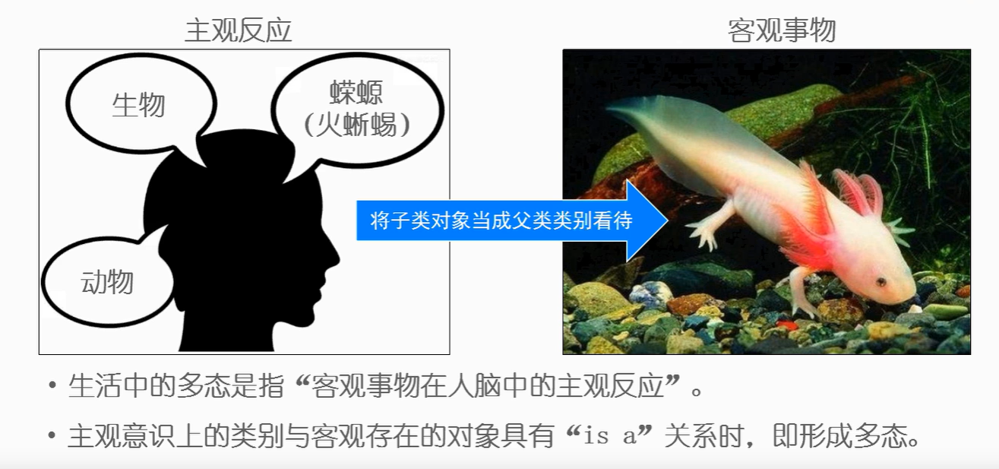
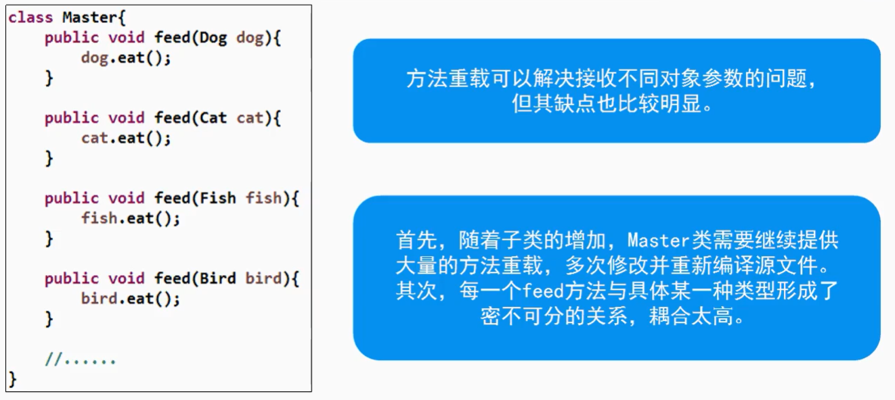
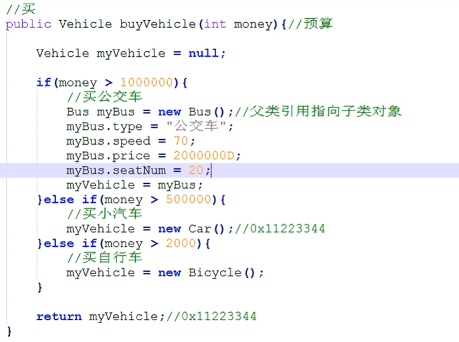

# 多态

生活中的多态



## 程序中的多态
- 概念：父类引用指向子类对象，从而产生多种形态。


- 二者具有直接或间接的继承关系时，父类引用可指向子类对象，即形成多态。

- 父类引用仅可调用父类所声明的属性和方法，**不可调用子类独有的**属性和方法。

```java
public class TestPolymorphic{
    public static void main(String[] args){
        Dog dog = new Dog(); //将狗当成狗看

        System.out.println(dog.breed + "\t" + dog.age + "\t" + dog.sex + "\t" + dog.furColor);

        dog.eat();
        dog.sleep();
        dog.run();

        // ------------------------------------------

        Animal a = new Dog(); //将狗当成动物看
        
        System.out.println(dog.breed + "\t" + dog.age + "\t" + dog.sex); //动物定义

        a.eat();
        a.sleep();
        // 不能调用run(); 即不能访问Dog类的独有属性和方法

    }
}

class Animal{
    String breed;
    int age;
    String sex;

    public void eat(){
        System.out.println("动物在吃...");
    }

    public void sleep(){
        System.out.println("动物在睡...");
    }
}

class Dog extends Animal{
    String furColor;

    public void run(){
        System.out.println("狗在跑...");
    }
}

class Cat extends Animal{
    String speed;

    public void climb(){
        System.out.println("猫在爬...");
    }
}
```

> 上述情况是父类没有定义run()方法，所以不能调用a.run();
>
> 但是若父类也定义了run()方法，此时调用a.run()是可行的，不过，此时调用的是Dog子类的run()方法（已覆盖）
## 多态的应用
- 使用父类作为方法形参实现多态，使方法参数的类型更为广泛`public void fun(Animal a) //Animal a = new Dog()`
> 在使用时，可以直接fun(dog) 或 fun(cat)



> 使用多态如下，如在使用时调用`feed(dog)`，则会调用在`Dog`类中覆盖的`feed()`，若没有定义，才使用`Animal`类中
```java
class Master{
    public void feed(Animal a){
        a.eat();
    }
}
```

- 使用父类作为方法返回值实现多态，使方法可以返回不同子类对象

