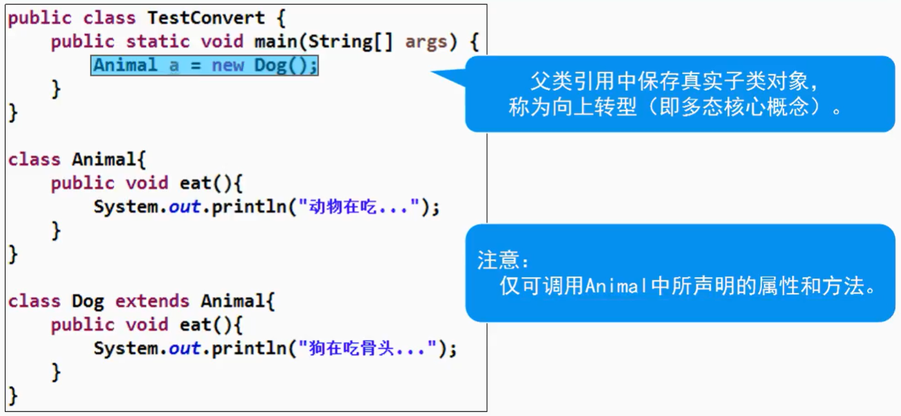
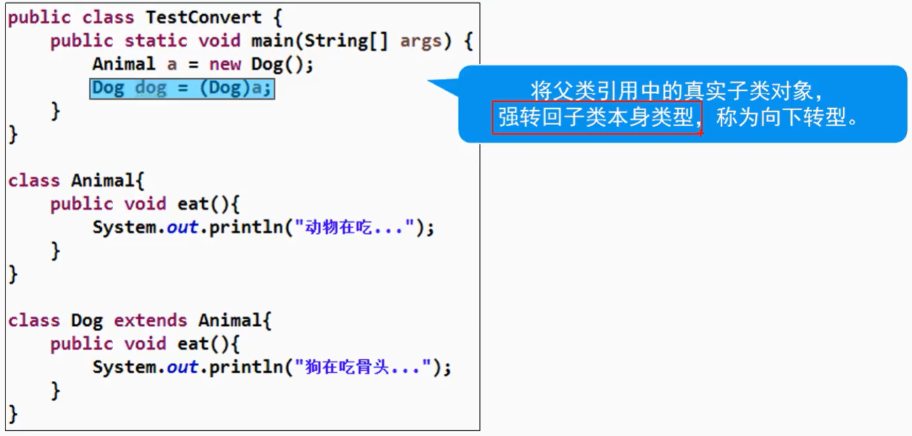

## 向上转型（装箱）



## 向下转型（拆箱）



> 将父类引用转换为子类本身类型

在拆箱时，如果父类引用种的子类对象类型和目标类型不匹配，则会发生类型转换异常

### instanceof关键字
- 向下转型前，应判断引用中的对象真实类型，保证类型转换的正确性

- 语法：`引用 instanceof 类型` //返回boolean类型结果

```java
if (myVeh instanceof Car){
    Car car = (Car)myVeh; //判断成立，拆箱 car <-- myVeh
}
```
> 不满足，不强转，就不会出错