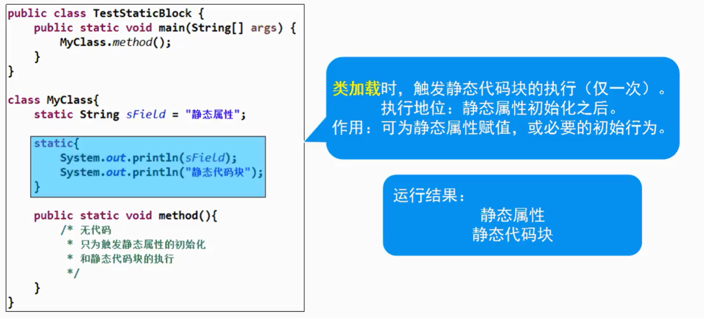

## 什么是抽象
- 似是而非的，像却又不是；具备某种对象的特征，但不完整


## 抽象类
- 应用： `abstract`修饰类，意为不完整的类，抽象类对象无法独立存在，该类不能`new`对象，但是有定义的价值（为子类服务）

```java
public class Test{
    public static void main(String[] args){
        new Animal(); //Error,  abstract限制，不能new
        
        new Dog();  //Correct
    } 
}

abstract class Animal{ // 逻辑不够完整，不够具体

}

class Dog extends Animal{

}
```

### 抽象类的作用
- 可被子类继承，提供共性属性和方法
- 可声明为引用，强制使用多态（父类引用指向子类对象，从而形成多种形态）


```java
abstract class Animal{ // 逻辑不够完整，不够具体
    public abstract void eat(); // 抽象方法,不完整的方法只能包含在不完整的类中，此时子类中的方法必须覆盖（或写成完整的方法`public abstract void eat(){}`）
}

class Dog extends Animal{
    public void eat(){
        // 
    }
}
```

- abstract修饰类：不能new对象，但可以声明引用
- abstract修饰方法：只有方法声明，没有方法实现
- 抽象类中不一定有抽象方法，但有抽象方法的类一定是抽象类
- 子类继承抽象后，必须覆盖父类所有的抽象方法，否则子类还是抽象类

## static关键字

### 实例属性
- 实例属性是每个对象各自持有的独立空间（多份），对象单方面修改不会影响其他对象


### 静态属性
- 静态属性是整个类共同持有的共享空间（一份），任何对象修改，都会影响其他对象


### 什么是静态
- 概念
  - 静态（static）可以修饰属性和方法
  - 称为静态属性（类属性）、静态方法（类方法）
  - 静态成员是全类所有对象共享的成员
  - 在全类中只有一份，不因创建多个对象而产生多份
  - 不必创建对象，可直接通过类名访问


例：统计一个类对象被创建过多少次？
```java
public class Test{
    public static void main(String[] args){
        new Student();

        new Student();

        new Student();

        System.out.println(Student.count);
    }
}

class Student{
    static int count = 0;
    public Student(){
        this.count++;
    }
}
```

* 静态方法可以继承，但是不能覆盖，没有多态

- Java中的方法调用，分为两种
  - 1.静态分派（静态方法中，允许参数列表不同的重名方法，指静态方法之间的重载）
  - 2.动态分派（在具有继承关系的情况下，调用实例方法时，自低向上查找可用的方法版本，指实例方法的覆盖）

* 方法调用指令5个
* invokespacial 调用私有方法，构造方法
* invokeinterface 调用接口方法
* invokestatic 调用静态方法
* invokevirtual 调用虚拟方法（父类定义的，日后被子类覆盖的方法）
* invokedynamic 调用动态链接方法

### 类加载
- JVM首次使用某个类时，需通过CLASSPATH查找该类的.class文件

- 将.class文件中对类的描述信息加载到内存中，进行保存
  - 如：包名、类名、父类、属性、方法、构造方法

- 加载时机：
  - 创建对象
  - 创建子类对象
  - 访问静态属性
  - 调用静态方法



### 执行顺序

```java
public class Test{
    public static void main(String[] args){
        new Super();

        new Sub();
    }
}

class Super{
    static String staticField = "父类静态属性";

    static {
        System.out.println(staticField);
        System.out.println("父类静态代码块");
    }

    String instanceField = "父类实例属性";

    {
        System.out.println(instanceField);
        System.out.println("父类实例代码块");
    }

    public Super(){
        System.out.println("父类构造方法");
    }
}

class Sub extends Super{
    static String staticField2 = "子类静态属性";

    static {
        System.out.println(staticField2);
        System.out.println("子类静态代码块");
    }

    String instanceField2 = "子类实例属性";

    {
        System.out.println(instanceField2);
        System.out.println("子类实例代码块");
    }

    public Sub(){
        System.out.println("子类构造方法");
    }
}
```

>> 注意以下执行结果的输出顺序

* `new Super()`
```
父类静态属性
父类静态代码块
父类实例属性
父类实例代码块
父类构造方法
```

* `new Sub()`时
```
父类静态属性
父类静态代码块
子类静态属性
子类静态代码块
父类实例属性
父类实例代码块
父类构造方法
子类实例属性
子类实例代码块
子类构造方法
```

* `new Sub();new Sub();` 两次new Sub()，静态属性和代码块也只执行一次
```
父类静态属性
父类静态代码块
子类静态属性
子类静态代码块
父类实例属性
父类实例代码块
父类构造方法
子类实例属性
子类实例代码块
子类构造方法
父类实例属性
父类实例代码块
父类构造方法
子类实例属性
子类实例代码块
子类构造方法
```