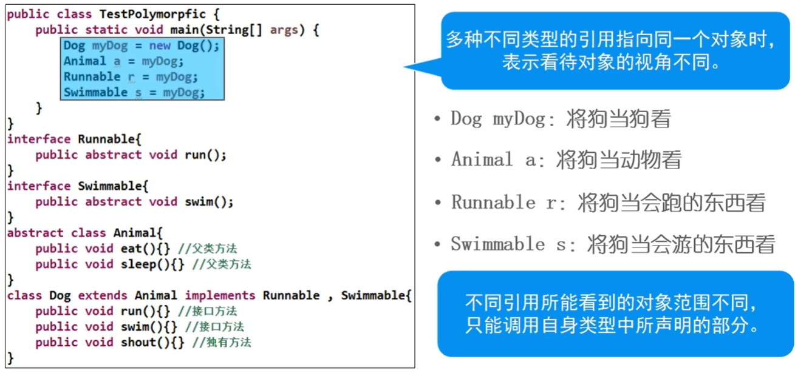

## 接口的语法
- 接口相等于特殊的抽象类（`abstract class`），定义方式、组成部分于抽象类类似。
> 接口不是类，不能new对象


```java
// 抽象类
abstract class Myclass{
    // 1.不能new对象（对象不能独立存在）
    public static final String FEILD = "Hello";

    // 2.抽象方法（子类必须覆盖）
    public abstract void method();
}

// 接口
interface MyInterface{
    // 1.公开静态常量
    public static final String FIELD = "Hello";

    // 2.公开抽象方法
    public abstract void method();
}
```

## 与抽象类的异同
- 相同
  * 可编译成字节码文件
  * 不能创建对象 new， 抽象类是不能用，但是接口是根本没有
  * 可以作为引用类型  
  ```
  Myclass mc; //将来存储子类对象

  MyInterface mi; //将来存储实现对象

  ```
  * 具备Object类中定义的方法

- 不同
  * 所有属性都是公开静态常量，隐式使用`public static final`修饰
  ```java
  public interface MyInterface{
      String FIELD = "Hello"; // 效果等同于public static final String FIELD = "Hello";

      void method(); // 等同于 public abstract void method();
  }
  ```
  * 所有方法都是公开抽象，隐式使用`public abstract`修饰
  * 没有构造方法、动态代码块、静态代码块

## 什么是接口
### 微观概念：接口是一种能力和约定
  * 接口的定义：代表了某种能力
  * 方法的定义：能力的具体要求

- 经验：Java为单继承，当父类的方法种类无法满足子类需求时，可实现接口扩充子类能力

- 接口支持多实现，可为类扩充多种能力

```java
abstract class Animal{
    String bread;
    int age;
    String sex;

    // 抽象方法（规定子类必须存在的行为、规范了该行为的具体要求）
    public abstract void eat();
    public abstract void sleep();
}

class Dog extends Animal implements Runnable,Swimmable{ //实现能力
    String furColor;

    public void eat(){}
    public void sleep(){}

    // 独有方法
    public void run(){}  // 若不写会报错： Dog不是抽象的，并且未覆盖Runnable中的抽象方法run();
    public void swim(){} 
}

class Cat extends Animal implements Runnable{
    String furColor;

    public void eat(){}
    public void sleep(){}

    // 独有方法
    public void run(){}
    //public void climb(){} 
}

class Bird extends Animal implements Runnable{
    String furColor;

    public void eat(){}
    public void sleep(){}

    // 独有方法
    //public void run(){}
    //public void fly(){} 
}

class Fish extends Animal{
    String furColor;

    public void eat(){}
    public void sleep(){}

    // 独有方法
    //public void swim(){}
}

class Bus implements Runnable{
    public void run(){}
}

// 接口是一种能力
interface Runnable{
    // 接口（中的方法）是一种约定
    public abstract void run();
}

interface Swimmable{
    public abstract void swim();
}
```
### 宏观概念
接口是一种标准。


## 接口的规范
- 任何类在实现接口时，必须实现接口中所有的抽象方法，否则此类为抽象类

- 实现接口中的抽象方法时，访问修饰符必须是public

## 接口引用
- 同父类一样，接口也可声明为引用，并指向实现类对象。

- 注意：
  - 仅可调用接口中所声明的方法




```java
public class Test{
    public static void main(String[] args){
        // 狗是一种动物 （把狗当成动物来看待）
        Animal a = new Dog(); // 父类引用指向子类对象（多态）

        // 狗是一种会跑的东西 （把狗当成一种会跑的东西来看待）
        Runnable r = new Dog(); //接口引用指向实现类对象（多态）
        
        //r.eat(); // Error
        r.run() ;

        Runnable r2 = new Bus();
        r2.run();

        // r中存储了一个会跑的东西，我需要调用接口以外的内容
        // 拆箱（向下转型）
        Dog myDog = (Dog)r;

        MyDog.eat();
    }
}
```

## 接口回调

```java
public class TestCallback{
    public static void main(String[] args){
        Student[] stus = new Student[]{new Student("张三",98D), new Student("李四",99D), new Student("王五",97D)}
        
        // 根据接口java.lang.Comparable覆盖compareTo方法，实现了以score排序
        // https://www.matools.com/api/java8
        java.util.Arrays.sort(stus);
    }
}

class Student implements Comparable<Student>{
    String name;
    int age;
    String sex;
    double score;

    public Student(String name, double score){
        this.name = name;
        this.score = score;
    }

    // 为了使用java.util.Arrays.sort工具，被迫要求实现一个接口(Comparable)，并覆盖一个方法(compareTo)
    public int compareTo(Student s){
        if (this.score > s.score){
            return -1;
        } else if (this.score < s.score){
            return 1;
        } else {
            return 0;
        }
    }
}
```