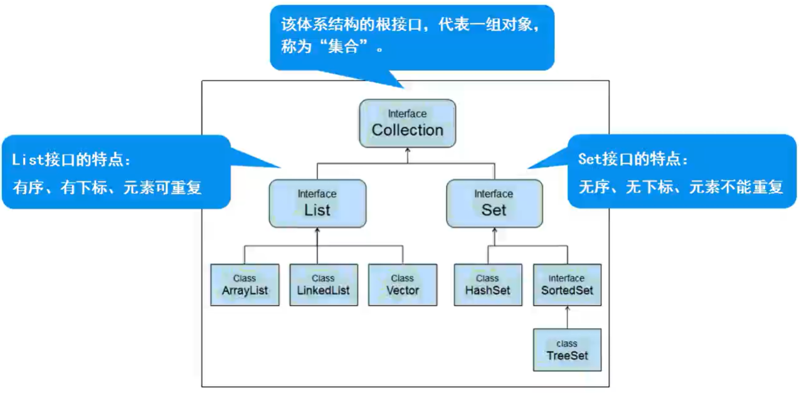

## String

- 字符串是常量，创建之后值不可变

- 字符串字面值存储在字符串池中，可以共享

- `String s = "Hello";` 产生一个对象，字符串池中存储

- `String s = new String("Hello");`产生两个对象，堆、池各存储一个

## 常用方法
- `public char charAt(int index)`：根据下标获取字符
- `public boolean contains(String str)`: 判断当前字符串中是否包含`str`
- `public char[] toCharArray()`: 将字符串转换成数组
- `public int indexOf(String str)`: 查找str首次出现的下标，存在，则返回该下标；不存在，则返回-1
- `public int lastIndexOf(String str)`：查找字符串在当前字符串中最后一次出现的下标索引
- `public int length()`: 返回字符串长度
- `public String trim()`: 去掉字符串前后的空格（中间的保留）
- `public String toUpperCase()`：小写转大写
- `public boolean endWith(String str)`: 判断字符串是否以str结尾
- `public String replace(char oldChar, char newChar)`：将旧字符串替换成新字符串
- `public String[] split(String str)`： 字符串拆分

## 可变字符串
- StringBuffer: 可变长字符串，JDK1.0提供，运行效率慢、线程安全

- StrinBuilder： 可变长字符串，JDK5.0提供，运行效率快、线程不安全

```java
public class Test{

    public static void main(String[] args) {

        String str = "Hello"; // 定义字符串Hello

        str += "World"; // 将World追加给Hello

        // JDK5之后的自动优化（拼接字符串）
        // 1. 创建StringBuilder
        // 2. 调用append追加方法
        // 3. 调用toString转换回String

        // 也就是实际上内存中只有一个HelloWorld而没有Hello


        System.out.println(str); // 打印追加后的str
    }
}
```

# 集合

## 什么是集合
- 概念：对象的容器，存储对象的对象，可代替数组

- 特点：容器的工具类，定义了对多个对象进行操作的常用方法

- java.util.*

## Collection体系集合



### Collection父接口
- 特点：代表一组任意类型的对象，无序、无下标
> Java API

## List集合

- 特点：有序、有下标、元素可以重复

### List实现类
- ArrayList
> 源码，底层是不断扩容的数组
  - 数组结构实现，查询快、增删慢；
  - JDK1.2版本，运行效率快、线程不安全

- Vector
  - 数组结构实现，查询快、增删慢；
  - JDK1.0版本，运行效率慢、线程安全

- LinkedList
  - 链表结构实现，增删快，查询慢

## 泛型集合
- 概念：参数化类型、类型安全的集合，强制集合元素的类型必须一致

- 特点：
  - 编译时即可检查，而非运行时抛出异常

  - 访问时，不必类型转换（拆箱）

  - 不同泛型之间引用不能相互赋值，泛型不存在多态

```java
public class Test {

  public static void main(String[] args) {

    // 实例泛型 -- 静态方法不可用
    MyClass<Integer> c1 = new MyClass<Integer>();
    c1.m1(11);

    MyInterface<Byte> mi = new MyImplClass();
    mi.m2( (byte)11 );


    // 静态泛型
    MyStaticClass.method(123); // Integer
    MyStaticClass.method(3.5); // Double

    // 加extends Number之后，不可操作字符串
    //MyStaticClass.method("Hello"); // String

  }
}

class MyStaticClass {

  // 静态泛型
  public static <T extends Number & Comparable> void method(T t) { // 用作排序


  }
}

class MyClass<E> {

  public void m1 (E e) {

  }
}

interface MyInterface<T> {

  public void m2(T t);
}

class MyImplClass implements MyInterface<Byte> {

  @Override
  public void m2(Byte t) {
    //
  }
} 
```


## Collections工具类

- 概念：集合工具类，定义了除了存取以外的集合常用方法