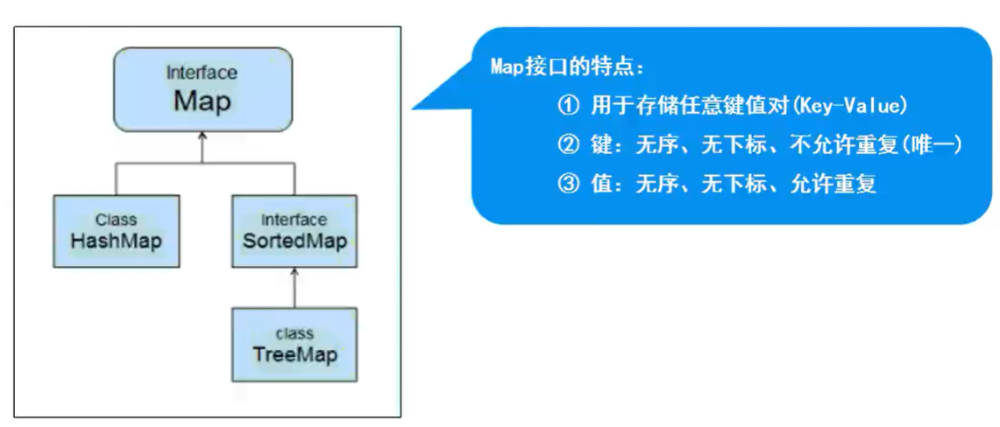

## Map结构

## Map父接口
- 特点：存储一对数据（Key-Value），无序、无下标，键不可重复，值可重复

## Map实现类
- HashMap
  - JDK1.2版本，线程不安全，运行效率快；允许用null作为key或是value

- HashTable
  - JDK1.1版本，线程安全，运行效率慢

- Properties
  - Hashtable的子类，要求key和value都是String。通常用于配置文件（.properties）的读取

- TreeMap
  - 实现了SortedMap接口（是Map的子接口），可以对key自动排序