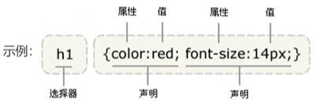

## CSS简介

#### 1.1 概念

CSS：层叠样式表（Cascading Style Sheets）是一种用来表现HTML或XML等文件样式的计算机语言。CSS不仅可以静态地修饰网页，还可以配合各种脚本语言动态地对网页各元素进行格式化

多个样式可以层层覆盖叠加，如果不同的ccs样式对同一html标签进行修饰，样式有冲突的，应用优先级高的，不同冲突的样式规则共同作用

#### 1.2 作用

- 修饰美化html网页
- 外部样式表可以提高代码复用性从而提高工作效率
- html内容与样式表分离，便于后期维护

#### 1.3 特点

- 丰富的样式定义
- 易于使用和修改
- 多页面应用
- 层叠
- 页面压缩

#### 1.4 语法

选择器，以及一条或多条声明

1. 选择器通常是需要改变样式的HTML元素
2. 每条声明由一个属性和一个值组成

**基础语法：选择器{属性：值 ；属性：值.......}**



> 使用花括号来包围声明

CSS书写方式有两种

- 选择器、每个声明各占一行
- 选择器声明都在一行

> CSS注释/\*...\*/

```html
<!DOCTYPE html>
<html lang="en">
<head>
    <meta charset="UTF-8">
    <title>Title</title>
    <style type="text/css">
        /* 书写CSS样式 */
        /* 选择器（HTML标签）  声明（样式的属性和指定的值）*/
        h1{
            color: red;
            font-family: "华文彩云";
            background-color: yellow;
        }
    </style>
</head>
<body>
    <h1>第一个CSS样式</h1>
    <h1>text</h1>
</body>
</html>
```

## 使用方式

#### 2.1 内联方式

将css样式嵌入到html标签中，类似属性的用法

```html
<div style="color:blue;font-size:50px">
    HTML text.
</div>
```


#### 2.1 内部方式

在head标签中使用style标签引入css

```html
    <style type="text/css"> /* 告诉浏览器使用css解析器 */
        div{
            color: red;
            font-family: "华文彩云";
            background-color: yellow;
        }
    </style>
```

- 好处：可以控制页面中多个元素样式
- 缺点：只能一个页面使用

#### 2.1 外部方式

将css样式抽成一个单独文件，谁用谁就引用

```css
/* 单独文件div.css */
div{
    color:red;
    font-size:50px
}
```

- 链接式

```html
<link rel="stylesheet" type="text/css" href="div.css"></link>
```

> rel:代表当前页面与href所指定文档的关系
>
> type：文件类型，解析器
>
> href：css文件地址

- 导入式

```html
<style type="text/css">
	@import url("div.css")
</style>
```

## CSS选择器


