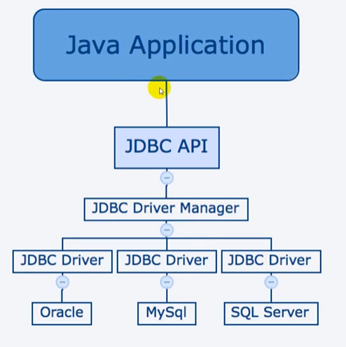
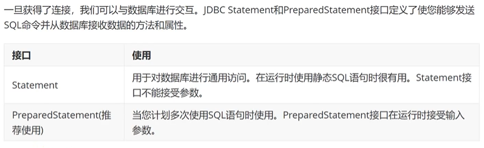

## JDBC简介

### 简介

JDBC（Java DataBase Connectivity, java数据库连接）是一种用于执行SQL语句的Java API，可以为多种关系数据库提供统一访问，由一组类和接口组成。

> JDBC提供了一种基准，据此可以构建更高级的工具和接口，使数据库开发人员能够编写数据库应用程序

JDBC库包括通常与数据库使用相关的API

- 连接数据库
- 创建SQL或MySQL语句
- 在数据库中执行SQL或MySQL查询
- 查看和修改生成的记录

### JDBC体系结构
JDBC API支持用于数据库访问的两层和三层处理模型，但通常，JDBC体系结构由两层组成：
- JDBC：提供了应用程序到数据库连接规范
- JDBC驱动程序：连接数据库的驱动程序实现（MySQL提供）



### 核心组件
- DriverManager：此类管理数据库驱动程序列表。使通信协议将来自java应用程序的连接请求与适当的数据库驱动程序匹配

- Driver：此接口处理与数据库服务器的通信。很少会直接与Driver对象进行交互，而是使用DriverManager对象来管理

- Connection：该接口具有连接数据库的所有方法

- Statement：使用从此接口创建的对象将SQL语句提交到数据库

- ResultSet：保存从数据库检索的数据

- SQLException：数据库处理时的异常

## JDBC初始

### 使用步骤
构建JDBC应用程序涉及以下六个步骤：

- **导入JDBC驱动包**：下载包含数据库编程所需的JDBC的jar包
- **注册JDBC驱动程序**：初始化驱动
- **创建连接**：使用`DriverManager.getConnection`方法创建Connection对象
- **执行查询结果**：使用类型为Statement的对象构建和提交SQL语句
- **提取数据**：使用`ResultSet.getXXX()`
- **释放资源**：关闭资源


#### （3）获取连接
- 数据库URL配置

加载驱动后，使用`DriverManager.getConnection`建立连接

- `DriverManager.getConnection(String url)`
- `DriverManager.getConnection(String url, Porperties prop)`
- `DriverManager.getConnection(String url, String user, String password)`

|RDBMS|JDBC驱动程序名称|连接字符串格式|
|-|-|-|
|MySQL|com.mysql.jdbc.Driver|jdbc:mysql://hostname:3306/databaseName|
|ORACLE| oracle.jdbc.driver.OracleDriver|jdbc: oracle: thin: @//hostname:port Number:databaseName|

#### （4）执行SQL语句




## PreparedStatement扩展了Statement接口，避免了SQL注入攻击

```java
// ?表示占位符
String sql = "select * from database where user = ? and password = ?";

// 预编译好sql语句，占位符？展示的是没有具体值
PreparedStatement prepare = connection.prepareStatement(sql);

// 为每个占位符赋予一个值
prepare.setObject(1,"1001");
prepare.setObject(2,"123123");
```

> 赋值时，会将特殊字符进行转义，如'#' 转义为'\#'