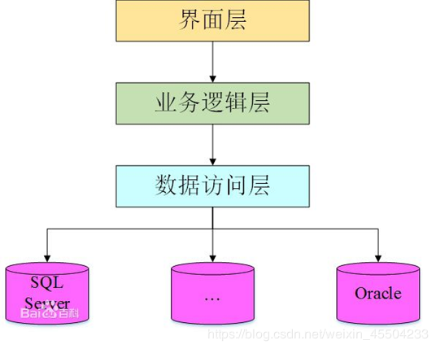
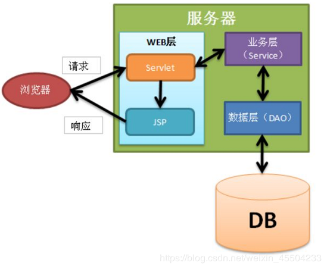

## MVC模式

#### 1. 概念

MVC模式并不是javaweb项目独有，而是一种软件工程中的一种设计模式，把软件系统分为三个基本部分：模型（Model）、视图（View）和控制器（Controller），即MVC。它是一种软件设计的典范。

#### 2. 详解

现在几乎所有的B/S架构都采用了MVC框架模式

- Model：模型代表着一种企业规范，就是业务流程/状态的处理以及业务规则的规定。业务流程的处理过程对其他层来说是不透明的，模型接受的请求，并返回最终的处理结果。业务模型的设计可以说是MVC的核心
- View：视图即用户看到并与之交互的界面，比如HTML（静态资源），JSP（动态资源）等待
- Controller：控制器即控制请求的处理逻辑，对请求进行处理，负责请求转发和重定向

#### 3. MVC与三层架构区别

> https://www.bilibili.com/video/BV15E411F75x?p=283

#### 4. MVC的三层架构的实现

虽然MVC把程序分成三部分，每个部分负责不同的功能，但是这只是逻辑的分离，实际代码并没有真正分离，特别是Model（包括业务、数据访问和实体类、工具类等）部分的代码，为了增强代码的维护性和降低代码耦合性，需要把代码分层管理，于是就有了三层架构：

分别是:web层（表示|界面层）、service层（业务逻辑层）、dao层(数据访问层、持久层)

- web层对应MVC中的Servlet和JSP
- 其他层都属于MVC中的Model

