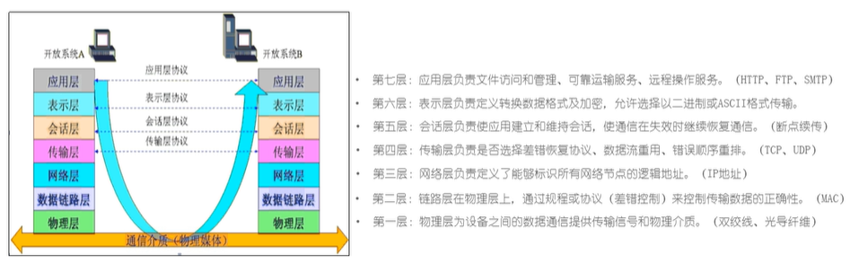
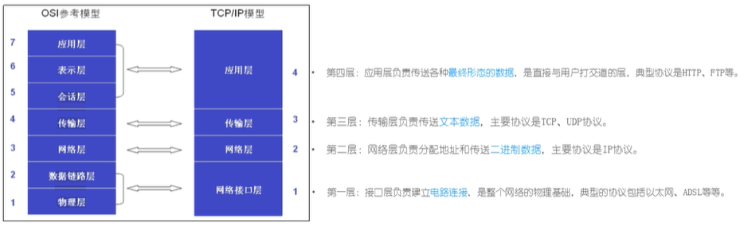
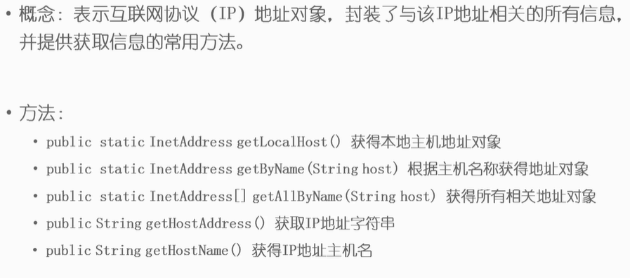

## 什么是网络
- 由点和线构成，表示诸多对象间的相互联系

## 计算机网络

- 为实现资源共享和信息传递，通过通信线路连接起来的若干主机。

- 互联网：点与点相连

- 万维网：端与端相连

- 物联网(IoT)：物与物相连

## 网络模型
- OSI协议 7层模型

## TCP / IP 模型

- 一组用于实现网络互连的通信协议，将协议分成四个层次

## TCP / UDP
- TCP协议：Transmission Control Protocol 传输控制协议

  - 面向连接的、可靠的、基于字节流的传输层通信协议。数据大小无限制。建立连接的过程需要**三次握手**，断开连接的过程需要**四次挥手**。

- UDP协议：User Datagram Protocol
  
  - 是一种无连接的传输层协议，提供面向事务的简单不可靠信息传送服务，每个包的大小64KB。

## IP
- IP协议：Internet Protocol Address 互联网协议地址/网际协议地址

  - IPV4
  - IPV6

> Java中提供InetAddress类用于对IP地址的操作

