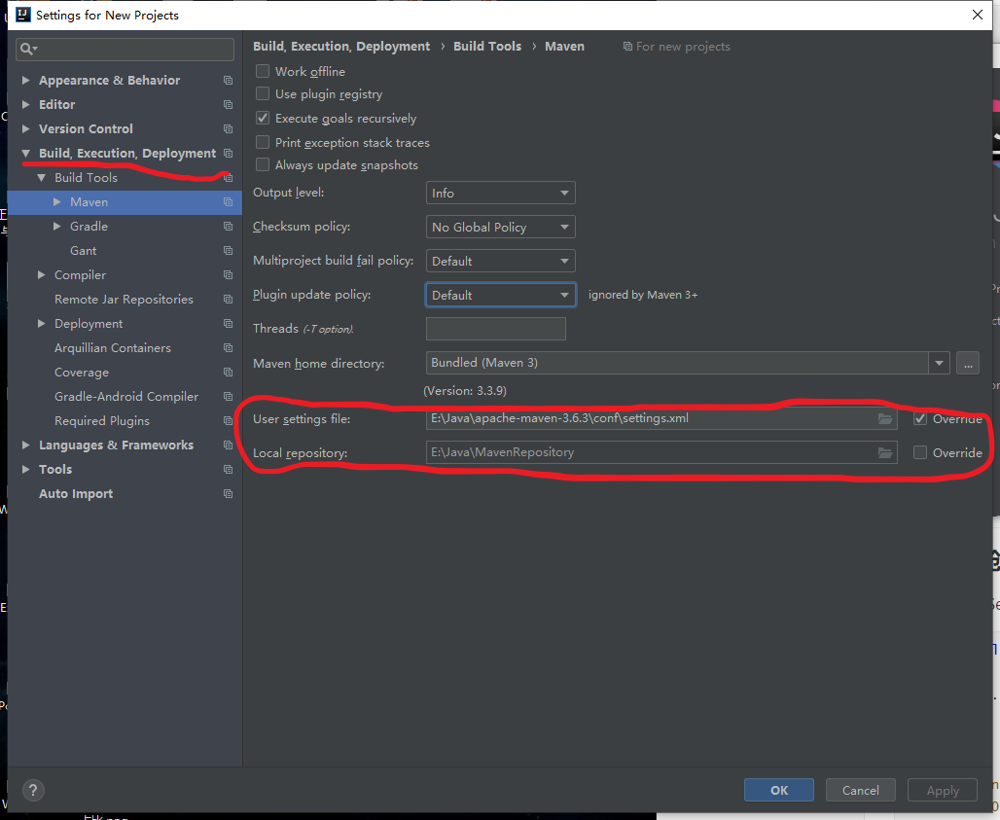

## IDEA中创建Spring项目步骤

1. 官网下载Maven：https://maven.apache.org/
2. 配置Maven环境变量

```
cmd中输入mvn -v显示如下则成功

Apache Maven 3.6.3 (cecedd343002696d0abb50b32b541b8a6ba2883f)
Maven home: E:\Java\apache-maven-3.6.3\bin\..
Java version: 1.8.0_181, vendor: Oracle Corporation, runtime: E:\Java\jdk1.8.0_181\jre
Default locale: zh_CN, platform encoding: GBK
OS name: "windows 10", version: "10.0", arch: "amd64", family: "windows"
```

3. 下载本地仓库

```
cmd输入 mvn help:system
```

4. 在IDEA中创建项目步骤

```
New Project -> Macen -> 设置项目名称等等  Next -> ... -> finished

注意：配置pom.xml，初始简单项目配置如下
    <dependencies>
        <dependency>
            <groupId>org.springframework</groupId>
            <artifactId>spring-context</artifactId>
            <version>5.0.2.RELEASE</version>
        </dependency>
    </dependencies>
在IDEA中可以正确写好名称，然后自行下载相关包
```

> 遗留问题：IDEA会自动下载依赖到本地仓库，如果是错误依赖也会创建文件夹，最好是写入正确依赖

5. 在setting中需要配置到正确的库路径



## 案例：打印

### 注解形式创建对象

- MessageService.java

```java
package hello;

import org.springframework.stereotype.Component;

/**
 * @author Li W
 * @version 1.8
 * @date 2020/8/7 11:41
 *
 * 打印服务
 */

@Component
public class MessageService {

    public MessageService() {
        System.out.println("MessageService... 创建");
    }

    /**
     * @return
     */
    public String getMessage() {
        return "hello world";
    }

    @Override
    public String toString() {
        return "这是MessageService对象";
    }
}
```

- MessagePrinter.java

```java
package hello;

import org.springframework.beans.factory.annotation.Autowired;
import org.springframework.stereotype.Component;

/**
 * @author Li W
 * @version 1.8
 * @date 2020/8/7 11:42
 */

/* Component注解用于Spring管理对象的创建 */
@Component
public class MessagePrinter {
    public MessagePrinter() {
        System.out.println("MessagePrinter... 创建");
    }

    private MessageService service;

    /**
     * @Autowired spring容器自动管理
     * @param service
     */
    @Autowired
    public void setService(MessageService service) {
        this.service = service;
    }

    public void printMessage() {
        System.out.println(this.service.getMessage());
    }

    @Override
    public String toString() {
        return "这是MessagePrinter对象";
    }
}
```

- Application.java：主函数

```java
package hello;

import org.springframework.context.ApplicationContext;
import org.springframework.context.annotation.AnnotationConfigApplicationContext;
import org.springframework.context.annotation.ComponentScan;
import org.springframework.stereotype.Component;

/**
 * @author Li W
 * @version 1.8
 * @date 2020/8/7 11:44
 */

@ComponentScan
public class Application {

    public static void main(String[] args) {
//        System.out.println("application");
//
//        MessagePrinter printer = new MessagePrinter();
//        printer.setService(new MessageService());
//
//        printer.printMessage();

        // 添加Spring注解之后
        System.out.println("application spring");

        // 初始化spring容器 --- 带有Component注解的类会被自动创建（注解形式创建）
        ApplicationContext context = new AnnotationConfigApplicationContext(Application.class);

        // 从容器中获取对象
        MessagePrinter printer = context.getBean(MessagePrinter.class);

        // 对setService方法添加@Autowired后，容器自动管理，则不需要获取
//        MessageService service = context.getBean(MessageService.class);
//        System.out.println(printer);
//        System.out.println(service);

        // 打印
//        printer.setService(service);
        printer.printMessage();
    }
}
```

### xml形式创建对象

- resources文件夹下创建applicationContext.xml配置文件

```xml
<?xml version="1.0" encoding="UTF-8"?>
<beans xmlns="http://www.springframework.org/schema/beans"
       xmlns:xsi="http://www.w3.org/2001/XMLSchema-instance"
       xsi:schemaLocation="http://www.springframework.org/schema/beans http://www.springframework.org/schema/beans/spring-beans.xsd">

    <!--
        bean元素：描述当前的对象需要由spring容器管理
        id属性：表示对象，未来在应用程序中可以根据id获取对象
        class：被管理对象的类全名
    -->
    <bean id="service" class="hello.MessageService"></bean>

    <bean id="printer" class="hello.MessagePrinter">
        <!--
            name="service"指向的是类中的private MessageService service;
            ref="service"指向的是上面配置的id="service"
        -->
        <property name="service" ref="service"></property>
    </bean>
</beans>
```

- MessageService与MessagePrinter类删除注解

- Application.java：主函数

```java
package hello;

import org.springframework.context.ApplicationContext;
import org.springframework.context.support.ClassPathXmlApplicationContext;

/**
 * @author Li W
 * @version 1.8
 * @date 2020/8/7 11:44
 */

public class Application {

    public static void main(String[] args) {

        // 初始化spring容器 --- 带有Component注解的类会被自动创建（注解形式创建）
//        ApplicationContext context = new AnnotationConfigApplicationContext(Application.class);
        // xml文件创建
        ApplicationContext context = new ClassPathXmlApplicationContext("applicationContext.xml");

        // 从容器中获取对象
        MessagePrinter printer = context.getBean(MessagePrinter.class);

        printer.printMessage();
    }
}
```

## 配置日志log4j

resources文件夹下创建log4j.properties

```properties
log4j.rootCategory=INFO, stdout

log4j.appender.stdout=org.apache.log4j.ConsoleAppender
log4j.appender.stdout.layout=org.apache.log4j.PatternLayout
log4j.appender.stdout.layout.ConversionPattern=%d{ABSOLUTE} %5p %t %c{2}:%L - %m%n

log4j.logger.org.springframework.beans.factory=DEBUG
```

pom.xml添加配置依赖

```xml
<dependencies>
    <dependency>
        <groupId>org.springframework</groupId>
        <artifactId>spring-context</artifactId>
        <version>4.3.13.RELEASE</version>
    </dependency>

    <!--log4j日志-->
    <dependency>
        <groupId>log4j</groupId>
        <artifactId>log4j</artifactId>
        <version>1.2.17</version>
    </dependency>
</dependencies>
```

> 遗留问题，上述方式在4.3版本可用，但是5.0版本有更新，（似乎是升级了log4j2）