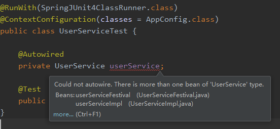

## 面向接口编程

[例](.\使用接口.md)

然而，当存在多个接口的实现类时，直接对该接口添加@Autowired注解，会产生歧义（运行报错，非编译错误）



- 一种直接的解决方法是使用实现类，但这并不符合面向接口编程特点

```java
@Autowired
private UserServiceImpl userService;
```

### 1. 使用首选bean

- 添加@Primary注解，就会首选该实现类

```java
@Component
@Primary
public class UserServiceFestival implements UserService {
    public void add() {
        System.out.println("节日期间添加用户，并发放优惠券");
    }
}
```

```java
@Component
public class UserServiceImpl implements UserService {
    public void add() {
        System.out.println("添加用户");
    }
}
```

- 缺点：不能设置多个，且只能在类定义中设置（业务逻辑中，此时并不能确定是否要首选）

### 2. 使用限定符

```java
@Component
@Qualifier("festival")
public class UserServiceFestival implements UserService {
    public void add() {
        System.out.println("节日期间添加用户，并发放优惠券");
    }
}
```

```java
@Component
@Qualifier("normal")
public class UserServiceImpl implements UserService {
    public void add() {
        System.out.println("添加用户");
    }
}
```

- 测试

```java
@RunWith(SpringJUnit4ClassRunner.class)
@ContextConfiguration(classes = AppConfig.class)
public class UserServiceTest {

    @Autowired
    @Qualifier("festival")
    private UserService userService;

    @Test
    public void testAdd() {
        userService.add();
    }
}
```

### 3. 使用限定符和类ID

```java
@Component("festival")
//@Primary
//@Qualifier("festival")
public class UserServiceFestival implements UserService {
    public void add() {
        System.out.println("节日期间添加用户，并发放优惠券");
    }
}
```

```java
@Component("normal")
public class UserServiceImpl implements UserService {
    public void add() {
        System.out.println("添加用户");
    }
}
```

> 每个类添加@Component注解的默认ID为将该类名第一个字母小写，如UserServiceFestival类的默认ID为userServiceFestival

- 测试类：@Qualifier()查找限定符与ID

```java
@RunWith(SpringJUnit4ClassRunner.class)
@ContextConfiguration(classes = AppConfig.class)
public class UserServiceTest {

    @Autowired
    @Qualifier("festival")
    private UserService userService;

    @Test
    public void testAdd() {
        userService.add();
    }
}
```

## 总结

- 首选bean
  - 在声明类的时候使用@Primary
  - 只能定义一个@Primary
- 限定符
  - 在声明的时候和装配的时候分别使用@Qualifier
- 限定符合bean ID
  - 在声明的时候指定bean的id（默认id为类名的首字母小写）
  - 装配的时候使用@Qualifier

## java标准的解决方案

上面的方法都是spring的标准，而java的标准是使用`@Resource(name = "festival")`注解，可以替代@Autowired和@Qualifier("festival")

```java
import javax.annotation.Resource;

@RunWith(SpringJUnit4ClassRunner.class)
@ContextConfiguration(classes = AppConfig.class)
public class UserServiceTest {

/*    @Autowired
    @Qualifier("festival")*/
    @Resource(name = "festival")
    private UserService userService;

    @Test
    public void testAdd() {
        userService.add();
    }
}
```