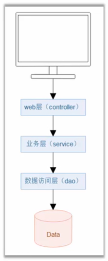

## WEB程序的基本架构



在分层下，各层可以有专门的注解替代`@Component`

- DAO层

```java
public interface UserDao {
    void add();
}
```

```java
@Repository
public class UserDaoImpl implements UserDao {

    public void add() {
        System.out.println("向数据库添加用户");
    }
}
```

- Service层

```java
public interface UserService {
    void add();
}
```

```java
//@Component("normal")
@Service("normal")
public class UserServiceImpl implements UserService {

    @Autowired
    private UserDao userDao;

    public void add() {
        userDao.add();
    }
}
```

- controller层

```java
// @Component
@org.springframework.stereotype.Controller
public class Controller {

    @Autowired
    @Qualifier("normal")
    private UserService userService;

    public void add() {
        userService.add();
    }
}
```

单元测试

```java
@RunWith(SpringJUnit4ClassRunner.class)
@ContextConfiguration(classes = AppConfig.class)
public class ControllerTest {
    @Autowired
    private Controller controller;

    @Test
    public void testAdd() {
        controller.add();
    }
}
```

> 全局配置，@ComponentScan默认扫描同包下（包括该内所有的子包）所有@Component注解
>
> 也可指定扫描的包名`@ComponentScan("com.demo")`，或多个包`@ComponentScan(basePackages = {"com.demo.dao", "com.demo.service", "com.demo.web"})`或类名`@ComponentScan(basePackageClasses = {Controller.class, UserService.class, UserDao.class})`

## 总结

### 定义配置

- @Configuration
- @ComponentScan

### 定义组件

- @Component
- @Autowired
- @Autowired(required=false)

### 自动装配歧义性

- @Primary
- @Qualifier
- @Resource

### 分层架构中定义组件

- @Controller
- @Service
- @Repositoty

### Spring测试环境

- @RunWith
- @ContextConfiguration

### 使用xml启用组件扫描

- ```xml
  <context:component-scan base-package="..."/>
  ```