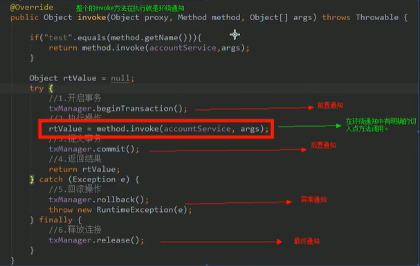

## 动态代理

### 基于接口的动态代理

- Producer.java

```java
package demo.proxy;

/**
 * 一个生产者
 */
public class Producer implements IProducer{

    /**
     * 销售
     * @param money
     */
    public void saleProduct(float money) {
        System.out.println("销售产品，并拿到钱："+money);
    }

    /**
     * 售后
     * @param money
     */
    public void afterService(float money) {
        System.out.println("售后服务，并拿到钱："+money);
    }
}
```

- 接口

```java
package demo.proxy;

/**
 * 对生成厂家要求的接口
 */
public interface IProducer {
    void saleProduct(float money);

    void afterService(float money);
}
```

- Client.java

```java
package demo.proxy;

import java.lang.reflect.InvocationHandler;
import java.lang.reflect.Method;
import java.lang.reflect.Proxy;

/**
 * 模拟一个消费者
 */
public class Client {
    public static void main(String[] args) {
        final Producer producer = new Producer();

        /**
         * 动态代理：
         *      特点：字节码随用随创建，随用随加载
         *      作用：不修改源码的基础上对方法增强
         *      分类：
         *          基于接口的动态代理
         *              涉及的类：Proxy
         *              提供这：JDK官方
         *
         *              如何创建代理对象：
         *                  使用Proxy中的newProxyInstance方法
         *              创建代理的要求：
         *                  **被代理类最少实现一个接口**，若没有则无法运行
         *              newProxyInstance参数：
         *                  ClassLoader：类加载器
         *                      加载代理对象字节码。和被代理对象使用相同的类加载器
         *                      eg：producer.getClass().getClassLoader()
         *                  Class[]：字节码数组
         *                      让代理对象和被代理对象有相同的方法
         *                      eg：producer.getClass().getInterfaces()
         *                  InvocationHandler：提供增强的代码
         *                      如何代理。一般都是写该接口的实现类，通常情况下是匿名内部类，但不是必须的
         *
         *          基于子类的动态代理：见demo.cglib.Client类
         *
         */
        IProducer proxyInstance = (IProducer) Proxy.newProxyInstance(producer.getClass().getClassLoader(),
                producer.getClass().getInterfaces(),
                new InvocationHandler() {
                    /**
                     * 作用：执行被代理对象的任何接口方法都会经过该方法
                     * @param proxy：代理对象的引用
                     * @param method：当前执行的方法
                     * @param args：当前执行方法所需的参数
                     * @return      和被代理对象有相同的返回值
                     * @throws Throwable
                     */
                    public Object invoke(Object proxy, Method method, Object[] args) throws Throwable {
                        // 提供增强的代码
                        // 1.获取方法执行的参数
                        Float money =(Float) args[0];
                        // 2.判断当前方法是不是销售
                        if("saleProduct".equals(method.getName())){
                            return method.invoke(producer, money*0.8f);
                        }
                        return null;
                    }
                });

        proxyInstance.saleProduct(1000f);
    }
}
```

### 基于子类的动态代理

> 需要引入依赖

```xml
<dependencies>
    <!--基于子类的动态代理依赖-->
    <dependency>
        <groupId>cglib</groupId>
        <artifactId>cglib</artifactId>
        <version>2.1_3</version>
    </dependency>
</dependencies>
```

```java
package demo.cglib;

import net.sf.cglib.proxy.Enhancer;
import net.sf.cglib.proxy.MethodInterceptor;
import net.sf.cglib.proxy.MethodProxy;

import java.lang.reflect.Method;

/**
 * 模拟一个消费者
 */
public class Client {
    public static void main(String[] args) {
        final Producer producer = new Producer();

        /**
         * 动态代理：
         *      特点：字节码随用随创建，随用随加载
         *      作用：不修改源码的基础上对方法增强
         *
         *      分类：
         *          基于子类的动态代理
         *              涉及的类：Enhancer
         *              提供这：第三方cglib库
         *
         *              如何创建代理对象：
         *                  使用Enhancer中的create方法
         *              创建代理的要求：
         *                  **被代理类不能是最终类**，
         *              create参数：
         *                  Class：字节码
         *                      指定被代理对象的字节码
         *                      eg：producer.getClass().getClassLoader()
         *                  Callback：提供增强的代码
         *                      如何代理。一般都是写该接口的实现类，通常情况下是匿名内部类，但不是必须的
         */

        Producer cglibProducer = (Producer) Enhancer.create(producer.getClass(),
                new MethodInterceptor() {
                    /**
                     * 执行被代理对象的任何方法都会经过该方法
                     * @param o
                     * @param method
                     * @param objects
                     * // 以上三个参数和基于接口的动态代理中invoke方法是一样的
                     * @param methodProxy：当前执行方法的代理对象
                     * @return
                     * @throws Throwable
                     */
                    public Object intercept(Object o, Method method, Object[] objects, MethodProxy methodProxy) throws Throwable {
                        // 提供增强的代码
                        // 1.获取方法执行的参数
                        Float money = (Float) objects[0];
                        // 2.判断当前方法是不是销售
                        if ("saleProduct".equals(method.getName())) {
                            return method.invoke(producer, money * 0.8f);
                        }
                        return null;
                    }
                });
        cglibProducer.saleProduct(1000f);
    }
}
```

## AOP概述

### 什么是AOP？

AOP全称Aspect Oriented Programming，即：面向切面编程。通过预编译方式和运行时期动态代理实现程序功能的统一维护。是OOP（面向对象编程）的延续。

### 作用及优势

- 作用：

  - 在程序运行期间，不修改源码对已有方法进行增强

  > Python的注解@

- 优势

  - 减少重复代码
  - 提高开发效率
  - 维护方便

### 实现方式：动态代理

## Spring中的AOP

通过配置的方式，实现前面的功能

### 相关术语

> 原视频地址：https://www.bilibili.com/video/BV1mE411X7yp?p=133

- Joinpoint（连接点）：

  指那些被拦截到的点。在spring中，这些点指的是方法，因为spring只支持方法类型的连接点

- Pointcut（切入点）：

  指我们要对哪些Joinpoint进行拦截的定义

- Advice（通知/增强）：

  指拦截到Joinpoint之后所要做的事情就是通知

  - 通知类型：前置通知，后置通知，异常通知，最终通知，环绕通知

  

- Introduction（引介）：

  是一种特殊的通知，在不修改类代码的前提下，Introduction可以在运行期为类动态地添加一些方法或Field

- Target（目标对象）：

  被代理对象

- Weaving（织入）：

  指把增强应用到目标对象来创建新的代理对象的过程

- Proxy（代理）：

  一个类被AOP织入增强后，就产生一个结构代理类

- Aspect（切面）：

  切入点和通知（引介）的结合

### 学习AOP要明确的事

- 开发阶段
  - 编写核心业务代码（开发主线）：大部分程序员来做，要求熟悉业务要求
  - 把公用代码抽取出来，制作成通知。（开发阶段最后再做）：AOP编程人员来做
  - 在配置文件中，生命切入点与通知间的关系，即切面。AOP人员来做
- 运行阶段（spring框架完成）
  - spring框架监控切入点方法的执行。一旦监控到切入点方法被运行，使用代理机制，动态创建目标对象的代理对象，根据通知类别，在代理对象的对应位置，将通知对象的功能织入，完成完整的代码逻辑运行。