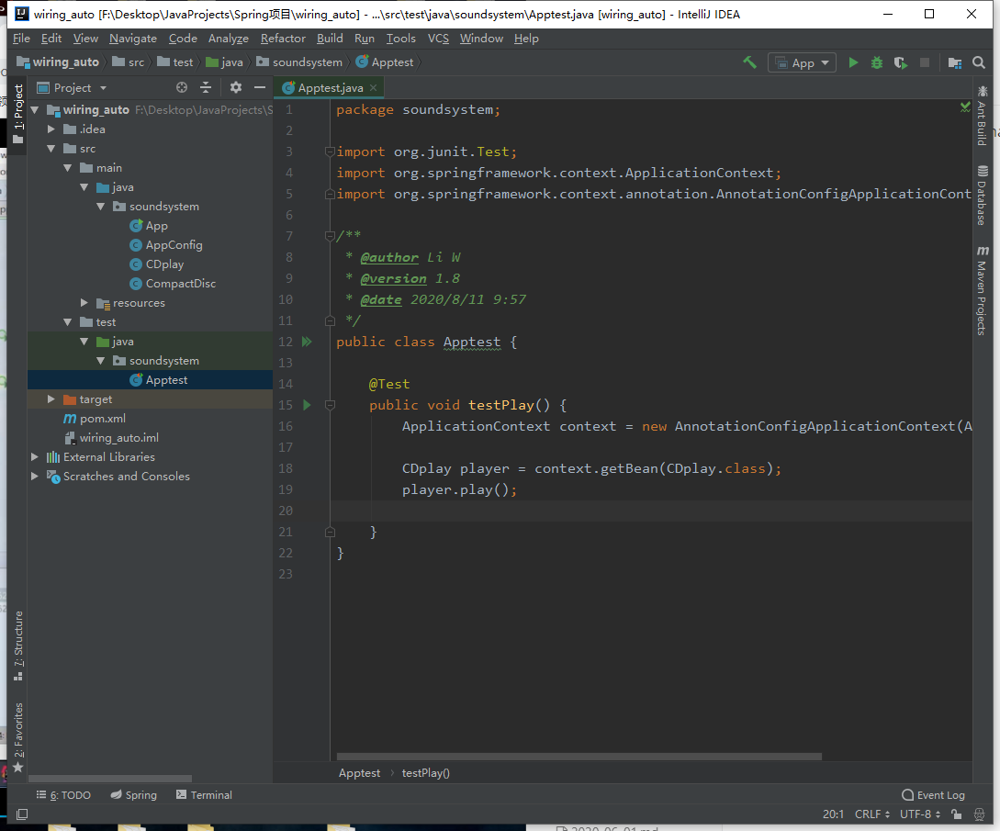

## Junit4单元测试

Maven下，test文件夹测试代码会与main文件编译到同名的包下，在写测试代码时，类文件不需要重写

- 引入junit依赖

```xml
<dependency>
    <groupId>junit</groupId>
    <artifactId>junit</artifactId>
    <version>LATEST</version>
</dependency>
```



- 引入spring-test依赖，使测试更简化

```xml
<dependency>
    <groupId>org.springframework</groupId>
    <artifactId>spring-test</artifactId>
    <version>4.3.13.RELEASE</version>
</dependency>
```

```java
package soundsystem;

import org.junit.Test;
import org.junit.runner.RunWith;
import org.springframework.beans.factory.annotation.Autowired;
import org.springframework.context.ApplicationContext;
import org.springframework.context.annotation.AnnotationConfigApplicationContext;
import org.springframework.test.context.ContextConfiguration;
import org.springframework.test.context.junit4.SpringJUnit4ClassRunner;

/**
 * @author Li W
 * @version 1.8
 * @date 2020/8/11 9:57
 */

@RunWith(SpringJUnit4ClassRunner.class)
@ContextConfiguration(classes = AppConfig.class)
public class Apptest {

    // 使用spring注解方式
    @Autowired
    private CDplay player;

    @Test
    public void testPlay() {
        // 读取配置文件， 注解方式@ContextConfiguration(classes = AppConfig.class)
//        ApplicationContext context = new AnnotationConfigApplicationContext(AppConfig.class);
//        CDplay player = context.getBean(CDplay.class);
        player.play();

    }
}
```

- 完整依赖

```xml
<dependencies>
    <dependency>
        <groupId>org.springframework</groupId>
        <artifactId>spring-context</artifactId>
        <version>4.3.13.RELEASE</version>
    </dependency>

    <dependency>
        <groupId>org.springframework</groupId>
        <artifactId>spring-test</artifactId>
        <version>4.3.13.RELEASE</version>
    </dependency>

    <dependency>
        <groupId>log4j</groupId>
        <artifactId>log4j</artifactId>
        <version>1.2.17</version>
    </dependency>

    <dependency>
        <groupId>junit</groupId>
        <artifactId>junit</artifactId>
        <version>LATEST</version>
    </dependency>
</dependencies>
```