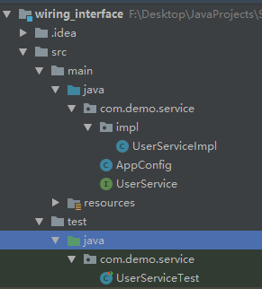

## 使用spring面向接口编程

包的创建如下：



> 注意：AppConfig配置文件要在与接口相同的包下，且@Component注解是添加在接口的实现类上的

- UserService接口

```java
package com.demo.service;

/**
 * @author Li W
 * @version 1.8
 * @date 2020/8/11 10:32
 */

public interface UserService {
    void add();
}
```

- UserService实现类

```java
package com.demo.service.impl;

import com.demo.service.UserService;
import org.springframework.stereotype.Component;

/**
 * @author Li W
 * @version 1.8
 * @date 2020/8/11 10:33
 */
@Component
public class UserServiceImpl implements UserService {
    public void add() {
        System.out.println("添加用户");
    }
}
```

- AppConfig配置

```java
package com.demo.service;

import org.springframework.context.annotation.ComponentScan;
import org.springframework.context.annotation.Configuration;

/**
 * @author Li W
 * @version 1.8
 * @date 2020/8/11 10:34
 */

@Configuration
@ComponentScan
public class AppConfig {
}
```

- UserService单元测试

```java
package com.demo.service;

import org.junit.Test;
import org.junit.runner.RunWith;
import org.springframework.beans.factory.annotation.Autowired;
import org.springframework.test.context.ContextConfiguration;
import org.springframework.test.context.junit4.SpringJUnit4ClassRunner;

/**
 * @author Li W
 * @version 1.8
 * @date 2020/8/11 10:37
 */
@RunWith(SpringJUnit4ClassRunner.class)
@ContextConfiguration(classes = AppConfig.class)
public class UserServiceTest {

    @Autowired
    private UserService userService;

    @Test
    public void testAdd() {
        userService.add();
    }
}
```

