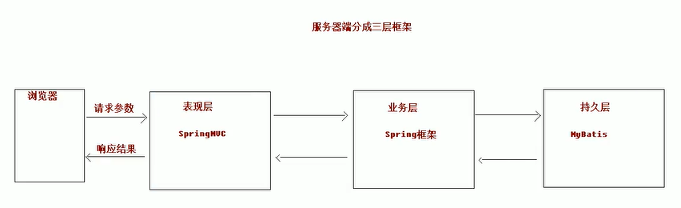

## 基本概念



- 表现层

```
也就是常说的web层。它负责接收客户端请求，向客户端响应结果，通常客户端使用http协议请求web层，web需要接收http请求，完成响应。

表现层包括展示层和控制层：控制层负责接收请求，展示层负责结果的展示。

表现层依赖业务层，接收到客户端请求一般会调用业务层进程业务处理，并将处理结果响应给客户端。

表现层的设计一般都使用MVC模型。（MVC是表现层的设计模型，和其他层没有关系）
```

- 业务层

```
也就是常说的Service层。它负责业务逻辑处理，和我们开发项目的需求息息相关。web层依赖业务层，但是业务层不依赖web层。

业务层在业务处理时可能会依赖持久层，如果要对数据持久化需要保证事务一致性。（事务应该放到业务层来控制）
```

- 持久层

```
也是我们常说的Dao层。负责数据持久化，包括数据层，即数据库和数据访问层。数据库是对数据进行持久化的载体，数据访问层是业务层和持久层交互的接口，业务层需要通过数据访问层将数据持久化到数据库中。通俗的讲，持久层就是和数据库交互，对数据库表进行CRUD。
```

## MVC设计模型

- M：Model模型      JavaBean

```
通常指的就是我们的数据模型。作用一般情况下用于封装数据。
```

- V：View视图        JSP、HTML等

```
通常指jsp或html。作用一般是展示数据
通常视图是依据模型数据创建的
```

- C：Controller控制器      Servlet

```
是应用程序中处理用户交互的部分。作用一般就是处理程序逻辑的。

例如：
	我们保存一个用户的信息，该用户信息中包含了姓名，性别，年龄等。
	这时表单输入要求年龄必须是1~100的整数。姓名和性别不为空。并且把数据填充到模型中。
	此时除了js的校验之外，服务器端也应该有数据准确性的校验，那么校验就是控制器该做的。
	
	当校验失败后，由控制器负责把错误页面展示给使用者。
	若校验成功，控制器负责把数据填充到模型，并且调用业务层实现完整的业务需求。

```

## SpringMVC概述

