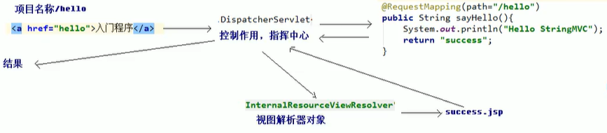
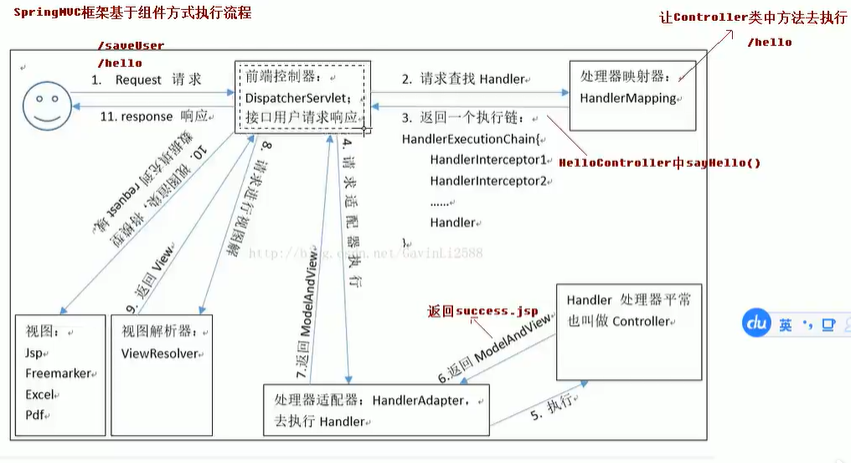

## 基本概念


- 表现层

```
也就是常说的web层。它负责接收客户端请求，向客户端响应结果，通常客户端使用http协议请求web层，web需要接收http请求，完成响应。

表现层包括展示层和控制层：控制层负责接收请求，展示层负责结果的展示。

表现层依赖业务层，接收到客户端请求一般会调用业务层进程业务处理，并将处理结果响应给客户端。

表现层的设计一般都使用MVC模型。（MVC是表现层的设计模型，和其他层没有关系）
```

- 业务层

```
也就是常说的Service层。它负责业务逻辑处理，和我们开发项目的需求息息相关。web层依赖业务层，但是业务层不依赖web层。

业务层在业务处理时可能会依赖持久层，如果要对数据持久化需要保证事务一致性。（事务应该放到业务层来控制）
```

- 持久层

```
也是我们常说的Dao层。负责数据持久化，包括数据层，即数据库和数据访问层。数据库是对数据进行持久化的载体，数据访问层是业务层和持久层交互的接口，业务层需要通过数据访问层将数据持久化到数据库中。通俗的讲，持久层就是和数据库交互，对数据库表进行CRUD。
```

## MVC设计模型

- M：Model模型      JavaBean

```
通常指的就是我们的数据模型。作用一般情况下用于封装数据。
```

- V：View视图        JSP、HTML等

```
通常指jsp或html。作用一般是展示数据
通常视图是依据模型数据创建的
```

- C：Controller控制器      Servlet

```
是应用程序中处理用户交互的部分。作用一般就是处理程序逻辑的。

例如：
	我们保存一个用户的信息，该用户信息中包含了姓名，性别，年龄等。
	这时表单输入要求年龄必须是1~100的整数。姓名和性别不为空。并且把数据填充到模型中。
	此时除了js的校验之外，服务器端也应该有数据准确性的校验，那么校验就是控制器该做的。
	
	当校验失败后，由控制器负责把错误页面展示给使用者。
	若校验成功，控制器负责把数据填充到模型，并且调用业务层实现完整的业务需求。

```

## SpringMVC入门

1. 启动服务器，加载配置文件

   - `DispatcherServlet`对象创建
   - `springmvc.xml`配置文件加载

   > 还配置了视图解析器，用于跳转页面
   >
   > 注解支持

   - `HelloController`对象创建（上面spring文件配置扫描）

2. 发送请求（index.jsp），后台处理



> 具体代码见：./code/quick start/

- 细节



### 涉及组件

- DispatherServlet：前端控制器

```
用户请求到达前端控制器，它就相当于MVC模式中的C，dispatcherServlet是整个流程控制的中心，由它调用其他组件处理用户的请求，dispatcherServlet的存在降低了组件之间的耦合性。
```

- HandlerMapping：处理器映射器

```
HandlerMapping负责根据用户请求找到Handler，即处理器，SpringMVC提供了不同的映射器实现不同的映射方式，例如：配置文件方式，实现接口方式，注解方式等。
```

- Handler：处理器

```
它就是我们开发中要编写的具体业务控制器。由DispatherServlet把用户请求转发到Handler。由Handler对具体的用户请求进行处理。
```

- HandlerAdapter：处理器适配器

```
通过HandlerAdapter对处理器进行执行，这是适配器模式的应用，通过扩展适配器可以对更多类型 的处理器进行执行。
```

- View Resolver：视图解析器

```
负责将处理结果生成View视图，其首先根据逻辑视图名称解析成物理视图名，即具体的页面地址，再生成View视图对象，最后对View进行渲染，将处理结果通过页面展示给用户。
```

- View：视图

```
SpringMVC框架提供了很多的视图类型支持，包括：jstlView、freemarkerView、pdfView等。最常用的就是jsp。

一般情况下，需要通过页面标签或页面模板技术将模型数据通过页面展示给用户，需要由程序员根据业务需求开发具体的页面。
```

- `<mvc:annotation-driven/>`说明

```
在SpringMVC的各个组件中，处理器映射器、处理器适配器、视图解析器称为SpringMVC的三大组件。

使用<mvc:annotation-driven/>自动加载RequestMappingHandlerMapping（处理器映射器）和RequestMappingHandlerAdapter（处理器适配器），可用在SpringMVC.xml配置文件中使用<mvc:annotation-driven/>替代注解处理器和适配器的配置。
```

