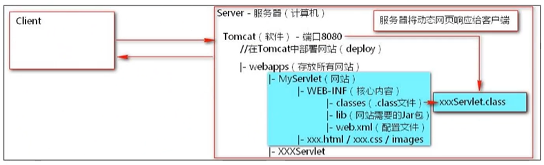
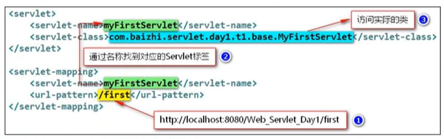

## 第一个Servlet（Java Server Applet）

#### 1. 概念

- Servlet是服务器端的一段程序（代码、功能实现），可交互式的处理客户端发送到服务器的请求，并完成操作响应
- 动态网页技术
- JavaWeb程序开发的基础，JavaEE规范（一套接口）的一个组成部分。// 由服务器厂商实现

#### 2. Servlet的核心作用

- 接收客户端请求，完成操作任务
- 动态生成网页（页面数据可变）
- 将包含操作结果的动态网页响应给客户端



#### 3. Servlet开发步骤

1. 搭建开发环境：创建目录结构（上图），将Servlet相关的jar包（servlet-api.jar）配置到CLASSPATH中

   ```java
   路径\lib\servlet-api.jar
   ```

   > 注意：如果配置了环境变量，还是出现包的引用问题，可以使用以下方式
   >
   > 不带包
   >
   > javac -classpath 路径\lib\servlet-api.jar
   >
   > 在编译时，引用servlet-api的路径
   >
   > > java带包编译时：`javac -d . -classpath E:\Java\apache-tomcat-9.0.36\lib\servlet-api.jar MyServlet.java`

2. 实现`javax.servlet.Servlet`接口，覆盖5个主要方法

   ```java
   package com.servlets; // 若需要带包编译
   
   import javax.servlet.Servlet;
   import javax.servlet.ServletException;
   import javax.servlet.ServletConfig;
   import javax.servlet.ServletRequest;
   import javax.servlet.ServletResponse;
   
   import java.io.IOException;
   /**
    * 实现接口的所有方法
    */
   
   public class MyServlet implements Servlet{
   
       // 1.初始化
       public void init(ServletConfig servletConfig) throws ServletException{
           // 初始化工作
       }
   
       // 2.获取配置信息
       public ServletConfig getServletConfig() {
           return null;
       }
   
       // 3.提供服务
       public void service(ServletRequest request, ServletResponse response)
               throws ServletException, IOException{
           // 注意：这句话会打印在服务器Tomcat控制台
           System.out.println("这是我的第一个Servlet");
       }
   
       // 4.返回servlet基本信息
       public String getServletInfo() {
           return null;
       }
   
       // 5.销毁
       public void destroy() {}
   }
   ```

   

3. 将核心的service()方法中书写输出语句，验证访问结果

4. 将编译后的.class文件放置在WEB-INF/classes中

   > 若.class有路径，则需要添加完整路径

   

5. web.xml文件中添加配置信息（先在现有示例项目）

   > 创建两对标签：

   


>完整文件信息如下：

```xml
<?xml version="1.0" encoding="UTF-8"?>

<web-app xmlns="http://xmlns.jcp.org/xml/ns/javaee"
  xmlns:xsi="http://www.w3.org/2001/XMLSchema-instance"
  xsi:schemaLocation="http://xmlns.jcp.org/xml/ns/javaee
                      http://xmlns.jcp.org/xml/ns/javaee/web-app_4_0.xsd"
  version="4.0"
  metadata-complete="true">

    <!--创建servlet标签-->
    <servlet>
        <!--给指定的servlet类命名-->
        <servlet-name>myservlet</servlet-name>
        <!--编译之后的.class类名（带包），全限定路径-->
        <servlet-class>com.servlets.MyServlet</servlet-class>
    </servlet>

    <!--创建servlet映射-->
    <servlet-mapping>
        <!--映射到哪一个servlet-->
        <servlet-name>myservlet</servlet-name>
        <!--客户端访问路径! localhost:8080/项目名称/资源-->
        <url-pattern>/test</url-pattern>
    </servlet-mapping>
</web-app>
```

