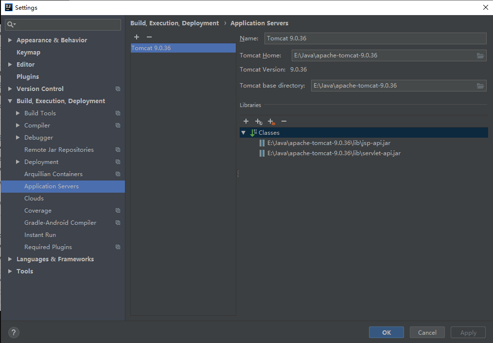
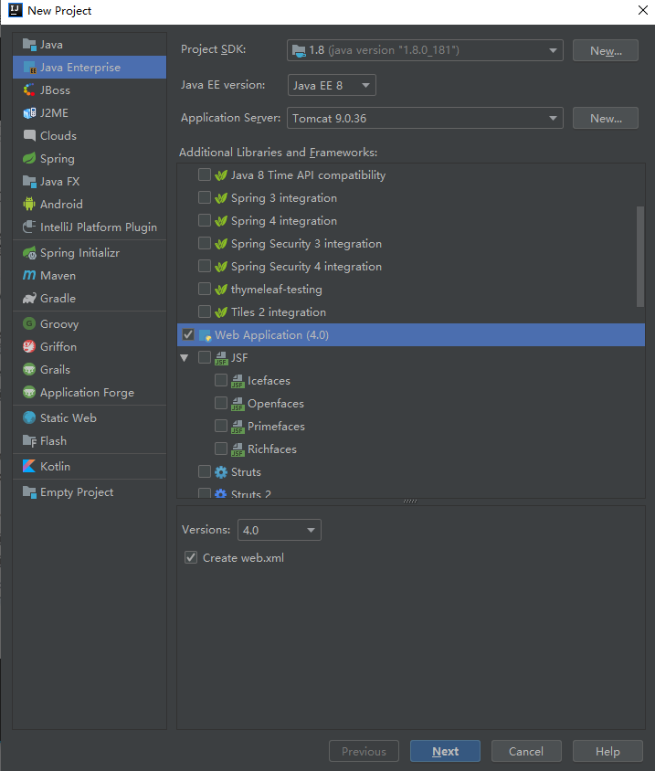
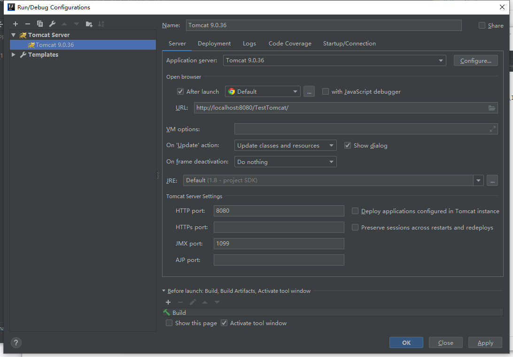

> IDEA创建Tomcat项目步骤

1. 配置Tomcat：file  >  settings  >  Bulid,Excution,Deployment  >  Application Servers > 将Tomcat安装路径添加

   

2. 创建Tomcat项目：new project  >  java enterprise  >  Web application创建

   

3. 项目创建完成之后的其他配置信息

   

> IDEA中若有乱码问题，可以在上图VM options处添加`-Dfile.enconding=utf-8`