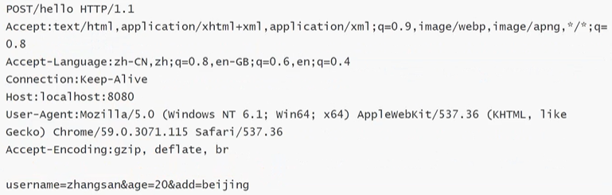
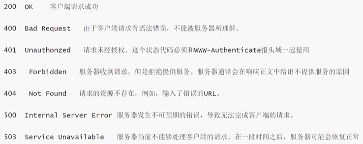

## HTTP协议

#### 1 什么是HTTP协议

超文本传输协议（HTTP，HyperText Transfer Protocol）是互联网上应用最为广泛的一种网络协议，是一个基于请求与响应模式的、无状态的、应用层的协议，常基于TCP的连接方式。

主要特点：

- 支持客户端（浏览器）/ 服务器模式。
- 简单快速：客户向服务器请求服务时，只需传送请求方法和路径。请求方法常用的有GET、POST。没种方法规定了客户与服务器联系的类型不同。由于HTTP协议简单，使得HTTP服务器的程序规模小，因而通信速度很快。
- 灵活：HTTP允许传输任意类型的数据对象。传输的类型由**Content-Type**加以标记。
- 无连接：无连接的含义是限制每次连接只处理一个请求。服务器处理完客户的请求，并收到客户的应答后，即断开连接。可以节省传输时间。
- 无状态：HTTP协议是无状态协议。无状态是指协议对于事务处理没有记忆能力。缺少状态意味着如果后续处理需要前面的信息，则它必须重传，这样可能导致每次连接传输的数据量增大。另一方面，在服务器不需要先前信息时它的应答就较快。

#### 2. HTTP协议的通信

在一次完整的通信中，Web浏览器与Web服务器之间将完成下列7个步骤：

- 建立TCP连接

  在HTTP工作开始之前，Web浏览器首先要通过网络与Web服务器建立连接，通过TCP完成。（一般TCP连接的端口号是80）

- 浏览器向服务器发送请求命令

  一旦建立了TCP连接，浏览器就会向服务器发送请求命令

  - 如`GET /sample/hello.html HTTP/1.1`，类似Tomcat找资源

- 浏览器发送请求头信息（Request Headers）

  在发送请求命令之后，以头信息的形式向Web服务器发送一些别的信息，之后浏览器发送了一空白行来通知服务器，它已经结束了该头信息的发送。

- Web服务器应答

  客户机向服务器发送请求后，服务器会送应答

  - `HTTP/1.1 200 OK`应答的第一部分是协议的版本号和应答状态码

- Web服务器发送应答头信息（Response Headers）

- Web服务器向浏览器发送数据

  同样以空白行标志头信息的结束，接着，以Content-Type应答头信息所描述的格式发送用户所请求的实际数据

- Web服务器关闭TCP连接

  一般情况下，Web服务器向浏览器发送了请求数据，就要关闭TCP连接。如果浏览器或服务器在其头信息加入`Connection:keep-alive`，TCP连接在发送后仍将保持打开状态，于是，浏览器可以继续通过相同的连接发送请求。保持连接节省了时间。

#### 3. 请求和响应数据格式

##### 请求报文

当浏览器向Web服务器发出请求时，它向服务器传递了一个数据块，也就是请求信息（请求报文），HTTP请求信息由4个部分组成：

1. 请求行 	请求方法/地址  URL协议/版本
2. 请求头
3. 空行
4. 请求正文

- 一个请求的例子



##### 响应报文

1. 状态行	HTTP/1.1  200  OK
2. 响应头
3. 空行
4. 响应正文

```
状态代码描述
- 1XX： 		指示信息，表示请求已接收，继续处理
- 2XX：		成功-表示请求已被成功接收、理解、接受
- 3XX：		重定向-要完成请求必须进行更进一步的操作
- 4XX：		客户端错误，请求有语法错误或请求无法实现
- 5XX：		服务器端错误，服务器未能实现合法的请求

```

