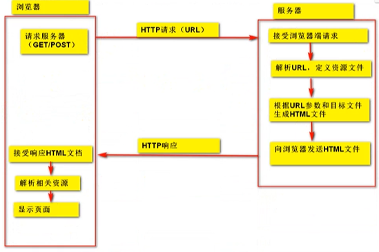
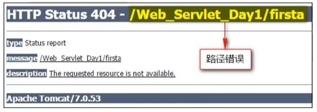
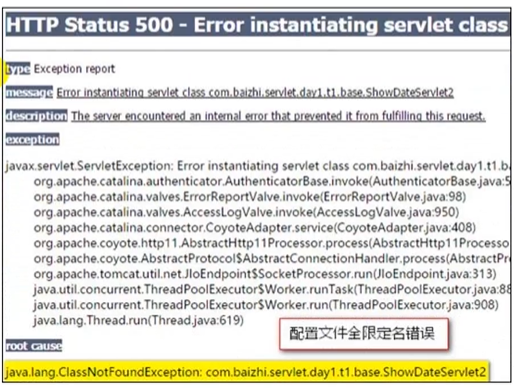

## Tomcat服务器介绍

Tomcat服务器是一个免费的开源Web应用服务器，属于轻量级应用【服务器】，在中小型系统和并发访问用户不是很多的场合下被普遍使用，是开发和调试JSP程序的首选。

#### 安装

Tomcat压缩版，解压即可

> tomcat安装需要配置JAVA_HOME环境变量（有JRE亦可）

> 第一次启动服务器建议使用命名行打开，因为可以提示错误信息

## Tomcat目录介绍

#### bin：二进制执行文件目录

该目录下存放的是二进制可执行文件，

- 如果是安装版，那么该目录下会有两个exe文件：`tomcat9.exe`、`tomcat9w.exe`；前者是在控制台下启动Tomcat，后者是弹出UGI窗口启动；
- 如果是解压版，会有`startup.bat`和`shutdown.bat`（执行需要配置JDK）

#### conf：配置信息目录

- server.xml：配置整个服务器信息。例如修改端口号，添加虚拟主机等。

- tomcat-users.xml：存储tomcat用户的文件，其保存的是tomcat的用户名及密码，以及用户的角色信息。可以按照该文件中的注释信息添加tomcat用户，然后就可以在Tomcat主页中进入Tomcat Manager页面

- web.xml：部署描述符文件，其中注册了很多MIME类型，即文档类型。

  > 这些MIME类型是客户端与服务器之间说明文档类型的，如用户请求一个html网页，那么服务器还会告诉客户端浏览器响应的文档是text/html类型的，这就是一个MIME类型。客户端浏览器通过这个MIME类型就知道如何处理它（浏览器中显示该html文件）。
  >
  > 但如果服务器响应的是exe文件，那么浏览器就不可能显示它，而是应该弹出下载窗口。
  >
  > MIME就是用来说明文档的内容是什么类型的！

- context.xml：对所有应用的统一配置（不用我们干预）。

#### lib：类库（jar文件）

- `servlet-api.jar`
- `tomcat-dbcp.jar`

#### logs：日志文件目录

记录Tomcat启动和关闭的信息，如果启动Tomcat时有错误，那么异常也会记录在日志文件

#### temp：临时文件

可以在停止Tomcat后删除

#### webapps：存放web项目的目录

其中每个文件夹都是一个项目；如果这个目录下已经存在了目录，那么都是tomcat自带的项目。其中ROOT是一个特殊的项目，在地址栏中没有给出项目目录时，对应的就是ROOT项目。

> http://localhost:8080/examples，进入示例项目。其中examples就是项目名

#### work：运行时产生的文件，最终运行的文件都在该目录。

通过webapps中的项目生成的！可以把这个目录下的内容删除，再次运行时会再次生成work目录。当客户端访问一个JSP文件时，Tomcat会通过JSP生成Java文件，然后再编译Java文件生成class文件，**生成的java和class文件都会放到这个目录下**。

#### LICENSE：许可证

#### NOTICE：说明文件

## 服务器启动

tomcat安装文件/bin/startup.bat启动

> 可能出现控制台乱码问题，可以修改 conf/logging.properties文件里的 java.util.logging.ConsoleHandler.encoding = UTF-8，将该行注释掉或者改为对应的编码

- 浏览器输入：localhost:8080成功即可

> `http://ip:port/examples/资源` （静态（html、css、Javascript）、动态（servlet、JSP））

1. 修改端口号：/conf/servel.xml文件

   ```xml
       <Connector port="8080" protocol="HTTP/1.1"
                  connectionTimeout="20000"
                  redirectPort="8443" />
   ```

## 通过url访问服务器静态资源

- 如何把资源放在Tomcat中访问

  ```
  1、在/webapps中建立文件夹。---> 该文件夹就是个项目资源
  2、把静态资源(图片、文本、网页)复制到该文件夹中。（如hello.html）
  3、通过url统一资源定位符，访问http://localhost:8080/文件夹/hello.html
  ```



### 常见错误

- Tomcat闪退问题：JAVA_HOME配置问题（解决：startup.bat中最后增加pause，查看错误信息）

- 404

  

- 500

  