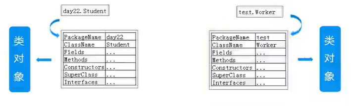

## 什么是类对象

- 类的对象：基于某个类new出来的对象，也称为实例对象

- 类对象：类加载的产物，封装了一个类的所有信息（类名、父类、接口、属性、方法、构造方法）



## 获取类对象
> 一个Class对象代表了一个.class文件
```java
class Student() {}
```

- 通过类的对象，获取类对象
```java
Student s = new Student(); // 类的对象
Class c = s.getClass(); // 类对象（Class对象，保存了Student.class这个文件的所有信息）

System.out.println(c.getName());
```

- 通过类名获取类对象
```java
Class c = Student.class;
System.out.println(c.getName());
```

- 通过静态方法获取类对象Class.forName("包名.类名")
```java
Class c = Class.forName("reflects.Student");
System.out.println(c.getName());
```