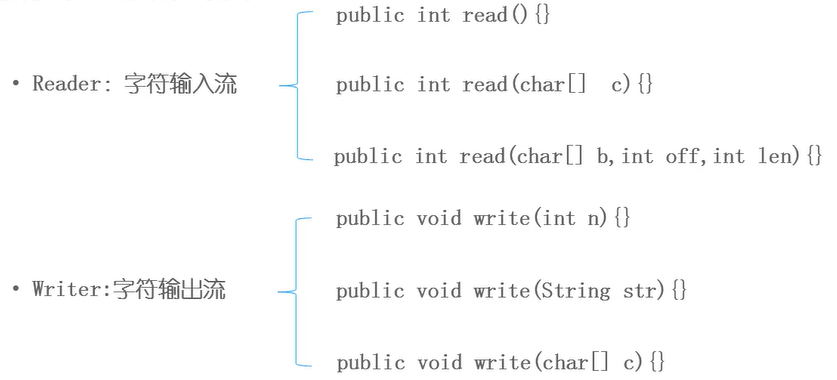

## 字符输入流




## 字符节点流
- FileWriter

- FileReader

## 字符过滤流
- 缓冲流：`BufferedWriter / BufferedReader`
  - 支持输入换行符
  - 逐行读写

- PrintWriter
  - 封装了print() / println() 方法，支持写入后换行

```java
class TestBuffered {

    public static void main(String[] args) throws IOException {
        
        Writer fw = new FileWriter("file\\b.txt");

        PrintWriter pw = new PrintWriter(fw);
        
        pw.println("Hello");
        pw.println("World");
        
        pw.close();

        Reader fr = new FileReader("file\\b.txt");
        
        BufferedReader br = new BufferedReader(fr);
        
        while (true) {
            String s = br.readLine();
            if (s == null) {break;}
            
            System.out.println(s);
        }
    }
}
```

## 使用步骤
- 创建节点流
- 封装过滤流
- 读写
- 关闭