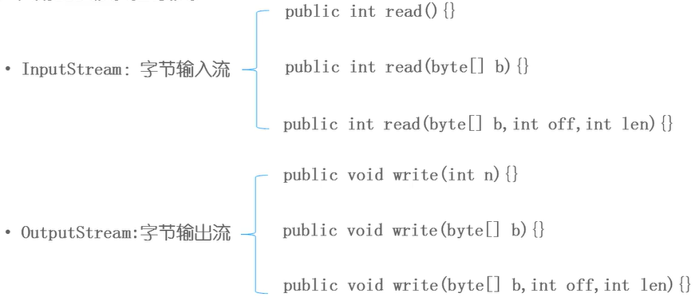
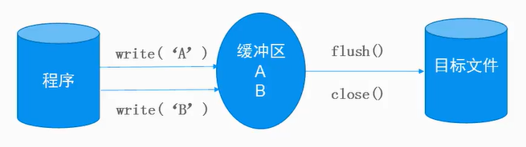

## 什么是流

- 概念：内存与存储设备之间传输数据的通道

## 流的分类

- **按方向**
  - 输入流：将《存储设备》中的内容读入到《内存》中
  - 输出流：《内存》 --> 《存储设备》

- 按单位
  - 字节流：以字节为单位，可以读写所有数据
  - 字符流：以字符为单位，只能读写文本数据

- 按功能
  - 节点流：具有实际传输数据的读写功能
  - 过滤流：在节点流的基础上增强功能

## 字节流
- 字节流的父类（抽象类）

  - InputStream：字节输入流

  - OutputStream：字节输出流



## 字节节点流
> 注意字节流读写文件是每次读写一个字节位

- FileInputStream

- FileOutputStream

## 字节过滤流
- 缓冲流： `BufferedOutputStream / BufferedInputStream`
  - 提高IO效率，减少访问磁盘的次数
  - 数据存储在缓冲区中，flush是将缓存区的内容写入文件中，也可以直接close

```java
public class Test{
  
    public static void main(String[] args) throws IOException{
        
        FileOutputStream os = new FileOutputStream("文件\\buffer.txt"); // 节点流

        BufferedOutputStream bos = new BufferedOutputStream(os); // 过滤流

        bos.write('A'); // 写到缓存中
        bos.write('B'); // 写到缓存中

        bos.flush(); // 刷新缓冲（将缓冲区的数据一次性写入文件，并清空该缓冲区）

        bos.write('C'); // 写到缓存中

        bos.close(); // 把缓存中内容写入之后再关闭文件
    }
}
```


```java
/**
 * close 源码
 */

    /**
     * Closes this output stream and releases any system resources
     * associated with the stream.
     * <p>
     * The <code>close</code> method of <code>FilterOutputStream</code>
     * calls its <code>flush</code> method, and then calls the
     * <code>close</code> method of its underlying output stream.
     *
     * @exception  IOException  if an I/O error occurs.
     * @see        java.io.FilterOutputStream#flush()
     * @see        java.io.FilterOutputStream#out
     */
    @SuppressWarnings("try")
    public void close() throws IOException {
        try (OutputStream ostream = out) {
            flush();
        }
    }
```

- 对象流：`ObjectOutputStream / ObjectInputStream`
    - 增强缓冲区功能
    - 增强了读写8种基本数据类型和字符串功能
    - 增强了读写对象的功能
        - `readObject()` 从流中读取一个对象
        - `writeObject(Object obj)` 向流中写入一个对象


- 序列化和反序列化
    - 必须实现`Serializable`接口
    - 必须保证其所有属性均可序列化
    - `transient`修饰为临时属性，不参与序列化
    - 读取文件尾部的标志：`java.io.EOFException`

```java
public class TestObjectStream {
    public static void main(String[] args) throws IOException{
        
        OutputStream os = new FileOutputStream("文件\\buffer.txt"); // 节点流

        ObjectOutputStream oos = new ObjectOutputStream(os); 

        //oos.writeDouble(3.5); // 将数据（而非文本）写入文件

        oos.writeDouble(new Student("tom",20,90.5));
        oos.writeDouble(new Student("jack",21,78.5));
        oos.flush();
        // -----------------------

        InputStream is = new FileInputStream("文件\\buffer.txt");

        ObjectInputStream ois = new ObjectInputStream(is); 

        while (true) {
            try {
                Object obj = ois.readObject();
                Student stu = (Student) obj;

                System.out.println(stu.name + "\t" + stu.age + "\t" + stu.score);
            } catch (EOFException e) {
                break;
            }
        }
        // age 打印为 null，transient修饰不参与序列化
    }
}

class Student implements Serializable{
    
    transient int age;
    String name;
    double score;

    public Student(String name, int age, double score) {
        super();
        this.name = name;
        this.age = age;
        this.score = score;
    }
}
```