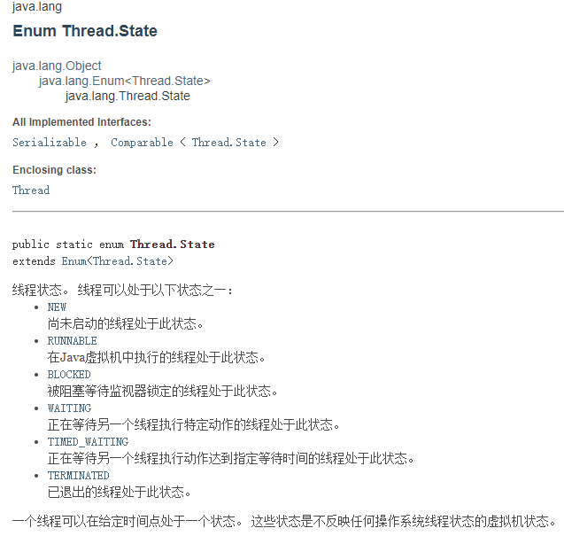
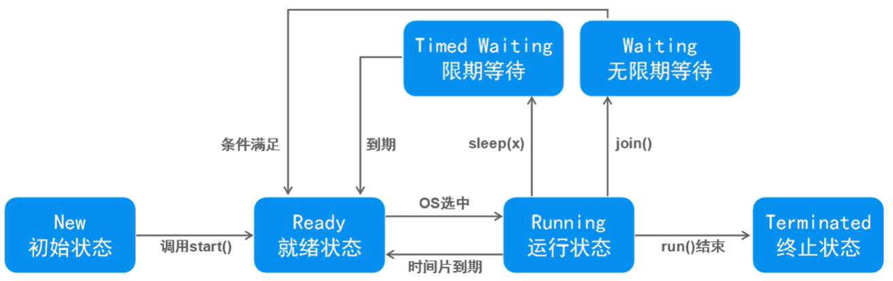
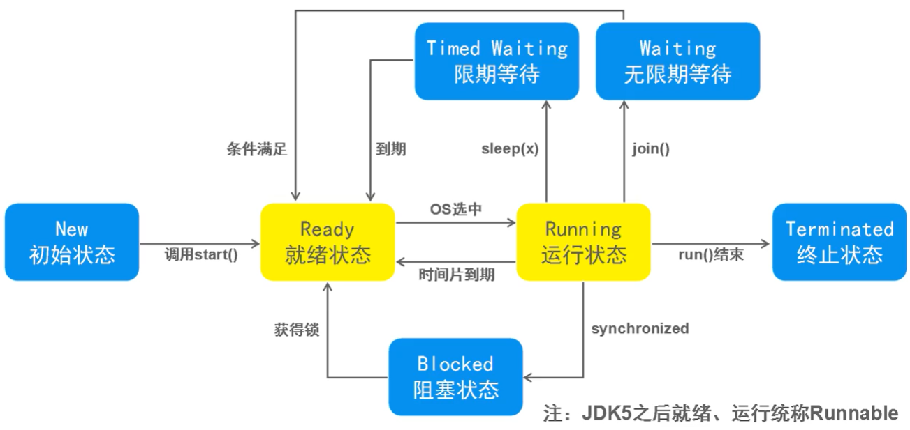

## 基本状态


> JDK线程状态



## 常见方法
- 休眠
  - `public static void sleep(long millis)`：使当前正在执行的线程以指定的毫秒数暂停（暂时停止执行），具体取决于系统定时器和调度程序的精度和准确性。
  - `public static void	sleep(long millis, int nanos)`：导致正在执行的线程以指定的毫秒数加上指定的纳秒数来暂停（临时停止执行），这取决于系统定时器和调度器的精度和准确性。

- 放弃
  - `public static void yield()`：对调度程序的一个暗示，即当前线程愿意放弃当前使用的处理器。

- 结合
  - `public void join()`：等待这个线程死亡。
  - `public void join(long millis)`：等待这个线程死亡最多 millis毫秒。
  - `public void join(long millis, int nanos)`：等待最多 millis毫秒加上 nanos纳秒这个线程死亡。



## 线程安全问题
- 线程不安全
  - 当多线程并发访问临界资源（可被共享的对象）时，如果破坏原子操作（不可再分割），可能会造成数据不一致
  - 临界资源：共享资源（同一对象），依次仅允许一个线程使用，才可保证其正确性
  - 原子操作：不可分割的多步操作，被视作一个整体，其顺序和步骤不可打乱或缺省

## 如何保证线程安全

### 同步方式（1）
- 同步代码块
```java
synchronized() { // 对临界资源对象加锁
    // 原子操作
}
```

> **每个对象都有一个互斥锁标记，用来分配给线程**
>
> 只有拥有对象互斥锁标记的线程，才能进入对该对象加速的同步代码块
> 
> 线程退出同步代码块时，会释放相应的互斥锁标记

