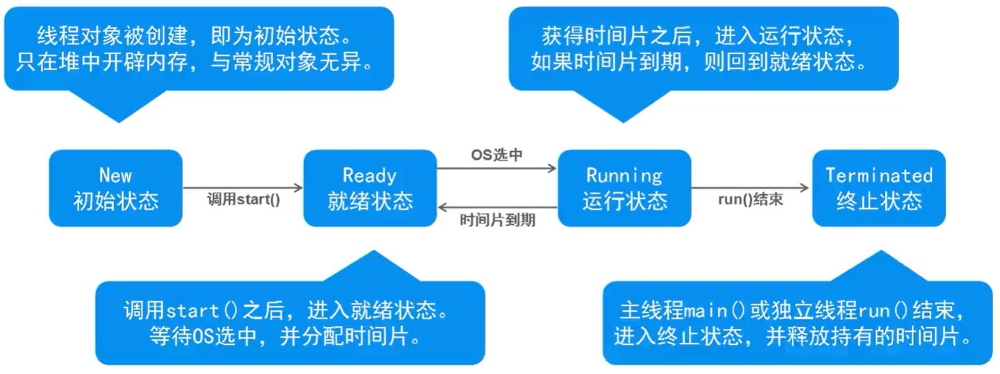

## 基本状态



> JDK线程状态


## 常见方法
- 休眠
  - `public static void sleep(long millis)`：使当前正在执行的线程以指定的毫秒数暂停（暂时停止执行），具体取决于系统定时器和调度程序的精度和准确性。
  - `public static void	sleep(long millis, int nanos)`：导致正在执行的线程以指定的毫秒数加上指定的纳秒数来暂停（临时停止执行），这取决于系统定时器和调度器的精度和准确性。

- 放弃
  - `public static void yield()`：对调度程序的一个暗示，即当前线程愿意放弃当前使用的处理器。

- 结合
  - `public void join()`：等待这个线程死亡。
  - `public void join(long millis)`：等待这个线程死亡最多 millis毫秒。
  - `public void join(long millis, int nanos)`：等待最多 millis毫秒加上 nanos纳秒这个线程死亡。


## 线程安全问题
- 线程不安全
  - 当多线程并发访问临界资源（可被共享的对象）时，如果破坏原子操作（不可再分割），可能会造成数据不一致
  - 临界资源：共享资源（同一对象），依次仅允许一个线程使用，才可保证其正确性
  - 原子操作：不可分割的多步操作，被视作一个整体，其顺序和步骤不可打乱或缺省

## 如何保证线程安全

### 同步方式（1）
- 同步代码块
```java
synchronized() { // 对临界资源对象加锁
    // 原子操作
}
```

> **每个对象都有一个互斥锁标记，用来分配给线程**
>
> 只有拥有对象互斥锁标记的线程，才能进入对该对象加速的同步代码块
> 
> 线程退出同步代码块时，会释放相应的互斥锁标记


### 同步方式（2）
- 同步方法：
```java
synchronized 返回值类型 方法名称(形参列表) { // 对当前对象（this）加锁
    // 原子操作
}
```

> 只有拥有对象互斥锁标记的线程，才能进入该对象加锁的同步方法中 


## 经典问题
- 死锁
  - 当第一个线程拥有A对象锁标记，并等待B对象锁标记，同时第二个线程拥有B对象锁标记，并等待A对象锁标记时，产生死锁
  - 一个线程可以同时拥有多个对象的锁标记，当线程阻塞时，不会释放已经拥有的锁标记，由此可能造成死锁

## 线程通信
- 等待
  - public final void wait()
  - public final void wait(long timeout)
  - 必须在对obj加锁的同步代码块中。在一个线程中，调用obj.wait()时，此线程释放其拥有的所有锁标记。同时此线程因obj处在无限期等待的状态中。
  > 释放锁，进入等待队列

- 通知
  - public final void notify()
  - public final void notifyAll()
  - 必须在对obj加锁的同步代码块中。从obj的Waiting中释放一个或全部线程。对自身没有任何影响

```java
public class Test {
    
    public static void main(String[] args) {
        
        final MyStack ms = new MyStack(); // 临界值

        Thread t1 = new Thread() {
            public void run() {
                for (char ch = 'A'; ch <= 'Z'; ch++) {
                    ms.push(ch+"");
                }
            }
        };

        Thread t2 = new Thread() {
            public void run() {
                for (int i = 0; i < 26; i++) {
                    ms.pop();
                }
            }
        };

        t1.start();
        t2.start();
    }
}


class MyStack {

    private String[] values = new String[]{"", "", "", "", ""};

    private int size = 0;

    public synchronized void push(String str) {

        this.notifyAll(); // 先唤醒对方

        while (values.length == size) {
            System.out.println("满了");
            
            try {
                this.wait();
            } catch (Exception e) {
                // 处理异常
            }
        }

        System.out.println(str + "入栈");
        values[size] = str;
        size++;
    }

    public synchronized void pop() {
        this.notifyAll(); // 先唤醒对方

        while (size == 0) {
            System.out.println("空了");
            
            try {
                this.wait();
            } catch (Exception e) {
                // 处理异常
            }
        }

        System.out.println(values[size-1] + "出栈");
        values[size-1] = "";
        size--;
    }
}
```