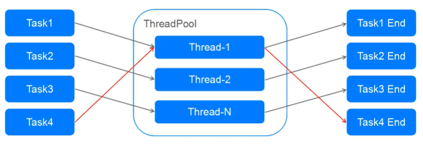
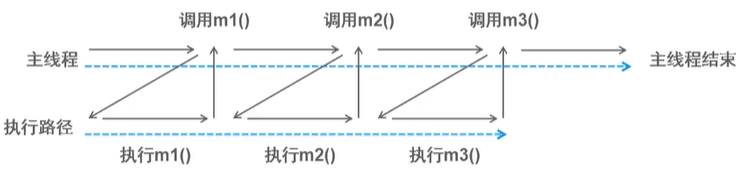
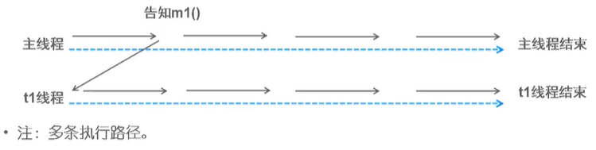
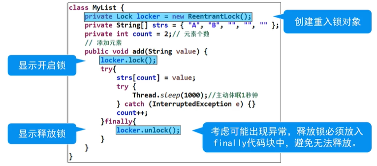

# 线程池

## 线程池概念

- 现有问题：
  - 线程是宝贵的内存资源、单个线程约占1MB空间，过多分配易造成内存溢出
  - 频繁的创建及销毁线程会增加虚拟机回收频率、资源开销，造成程序性能下降

> JVM GC中的stop the world，简称STW，即在执行垃圾收集算法时,Java应用程序的其他所有除了垃圾收集收集器线程之外的线程都被挂起。此时，系统只能允许GC线程进行运行，其他线程则会全部暂停，等待GC线程执行完毕后才能再次运行。

- 线程池
  - 线程容器，可设定线程分配的数量上限
  - 将预先创建的线程对象存入池中，并重用线程池中的线程对象
  - 避免频繁的创建和销毁

## 线程池原理



- 将任务提交给线程池，由线程池分配线程、运行任务，并在当前任务结束后复用线程

## 获取线程池
- 常用的线程池接口和类（`java.util.concurrent`包）
  - Executor接口：线程池的顶级接口

  - ExecutorService接口：线程池接口，可通过`submit(Runnable task)`提交任务代码

  - Executors工具类：通过此类可以获得一个线程池

  - 通过`newFixedThreadPool(int nThread)`获取固定数量的线程池。参数：指定线程池中线程的数量

  - 通过`newCachedThreadPool()`获取动态数量的线程池，如不够，则创建新的，没有上限

```java
import java.util.concurrent.ExecutorService;
import java.util.concurrent.Executors;

public class TestThreadPool {

    public static void main(String[] args) {

        // 线程池（引用） ---> Executots工具类（工厂类）
        ExecutorService es = Executors.newFixedThreadPool(3);

        Runnable task = new MyTask();

        es.submit(task);
        es.submit(task);
        es.submit(task);
        es.submit(task);
    }
}

class MyTask implements Runnable {

    @Override
    public void run() {
        for (int i=0; i<=1000 ; i++) {
            System.out.println(Thread.currentThread().getName() + "MyTask:" + i);
        }
    }
}
```

# Callable接口
```java
public interface Callable<V> {

    public V call() throws Exception;
}
```

- JDK5加入，与`Runnable`接口类似，实现之后代表一个线程任务
- `Callable`具有泛型返回值、可以声明异常

```java
import java.util.concurrent.ExecutorService;
import java.util.concurrent.Executors;
import java.util.concurrent.Callable;

public class Test {

    public static void main(String[] args) {

        ExecutorService es = Executors.newFixedThreadPool(3);

        Callable<String> task = new MyTask();
        es.submit(task);
    } 
}

class MyTask implements Callable<String> {

    @Override
    public String call() throws Exception {

        for (int i=1; i<=100; i++) {
            System.out.println(Thread.currentThread().getName() + ":" + i);
        }

        return null;
    }

}
```

# Future接口
- 概念：异步接收`ExecutorService.submit()`返回的状态结果，当中包含了`call()`的返回值

- 方法：`V get()`以阻塞形式等待`Future`中的异步处理结果（`call()`的返回值）

```java
public class Test {

    public static void main(String[] args) throws InterruptedException, ExecutionException {

        ExecutorService es = Executors.newFixedThreadPool(3);

        Callable<Integer> task1 = new MyTask();
        Callable<Integer> task2 = new MyTask();
        
        Future<Integer> f1 = es.submit(task1);

        Future<Integer> f2 = es.submit(task2);

        Integer res1 = f1.get(); // 无限期等待，获取返回值

        Integer res2 = f2.get(); // 

        // res1 = 1275, res2 = 3775
        System.out.println(res1 + "\t" + res2); // 异步加

    } 
}

class MyTask1 implements Callable<Integer> {

    @Override
    public Integer call() throws Exception {
        sum = 0;
        for (int i=1; i<=50; i++) {
            sum += i;
        }

        return sum;
    }
}

class MyTask2 implements Callable<Integer> {

    @Override
    public Integer call() throws Exception {
        sum = 0;
        for (int i=51; i<=100; i++) {
            sum += i;
        }

        return sum;
    }
}
```

# 同步与异步
- 同步：形容一次方法调用，同步一旦开始，调用者必须等待该方法返回，才能继续



- 异步：形容一次方法调用，异步一旦开始，像是一次消息传递，调用者告知之后立刻返回。二者竞争时间片，并发执行。




# Lock接口
- JDK5加入，与`synchronized`比较，显示定义，结构更灵活

- 提供更多使用性方法，功能更强大

- 常用方法

  - `void lock();` // 获取锁，如锁被占用，则等待
  - `boolean tryLock();` //尝试获取锁（成功返回true，失败返回false，**不阻塞**）
  - `void unlock();` //释放锁
  
## 重入锁
- `ReentrantLock`类：Lock接口的实现类，与synchronized一样具有互斥锁功能    



```java
class Account {
    Lock locker = new ReentrantLock();
    
    String cardNo;
    String password;
    double balance;
    
    public Account(String cardNo, String password, double balance) {
        super();
        this.cardNo = cardNo;
        this.password = password;
        this.balance = balance;
    }
    
    public void withdrawal(String no, String pwd, double money) {
        // 开启锁 synchronized(this) 
        locker.lock();
        
        try{
           if (this.cardNo.equals(no) && this.password.equals(pwd)) {
                       
               if (money < balance) {
                   try {
                       Thread.sleep(1000);
                   } catch (InterruptedException e) {
                       e.printStackTrace();
                   }
                           
                   balance -= money;
                                       
                   System.out.println("取款成功，当前余额为：" + balance);
               } else {
                   System.out.println("余额不足");
               }
                       
           } else {
               System.out.println("卡号或密码错误");
           } 
        } finally{
            // 释放锁
            locker.unlock();
        }
    }
}
```

## 读写锁
> 接口：ReadWriteLock (java.util.concurrent.locks)
- `ReentrantReadWriteLock`类:
  - 一种支持一写多读的同步锁，读写分离，可分别分配读锁和写锁
  - 支持多次分配读锁，使多个读操作可以并发执行
  
- 互斥规则
  - 写-写：互斥，阻塞
  - 读-写：互斥，读阻塞写、写阻塞读
  - 读-读：不互斥、不阻塞
> 在读操作远远高于写操作的环境中，可在保障线程安全的情况下，提高运行效率

```java
import java.util.concurrent.Callable;
import java.util.concurrent.ExecutorService;
import java.util.concurrent.Executors;
import java.util.concurrent.locks.ReentrantReadWriteLock;
import java.util.concurrent.locks.ReentrantReadWriteLock.ReadLock;
import java.util.concurrent.locks.ReentrantReadWriteLock.WriteLock;

public class TestReentrantReadWrite {
    
    public static void main(String[] args) {
        
        final Student s = new Student();
        
        Callable<Object> writeTask = new Callable<Object>() {
            @Override
            public Object call() throws Exception {
                s.setValue(11);
                return null;
            }
        };
        
        Callable<Object> readTask = new Callable<Object>() {
            @Override
            public Object call() throws Exception { 
                s.getValue();
                return null;
            }
        };
        
        ExecutorService es = Executors.newFixedThreadPool(20);
        
        // 开始时间
        long start = System.currentTimeMillis();
        
        for (int i=0; i<2; i++) {
            es.submit(writeTask);
        }
        
        for (int i=0; i<18; i++) {
            es.submit(readTask); 
        }
        
        // 停止线程池，不再接受新的任务，将现有任务全部执行完毕
        es.shutdown();
        
        while (es.isTerminated) {
            
        }
        
        // 耗时 
        System.out.println(System.currentTimeMillis() - start);
    }
}

class Student {
    
    // ReentrantLock rLock = new ReentrantLock();
    ReentrantReadWriteLock rwl = new ReentrantReadWriteLock();
    ReadLock rl = rwl.readLock();
    WriteLock wl = rwl.writeLock();
    
    int value;
    
    // 读
    public int getValue() {
        //rLock.lock();
        rl.lock();
        try{
            try{
                Thread.sleep(1000);
            } catch (InterruptedException e) {
                e.printStackTrace();
            }
            return this.value;
        } finally{
            //rLock.unlock();
            rl.unlock();
        }
    }
    
    // 写
    public void setValue(int value) {
        //rLock.lock();
        wl.lock();
        
        try{
            try{
                Thread.sleep(1000);
            } catch (InterruptedException e) {
                e.printStackTrace();
            }
            this.value = value;
        } finally{
            //rLock.unlock();
            wl.unlock();
        }
    }
}
```

