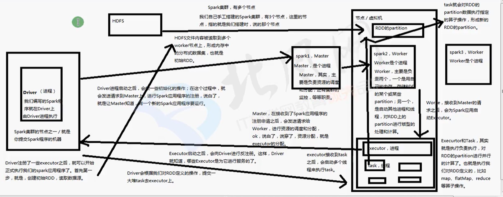

## Spark的核心编程是什么

1. 定义初始RDD，就是说定义第一个RDD是从哪里读取数据（HDFS、Linux本地文件、程序中的集合、JDBC）

2. 定义对RDD的计算操作，这个在spark里称为算子。map、reduce、flatMap、grouBy等。（比mapreduce提供的更强大）

3. 其实就是循环往复的过程，第一个计算完了以后，数据可能就会到了新的一批节点上，也就是变成一个新的RDD，然后再次反复，针对新的RDD定义计算操作

4. 获得最终的数据，将数据保存起来（将数据保存为hdfs文件或hive表数据、保存到DB中、把结果返回等）

