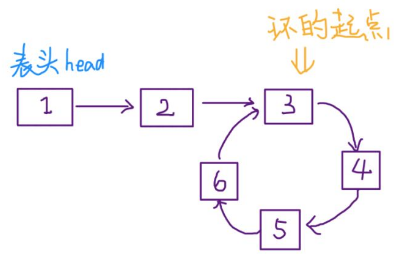
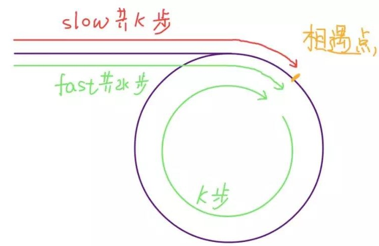
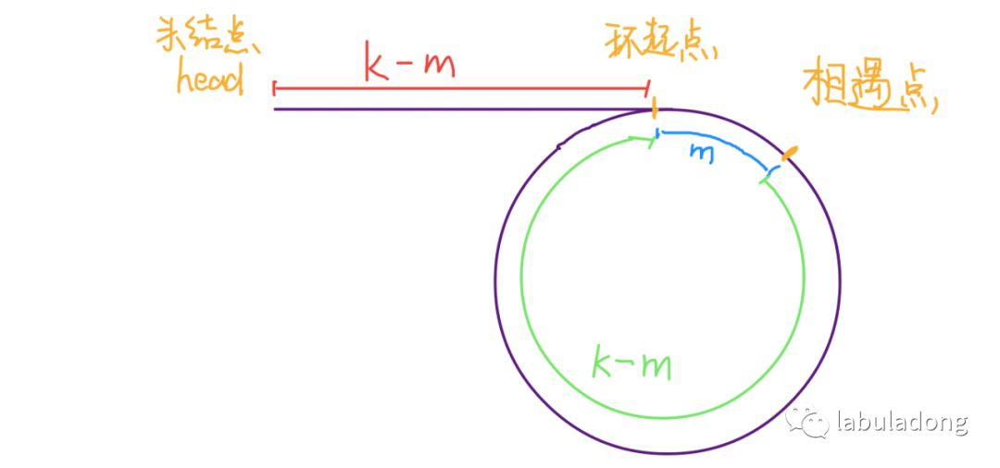
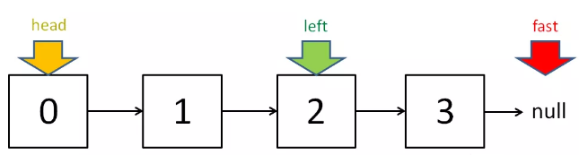
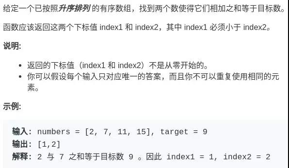

转自：https://mp.weixin.qq.com/s/yLc7-CZdti8gEMGWhd0JTg

- 双指针可以分为两类：快慢指针、左右指针

快慢指针主要解决链表中的问题，如判定链表中是否有环；左右指针可解决数组、字符串中问题，如二分查找

## 快慢指针常见算法

- 快慢指针一般都初始化指向链表的头结点 head，前进时快指针 fast 在前，慢指针 slow 在后

### 1. 判定链表中是否含有环

如果链表中含有环，单指针就会陷入死循环，因为环形链表中没有 null 指针作为尾部节点。

经典解法就是用两个指针，一个每次前进两步（fast），一个每次前进一步（slow）。如果不含有环，跑得快的那个指针最终会遇到 null，说明链表不含环；如果含有环，快指针最终会超慢指针一圈，和**慢指针相遇**，说明链表含有环。

```java
boolean hasCycle(ListNode head) {
    ListNode fast,slow;
    fast = slow = head;
    while (fast != null && fast.next != null) {
        fast = fast.next.next;
        slow = slow.next;
        
        if (fast == slow) {return true;}
    }
    return false;
}
```

### 2. 已知链表中含有环，返回这个环的起始位置



```java
ListNode detectCycle(ListNode head) {
    ListNode fast,slow;
    fast = slow = head;
    while (fast != null && fast.next != null) { // 有环的终止条件
        fast = fast.next.next;
        slow = slow.next;
        
        if (fast == slow) {break;}
    }
    
    slow = head;
    while (slow != fast) {
        fast = fast.next;
        slow = slow.next;
    }
    return slow;
}
```

- 当快慢指针相遇时，让其中任一个指针重新指向头节点，然后让它俩以相同速度前进，再次相遇时所在的节点位置就是环开始的位置。

第一次相遇时，假设慢指针 slow 走了 k 步，那么快指针 fast 一定走了 2k 步，也就是说比 slow 多走了 k 步（也就是环的长度）。



设相遇点距环的起点的距离为 m，那么环的起点距头结点 head 的距离为 k - m，也就是说如果从 head 前进 k - m 步就能到达环起点。

巧的是，如果从相遇点继续前进 k - m 步，也恰好到达环起点。



所以，只要我们把快慢指针中的任一个重新指向 head，然后两个指针同速前进，k - m 步后就会相遇，相遇之处就是环的起点了。

### 3. 寻找链表的中点

让快指针一次前进两步，慢指针一次前进一步，当快指针到达链表尽头时，慢指针就处于链表的中间位置。

```java
ListNode slow, fast;
slow = fast = head;
while (fast != null && fast.next != null) {
    fast = fast.next.next;
    slow = slow.next;
}
// slow 就在中间位置
return slow;
```

当链表的长度是奇数时，slow 恰巧停在中点位置；如果长度是偶数，slow 最终的位置是中间偏右：



> 用途：归并排序

### 4. 寻找链表的倒数第 k 个元素

让快指针先走 k 步，然后快慢指针开始同速前进。这样当快指针走到链表末尾 null 时，慢指针所在的位置就是倒数第 k 个链表节点（为了简化，假设 k 不会超过链表长度）：

```java
ListNode slow, fast;
slow = fast = head;
while (k-- > 0) 
    fast = fast.next;

while (fast != null) {
    slow = slow.next;
    fast = fast.next;
}
return slow;
```

## 左右指针常用算法

### 1. 二分查找

```java
int binarySeatch (int[] nums, int target) {
    int left = 0;
    int right = nums.length - 1;
    while (left <= right) {
        int mid = (right + left) / 2;
        if (nums[mid] == target) {
            return mid;
        } else if (nums[mid] > target) {
            right = mid - 1;
        } else {
            left = mid + 1;
        }
    }
    return -1;
}
```

### 2. 两数之和

 LeetCode 题目：




只要数组有序，就应该想到双指针技巧。通过调节 left 和 right 可以调整 sum 的大小：

```java
int[] twoSum (int[] nums, int target) {
    int left = 0;
    int right = nums.length - 1;
    while (left < right) {
        int sum = nums[left] + nums[right];
        if (sum == target) {
            return new int[]{left+1,right+1};
        } else if (sum < target) {
            left++;
        } else {
            right--;
        }
    }
    return new int[]{-1,-1};
}
```

### 3. 反转数组

```java
void reverse(int[] nums) {
    int left = 0;
    int right = nums.length - 1;
    while (left < right) {
        // swap(nums[left], nums[right])
        int temp = nums[left];
        nums[left] = nums[right];
        nums[right] = temp;
        left++; right--;
    }
}
```

### 4. 滑动窗口

> https://mp.weixin.qq.com/s/nJHIxQ2BbqhDv5jZ9NgXrQ