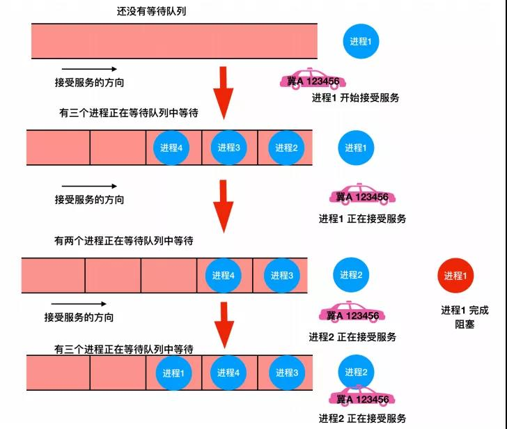
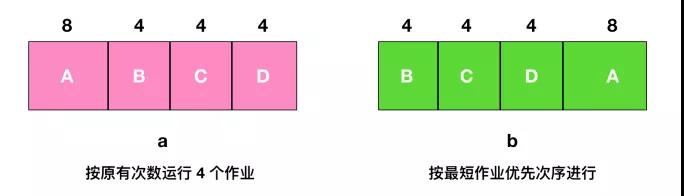
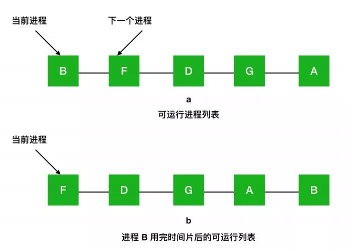
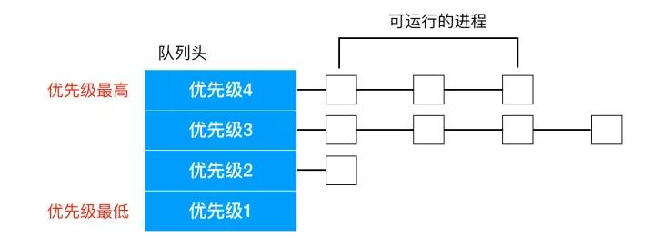
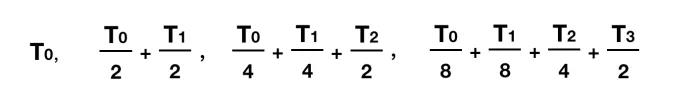
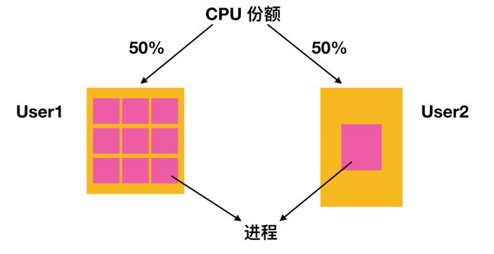

原文：https://mp.weixin.qq.com/s/J6PdEPV180ZkiUJJo97w6Q

## OS中的经典算法

### 1. 进程和线程管理中的算法

设计背景：当一个计算机是多道程序设计系统时，会频繁的有很多进程或者线程来**同时竞争 CPU 时间片**

当两个或两个以上的进程/线程处于就绪状态时，如何选择合适的进程/线程运行？

如果只有一个 CPU 可用，那么必须选择接下来哪个进程/线程可以运行。操作系统中有一个叫做 `调度程序(scheduler)` 的角色存在，它就是做这件事儿的，调度程序使用的算法叫做 `调度算法(scheduling algorithm)` 。

#### 调度算法分类

针对不同的操作系统环境，也有不同的算法分类，操作系统主要分为下面这几种

- 批处理操作系统
- 交互式操作系统
- 实时操作系统

#### 批处理操作系统中的算法

- #### 设计目标

`批处理系统`广泛应用于商业领域，比如用来处理工资单、存货清单、账目收入、账目支出、利息计算、索赔处理和其他周期性作业。在批处理系统中，一般会选择使用**`非抢占式算法`**或者**`周期性比较长`**的**`抢占式算法`**。这种方法可以减少线程切换因此能够提升性能。

在**`交互式用户环境`**中，因为为了用户体验，所以会避免长时间占用进程，所以需要**`抢占式算法`**。由于某个进程出现错误也有可能无限期的排斥其他所有进程。为了避免这种情况，抢占式也是必须的。

- #### 关键指标

  - `吞吐量(throughout)` 是系统每小时完成的作业数量。综合考虑，每小时完成 50 个工作要比每小时完成 40 个工作好。
  - `周转时间(Turnaround time)` 是一种平均时间，它指的是从一个批处理提交开始直到作业完成时刻为止的平均时间。该数据度量了用户要得到输出所需的平均等待时间。周转时间越小越好。
  - `CPU 利用率(CPU utilization)` 通常作为批处理系统上的指标。即使如此，CPU 利用率也不是一个好的度量指标，真正有价值的衡量指标是系统每小时可以完成多少作业（吞吐量），以及完成作业需要多长时间（周转时间）。

- #### 先来先服务

在这个算法中，一个单链表记录了所有就绪进程。要选取一个进程运行，只要从该队列的头部移走一个进程即可；要添加一个新的作业或者阻塞一个进程，只要把这个作业或进程附加在队列的末尾即可。这是很简单的一种实现。

- #### 最短作业优先

如上图 a 所示，这里有 4 个作业 A、B、C、D ，运行时间分别为 8、4、4、4 分钟。若按图中的次序运行，则 A 的周转时间为 8 分钟，B 为 12 分钟，C 为 16 分钟，D 为 20 分钟，平均时间内为 14 分钟。

现在考虑使用最短作业优先算法运行 4 个作业，如上图 b 所示，目前的周转时间分别为 4、8、12、20，平均为 11 分钟，可以证明最短作业优先是最优的。考虑有 4 个作业的情况，其运行时间分别为 a、b、c、d。第一个作业在时间 a 结束，第二个在时间 a + b 结束，以此类推。平均周转时间为 (4a + 3b + 2c + d) / 4 。显然 a 对平均值的影响最大，所以 a 应该是最短优先作业，其次是 b，然后是 c ，最后是 d 它就只能影响自己的周转时间了。

> 在所有的进程都可以运行的情况下，最短作业优先的算法才是最优的。

- #### 最短剩余时间优先

调度程序总是选择剩余运行时间最短的那个进程运行。

#### 交互式系统中的调度

- #### 轮询调度（轮转调度）

一种最古老、最简单、最公平并且最广泛使用的算法就是 `轮询算法(round-robin)`。每个进程都会被**分配一个时间段**，称为`时间片(quantum)`，在这个时间片内允许进程运行。如果进程在时间片结束前阻塞或结束，则 CPU 立即进行切换。

- #### 优先级调度

- #### 最短进程优先

对于批处理系统而言，由于最短作业优先常常伴随着最短响应时间，所以如果能够把它用于交互式进程，那将是非常好的。交互式进程通常遵循下列模式：等待命令、执行命令、等待命令、执行命令。。。如果我们把每个命令的执行都看作一个分离的作业，那么我们可以通过首先运行最短的作业来使响应时间最短。这里唯一的问题是如何从当前可运行进程中找出最短的那一个进程。

一种方式是根据进程过去的行为进行推测，并执行估计运行时间最短的那一个。假设每个终端上每条命令的预估运行时间为 `T0`，现在假设测量到其下一次运行时间为 `T1`，可以用两个值的加权来改进估计时间，即`a*T0+ (1- *)T1`。通过选择 a 的值，可以决定是尽快忘掉老的运行时间，还是在一段长时间内始终记住它们。当 a = 1/2 时，可以得到下面这个序列

可以看到，在三轮过后，T0 在新的估计值中所占比重下降至 1/8。

有时把这种通过当前测量值和先前估计值进行加权平均从而得到下一个估计值的技术称作 `老化(aging)`。这种方法会使用很多预测值基于当前值的情况。

- #### 保证调度

一种完全不同的调度方法是对用户做出明确的性能保证。一种实际而且容易实现的保证是：若用户工作时有 n 个用户登录，则每个用户将获得 CPU 处理能力的 1/n。类似地，在一个有 n 个进程运行的单用户系统中，若所有的进程都等价，则每个进程将获得 1/n 的 CPU 时间。

- #### 彩票调度

对用户进行承诺并在随后兑现承诺是一件好事，不过很难实现。但是有一种既可以给出预测结果而又有一种比较简单的实现方式的算法，就是 `彩票调度(lottery scheduling)`算法。

其基本思想是为进程提供各种系统资源（例如 CPU 时间）的彩票。当做出一个调度决策的时候，就随机抽出一张彩票，拥有彩票的进程将获得该资源。在应用到 CPU 调度时，系统可以每秒持有 50 次抽奖，每个中奖者将获得比如 20 毫秒的 CPU 时间作为奖励。

如果希望进程之间协作的话可以交换它们之间的票据。例如，客户端进程给服务器进程发送了一条消息后阻塞，客户端进程可能会把自己所有的票据都交给服务器，来增加下一次服务器运行的机会。当服务完成后，它会把彩票还给客户端让其有机会再次运行。事实上，如果没有客户机，服务器也根本不需要彩票。

- #### 公平分享调度

到目前为止，我们假设被调度的都是各个进程自身，而不用考虑该进程的拥有者是谁。结果是，如果用户 1 启动了 9 个进程，而用户 2 启动了一个进程，使用轮转或相同优先级调度算法，那么用户 1 将得到 90 % 的 CPU 时间，而用户 2 将之得到 10 % 的 CPU 时间。

为了阻止这种情况的出现，一些系统在调度前会把进程的拥有者考虑在内。在这种模型下，每个用户都会分配一些CPU 时间，而调度程序会选择进程并强制执行。因此如果两个用户每个都会有 50% 的 CPU 时间片保证，那么无论一个用户有多少个进程，都将获得相同的 CPU 份额。

### 2. 内存管理中的算法

操作系统有两种内存管理方式，一种是`位图`，一种是 `链表`。

### 3. 页面置换算法