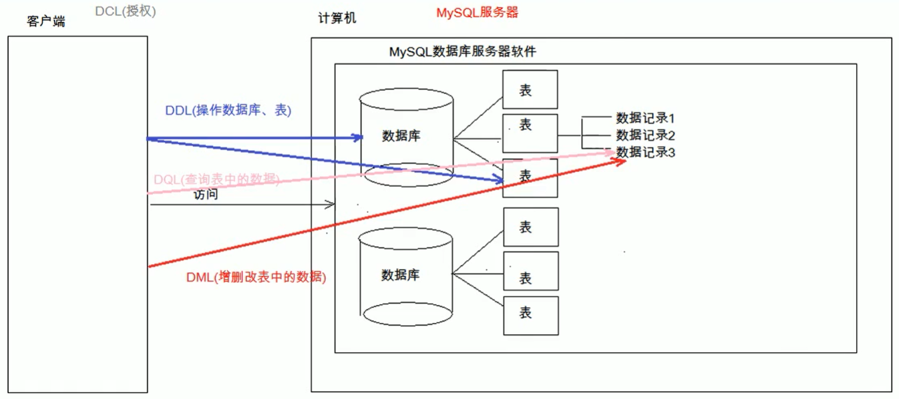

> https://www.bilibili.com/video/BV1S4411u74E?p=2

MySQL Workbench

> 安装教程

### MySQL服务启动
  - 手动
  - cmd --> services.msc 服务
  - 管理员cmd
    * net start mysql
    * net stop mysql

### MySQL登录
  - mysql -uroot -p密码
  - mysql -hip地址 -uroot -p目标密码
  - mysql --host=ip --user=root --password=密码

### MySQL推出
  - exit
  - quit

### 目录结构
  - 安装目录
  - 数据目录
    * 数据库：文件夹
    * 表：文件
    * 数据

# SQL 
结构化查询语言（Structured Query Language），定义了操作所有关系数据库规则。每一种数据库操作的方式存在不一样的地方

## 通用语法
1. SQL语句可以单行或多行书写，以分号结尾。
2. 可以使用空格和缩进来增强语句的可读性。
3. MySQL数据库的SQL语句不区分大小写，关键字建议大写。
4. 3种注释
  * 单行注释：`-- 注释内容` 或 `#注释内容`
  * 多行注释：`/*注释*/`
## 语句分类
1.  DDL(Data Definition Language)数据定义语言

用来定义数据库对象：数据库，表，列等。关键字：`create`, `drop`, `alter`等

2. DML(Data Manipulation Language)数据操作语言

用来对数据库中表的数据进行增删改。关键字：`insert`, `delete`, `update`等

3. DQL(Data Query Language)数据查询语言

用来查询数据库中表的记录（数据）。关键字：`select`, `where`等。

4. DCL(Data Control Language)数据控制语言

用来定义数据库的访问权限和安全级别，及创建用户。关键字：`grant`, `revoke`等。

# DDL:操作数据库、表
- 操作数据库：CRUD
  * Create
    + `create database if not exists db1;`: 创建时判断先进行判断
  * Retrieve: 查询
    + `show databases;`: 查询所有数据库名称
    + `show create database 数据库名称`: 查询创建数据库
  * Update
  * Delete
  * 使用数据库