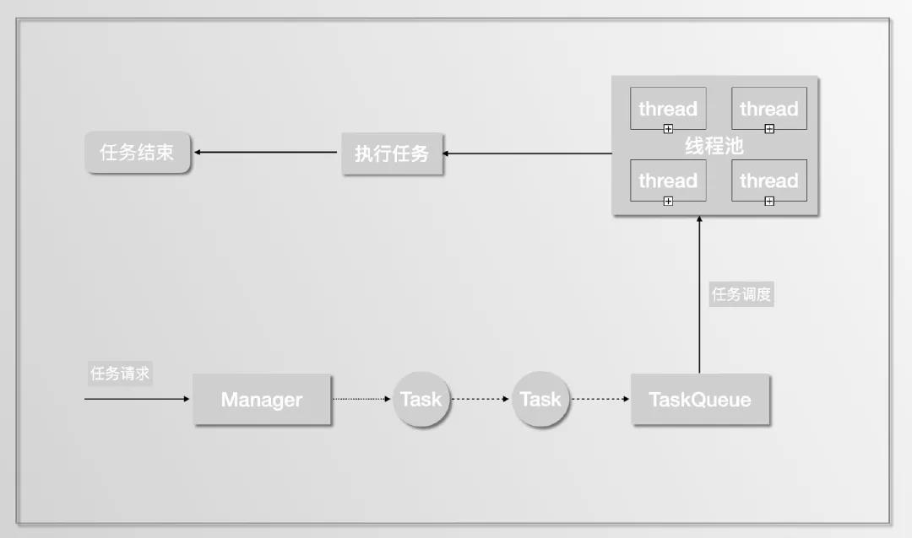

## 池化

> https://mp.weixin.qq.com/s/OPXM8ArXmafiuVtrjqvacg

在后台开发过程中，离不开各种 **「池子」：** 内存池、连接池、线程池、对象池......

内存、连接、线程这些都是资源，创建线程、分配内存、数据库连接这些操作都有一个特征， 那就是**创建和销毁过程都会涉及到很多系统调用或者网络 IO。** 每次都在请求中去申请创建这些资源，就会增加请求处理耗时，但是如果我们用一个 **容器（池）** 把它们保存起来，下次需要的时候，直接拿出来使用，避免重复创建和销毁浪费的时间。

### 1. 内存池

在 C/C++ 中，经常使用 malloc、new 等 API 动态申请内存。由于申请的内存块大小不一，如果频繁的申请、释放会导致大量的**内存碎片**，并且这些  API 底层依赖系统调用，会有额外的开销。

**内存池就是在使用内存前，先向系统申请一块空间留做备用，使用者需要内池时向内存池申请，用完后还回来。**

内存池的思想非常简单，实现却不简单，难点在于以下几点:

- **如何快速分配内存**
- **降低内存碎片率**
- **维护内存池所需的额外空间尽量少**

### 2. 线程池

线程就是我们**程序执行的实体**。在服务器开发领域，我们经常会为每个请求分配一个线程去处理，但是**线程的创建销毁、调度都会带来额外的开销**，线程太多也会导致系统整体性能下降。在这种场景下，我们通常会提前创建若干个线程，通过线程池来进行管理。当请求到来时，只需从线程池选一个线程去执行处理任务即可。

线程池常常和**队列**一起使用来实现**任务调度**，主线程收到请求后将创建对应的任务，然后放到队列里，线程池中的工作线程等待队列里的任务。

线程池实现上一般有四个核心组成部分:

- **管理器（Manager）:** 用于创建并管理线程池。
- **工作线程（Worker）:** 执行任务的线程。
- **任务接口（Task）:** 每个具体的任务必须实现任务接口，工作线程将调用该接口来完成具体的任务。
- **任务队列（TaskQueue）:** 存放还未执行的任务。

如下线程池模型

在 Java 中 **「ThreadPoolExecutor」** 类就是线程池的实现。

### 3. 连接池

顾名思义，连接池是创建和管理连接的。

大家最熟悉的莫过于数据库连接池，这里我们简单分析下如果不用数据库连接池，一次 SQL 查询请求会经过哪些步骤:

1. **和 MySQL server 建立 TCP 连接:**

2. - 三次握手

3. **MySQL 权限认证：**

4. - Server 向 Client 发送 密钥
   - Client 使用密钥加密用户名、密码等信息，将加密后的报文发送给 Server
   - Server 根据 Client 请求包，验证是否是合法用户，然后给 Client 发送认证结果

5. **Client 发送 SQL 语句**

6. **Server 返回语句执行结果**

7. **MySQL 关闭**

8. **TCP 连接断开**

9. - 四次挥手

可以看出不使用连接池的话，为了执行一条 SQL，会花很多时间在安全认证、网络IO上。

如果使用连接池，执行一条 SQL 就省去了建立连接和断开连接所需的额外开销。

## 总结

**池化实际上是预处理和延后处理的一种应用场景，通过池子将各类资源的创建提前和销毁延后。**

