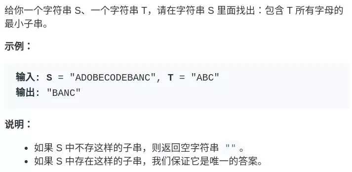
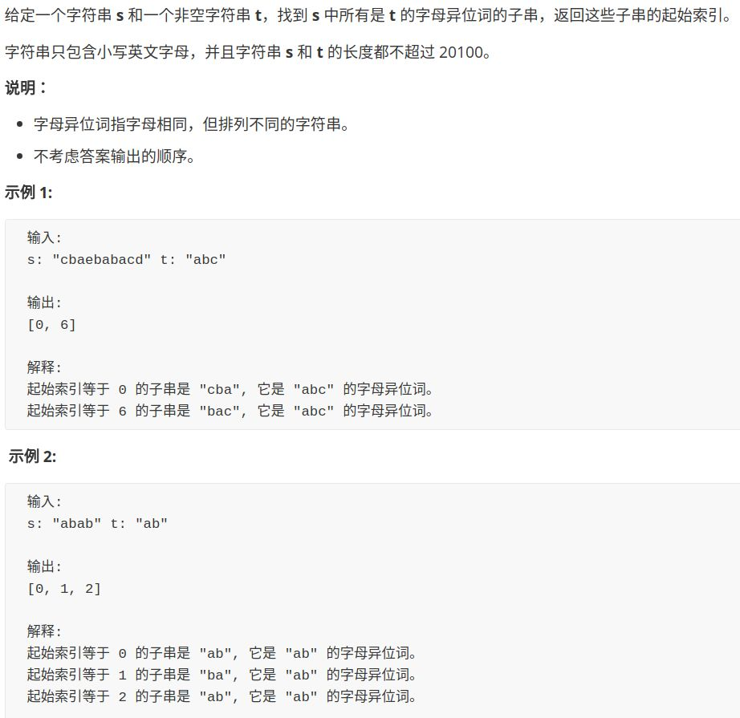

> https://mp.weixin.qq.com/s/nJHIxQ2BbqhDv5jZ9NgXrQ

## 一、最小覆盖子串



> 暴力解法

```java
for (int i = 0; i < s.size(); i++)
    for (int j = i + 1; j < s.size(); j++)
        if s[i:j] 包含 t 的所有字母:
            更新答案
```

#### 滑动窗口

- 在字符串 `s` 中使用双指针中的左右指针技巧，初始化` left = right = 0`
- 不断地增加` right` 指针扩大窗口 [left, right]，直到窗口中的字符串符合要求（包含了 T 中的所有字符）
- 停止增加 `right`，转而不断增加` left `指针缩小窗口 [left, right]，直到窗口中的字符串不再符合要求（不包含 T 中的所有字符了）。同时，每次增加 `left`，我们都要更新一轮结果。
- 重复第 2 和第 3 步，直到` right `到达字符串 S 的尽头

> **第 2 步相当于在寻找一个「可行解」，然后第 3 步在优化这个「可行解」，最终找到最优解。**

```java
string s, t;

// 在 s 中寻找 t 的「最小覆盖子串」
int left = 0, right = 0;
string res = s;
// 先移动 right 寻找可行解
while(right < s.size()) {
    window.add(s[right]);
    right++;
    // 找到可行解后，开始移动 left 缩小窗口
    while (window 符合要求) {
        // 如果这个窗口的子串更短，则更新结果
        res = minLen(res, window);
        window.remove(s[left]);
        left++;
    }
}
return res;
```

在对窗口判断的时候，需要引入哈希表，记录元素出现次数及出现字符

```java
import java.util.HashMap;
import java.util.Map;

public class Minimum {
    /**
     * @param s : A string
     * @param t: A string
     * @return: A string denote the minimum window, return "" if there is no such a string
     */
    public static String minWindow(String s, String t) {
        /**
         * 不忽略t中重复的元素
         */
        // 在s中找t的最小覆盖子串
        int left = 0, right = 0;
        String res = s+"#"; // 记录的结果字符串

        // 两个计数器Map
        Map<Character, Integer> window = new HashMap<>();
        Map<Character, Integer> needs = new HashMap<>();
        for (int i = 0; i < t.length(); i++) {
            if (needs.containsKey(t.charAt(i))) {
                needs.put(t.charAt(i),needs.get(t.charAt(i))+1);
            } else {
                needs.put(t.charAt(i),1);
            }
        }

        // 记录window中已经有多少字符匹配
        int match = 0;

        while (right < s.length()) {
            char ch = s.charAt(right);

            if (needs.containsKey(ch)) {
                if (window.containsKey(ch)) {
                    window.put(ch,window.get(ch)+1);
                } else {
                    window.put(ch,1);
                }

                //System.out.println(window.get(ch));
                //System.out.println(needs.get(ch).equals(window.get(ch)));

                if (needs.get(ch).equals(window.get(ch))) { // 这里必须使用equals!!!!，因为当数value大于127时, Integer 128 == Integer 128 为false（缓冲池问题）
                    // 该字符成功匹配
                    match++;
                }
            }
            right++;

            while (match == needs.size()) {
                // 更新结果
                if (right - left < res.length()) {
                    res = s.substring(left,right);
                }
                ch = s.charAt(left);
                if (needs.containsKey(ch)) {
                    window.put(ch,window.get(ch)-1);
                    if (window.get(ch) < needs.get(ch)) {
                        match--;
                    }
                }
                left++;
            }
        }

        return res.length()>s.length()?"":res;
    }

    public static void main(String[] args) {
        String source = "aaaaaa",
                target = "aaa";
        //System.out.println(minWindow(source,target));

        Integer x = 127;
        Integer y = 127;
        System.out.println(x == y);
    }
}
```

## 二、找到字符串中所有字母异位词



#### 解法一、直接修改上题更新结果的代码

```java
public static List<Integer> findAnagrams(String s, String p) {
        // write your code here
        /**
         * 滑动解法，只是修改了更新结果的部分
         */
        int left, right;
        left = right = 0;

        List<Integer> res = new ArrayList<>();
        int[] window = new int[128];
        int[] needs = new int[128];
        int characters = 0; // t中不同字符的个数

        for (int i = 0; i < p.length(); i++) {
            int pos = p.charAt(i);
            needs[pos]++;
            if (needs[pos] == 1) {
                characters++;
            }
        }

        int match = 0;
        while (right < s.length()) {
            int pos = s.charAt(right);

            if (needs[pos] > 0) {
                window[pos]++;

                if (needs[pos] == window[pos]) {
                    match++;
                }
            }
            right++;

            while (match == characters) {
                if (right - left == p.length()) {
                    res.add(left);
                }
                pos = s.charAt(left);
                if (needs[pos] > 0) {
                    window[pos]--;
                    if (window[pos] < needs[pos]) {
                        match--;
                    }
                }
                left++;
            }
        }
        return res;
    }
```

#### 解法二、异或+hash判断是否异位

```java
public static List<Integer> find(String s, String p) {
        /**
         * 尝试其他解法
         *
         * LC158题解法:  异或+hash可以快速判断是否为 anagram异位词
         *
         * 窗口可固定为p.length大小，不断移动窗口，判断窗口内的子串是否满足条件
         *
         * 性质： a^b^b = a; 异或运算
         *
         */

        List<Integer> res = new ArrayList<>();
        if (p.length() > s.length()) {return res;}

        int por, phash,  // 目标子串的异或值，和hash值
                mor, mhash; // 滑动窗口异或值与hash值
        por = phash = mor = mhash = 0;
        for (int i=0; i<p.length(); i++) {
            int pv = p.charAt(i); // 转为int
            int mv = s.charAt(i);
            por = por ^ pv; // 异或
            phash += pv%13; // 计算总和

            mor = mor ^ mv;
            mhash += mv%13;
        }

        if (mor==por && phash==mhash) {res.add(0);} // 第一个窗口满足条件
        /*到这里窗口已经固定为p.length大小了，开始滑动与判断*/

        int left = 0, right = p.length();
        while (right < s.length()) {
            int rv = s.charAt(right);
            int lv = s.charAt(left);

            mor ^= lv ^ rv; // 先异或left位置消除（x^a^a=x），再异或right位置添加
            mhash += rv%13 - lv%13;

            left++;
            right++;
            if (mor == por && mhash == phash) {
                res.add(left);
            }
        }
        return res;
    }
```

