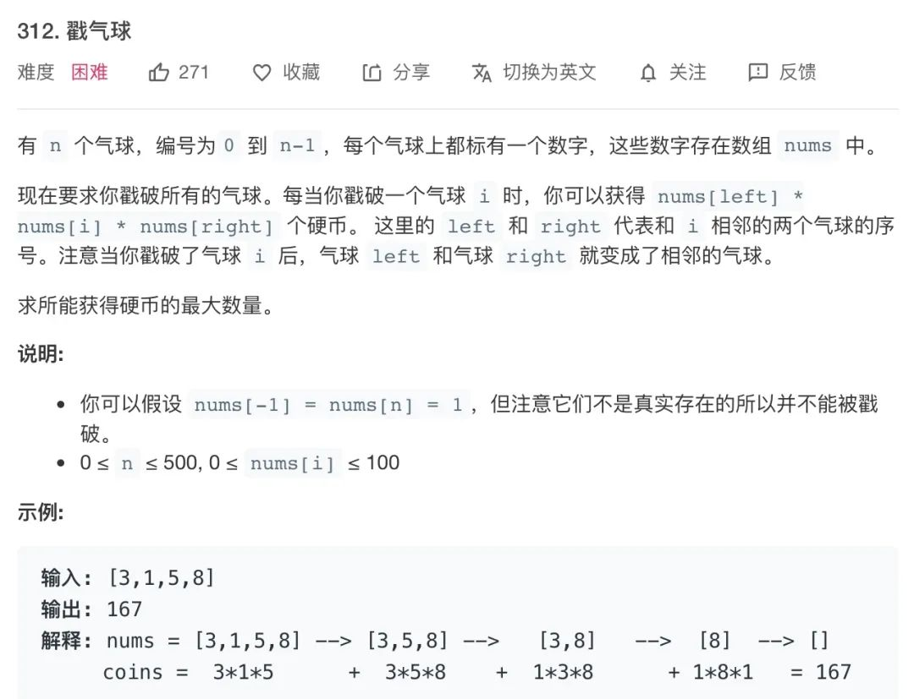
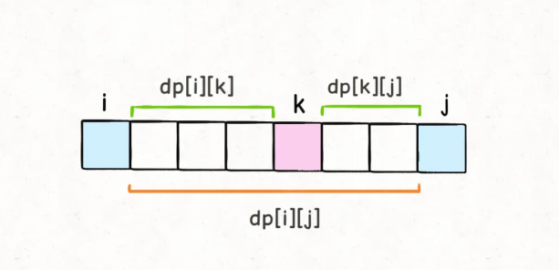
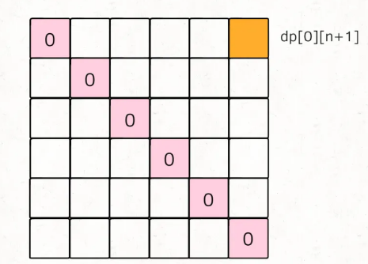
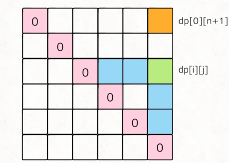
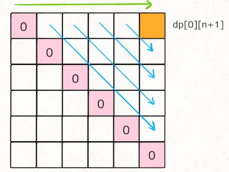
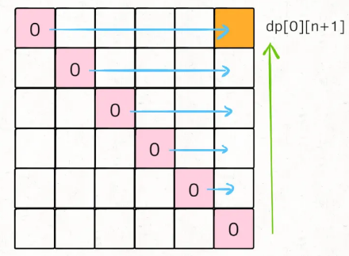

> 转自：https://mp.weixin.qq.com/s/I0yo0XZamm-jMpG-_B3G8g

## LC题目描述



## 回溯思路

> **穷举戳气球的顺序**，不同的戳气球顺序可能得到不同的分数，我们需要把所有可能的分数中最高的那个找出来。

```java
int res = Integer.MIN_VALUE;
/* 输入一组气球，返回戳破它们获得的最大分数 */
int maxCoins(int[] nums) {
    backtrack(nums, 0);
    return res;
}
/* 回溯算法的伪码解法 */
void backtrack(int[] nums, int socre) {
    if (nums 为空) {
        res = max(res, score);
        return;
    }
    for (int i = 0; i < nums.length; i++) {
        int point = nums[i-1] * nums[i] * nums[i+1];
        int temp = nums[i];
        // 做选择
        在 nums 中删除元素 nums[i]
        // 递归回溯
        backtrack(nums, score + point);
        // 撤销选择
        将 temp 还原到 nums[i]
    }
}
```

## 动态规划

**每戳破一个气球`nums[i]`，得到的分数和该气球相邻的气球`nums[i-1]`和`nums[i+1]`是有相关性的**。

而运用动态规划算法的一个重要条件：**子问题必须独立**。所以对于这个戳气球问题，如果想用动态规划，必须巧妙地定义`dp`数组的含义，避免子问题产生相关性，才能推出合理的状态转移方程。

如何定义`dp`数组呢，这里需要对问题进行一个简单地转化。题目说可以认为`nums[-1] = nums[n] = 1`，那么我们先直接把这两个边界加进去，形成一个新的数组`points`：

```java
int maxCoins(int[] nums) {
    int n = nums.length;
    // 两端加入两个虚拟气球
    int[] points = new int[n + 2];
    points[0] = points[n + 1] = 1;
    for (int i = 1; i <= n; i++) {
        points[i] = nums[i - 1];
    }
    // ...
}
```

现在气球的索引变成了从`1`到`n`，`points[0]`和`points[n+1]`可以认为是两个「虚拟气球」。

那么我们可以改变问题：**在一排气球`points`中，请你戳破气球`0`和气球`n+1`之间的所有气球（不包括`0`和`n+1`），使得最终只剩下气球`0`和气球`n+1`两个气球，最多能够得到多少分**？

- 定义`dp`数组的含义：

**`dp[i][j] = x`表示，戳破气球`i`和气球`j`之间（开区间，不包括`i`和`j`）的所有气球，可以获得的最高分数为`x`**。

那么根据这个定义，题目要求的结果就是`dp[0][n+1]`的值，而 base case 就是`dp[i][j] = 0`，其中`0 <= i <= n+1, j <= i+1`，因为这种情况下，开区间`(i, j)`中间根本没有气球可以戳。

```java
// base case 已经都被初始化为 0
int[][] dp = new int[n + 2][n + 2];
```

不是要最后戳破气球`k`吗？那得先把开区间`(i, k)`的气球都戳破，再把开区间`(k, j)`的气球都戳破；最后剩下的气球`k`，相邻的就是气球`i`和气球`j`，这时候戳破`k`的话得到的分数就是`points[i]*points[k]*points[j]`。

那么戳破开区间`(i, k)`和开区间`(k, j)`的气球最多能得到的分数是多少呢？就是`dp[i][k]`和`dp[k][j]`！



那么，对于一组给定的`i`和`j`，我们只要穷举`i < k < j`的所有气球`k`，选择得分最高的作为`dp[i][j]`的值即可，这也就是状态转移方程：

```java
// 最后戳破的气球是哪个？
for (int k = i + 1; k < j; k++) {
    // 择优做选择，使得 dp[i][j] 最大
    dp[i][j] = Math.max(
        dp[i][j], 
        dp[i][k] + dp[k][j] + points[i]*points[j]*points[k]
    );
}
```

写出状态转移方程就完成这道题的一大半了，但是还有问题：对于`k`的穷举仅仅是在做「选择」，但是应该如何穷举「状态」`i`和`j`呢？

```java
for (int i = ...; ; )
    for (int j = ...; ; )
        for (int k = i + 1; k < j; k++) {
            dp[i][j] = Math.max(
                dp[i][j], 
                dp[i][k] + dp[k][j] + points[i]*points[j]*points[k]
            );
return dp[0][n+1];
```

- **关于「状态」的穷举，最重要的一点就是：状态转移所依赖的状态必须被提前计算出来**。

`dp[i][j]`所依赖的状态是`dp[i][k]`和`dp[k][j]`，那么我们必须保证：在计算`dp[i][j]`时，`dp[i][k]`和`dp[k][j]`已经被计算出来了（其中`i < k < j`）。**根据 base case 和最终状态进行推导**。

先把 base case 和最终的状态在 DP table 上画出来：



对于任一`dp[i][j]`，我们希望所有`dp[i][k]`和`dp[k][j]`已经被计算，画在图上就是这种情况：



可以有两种遍历方法，要么斜着遍历，要么从下到上从左到右遍历：





- 从下往上遍历写法

```java
int maxCoins(int[] nums) {
    int n = nums.length;
    // 添加两侧的虚拟气球
    int[] points = new int[n + 2];
    points[0] = points[n + 1] = 1;
    for (int i = 1; i <= n; i++) {
        points[i] = nums[i - 1];
    }
    // base case 已经都被初始化为 0
    int[][] dp = new int[n + 2][n + 2];
    // 开始状态转移
    // i 应该从下往上
    for (int i = n; i >= 0; i--) {
        // j 应该从左往右
        for (int j = i + 1; j < n + 2; j++) {
            // 最后戳破的气球是哪个？
            for (int k = i + 1; k < j; k++) {
                // 择优做选择
                dp[i][j] = Math.max(
                    dp[i][j], 
                    dp[i][k] + dp[k][j] + points[i]*points[j]*points[k]
                );
            }
        }
    }
    return dp[0][n + 1];
}
```

