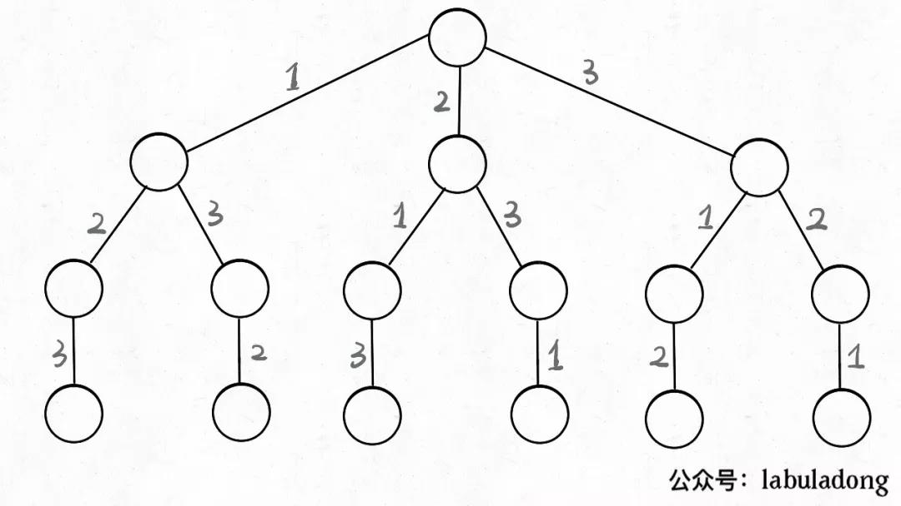
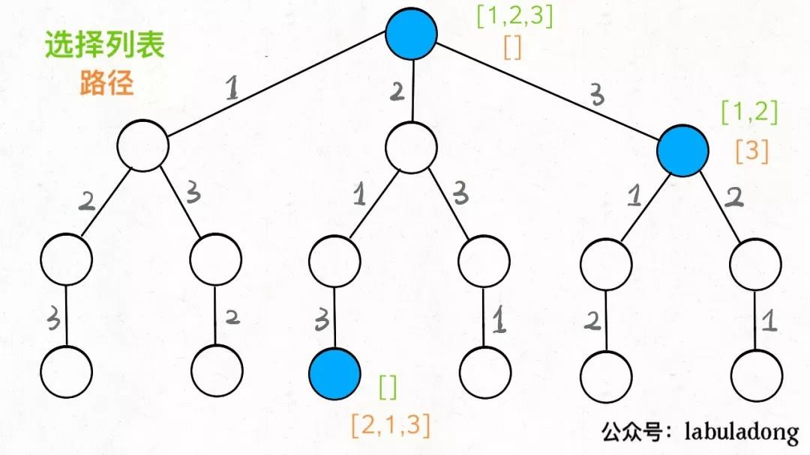
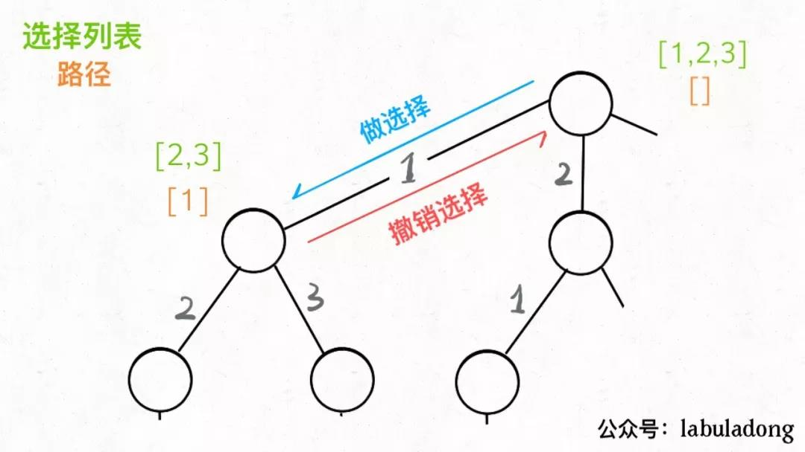
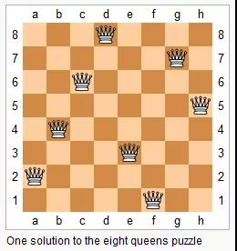
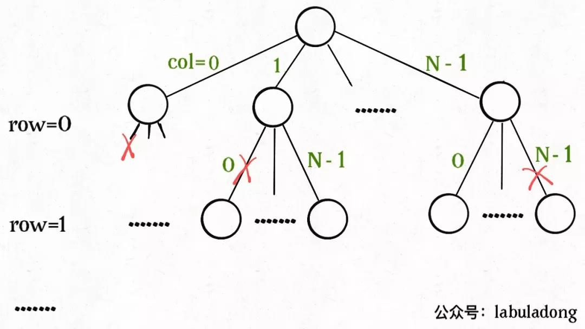

> https://mp.weixin.qq.com/s/nMUHqvwzG2LmWA9jMIHwQQ

## 框架：**决策树的遍历过程**
需要考虑3个问题

1. 路径：（已经做出的选择）
2. 选择列表：（当前可以做的选择）
3. 结束条件

```py
result = []
def backtrack(路径, 选择列表):
    if 满足结束条件:
        result.add(路径)
        return

    for 选择 in 选择列表:
        做选择
        backtrack(路径, 选择列表)
        撤销选择
```

**核心就是 for 循环里面的递归，在递归调用之前「做选择」，在递归调用之后「撤销选择」**

## 全排列问题
n个不重复的数，全排列共有n！个



只要从根遍历这棵树，记录路径上的数字，其实就是所有的全排列。我们不妨把这棵树称为回溯算法的「**决策树**」。
> 在每个节点上其实都在做决策



所定义的backtrack函数其实就像一个指针，在这棵树上游走，同时要正确维护每个节点的属性，每当走到树的底层，其「路径」就是一个全排列。



```py
for 选择 in 选择列表:
    # 做选择
    将该选择从选择列表移除
    路径.add(选择)
    backtrack(路径, 选择列表)
    # 撤销选择
    路径.remove(选择)
    将该选择再加入选择列表
```

只要**在递归之前做出选择**，在**递归之后撤销刚才的选择**，就能正确得到每个节点的选择列表和路径。

代码如下：
```java
List<List<Integer>> res = new LinkedList<>();

/* 主函数，输入一组不重复的数字，返回它们的全排列 */
List<List<Integer>> permute(int[] nums) {
    // 记录「路径」
    LinkedList<Integer> track = new LinkedList<>();
    backtrack(nums, track);
    return res;
}

// 路径：记录在 track 中
// 选择列表：nums 中不存在于 track 的那些元素
// 结束条件：nums 中的元素全都在 track 中出现
void backtrack(int[] nums, LinkedList<Integer> track) {
    // 触发结束条件
    if (track.size() == nums.length) {
        res.add(new LinkedList(track));
        return;
    }

    for (int i = 0; i < nums.length; i++) {
        // 排除不合法的选择
        if (track.contains(nums[i]))
            continue;
        // 做选择
        track.add(nums[i]);
        // 进入下一层决策树
        backtrack(nums, track);
        // 取消选择
        track.removeLast();
    }
}
```

> 当然，这个算法解决全排列不是很高效，因为对链表使用contains方法需要 O(N) 的时间复杂度。有更好的方法通过交换元素达到目的，但是难理解一些。
>
> However，不管怎么优化，都符合回溯框架，而且时间复杂度都不可能低于 O(N!)，因为穷举整棵决策树是无法避免的。这也是回溯算法的一个特点，不像动态规划存在重叠子问题可以优化，回溯算法就是纯暴力穷举，复杂度一般都很高。

## N 皇后问题

给你一个 N×N 的棋盘，让你放置 N 个皇后，使得它们不能互相攻击。
> 皇后可以攻击同一行、同一列、左上左下右上右下四个方向的任意单位。

如下是 8皇后的一种解法


> 本质上跟全排列问题差不多，决策树的每一层表示棋盘上的每一行；每个节点可以做出的选择是，在该行的任意一列放置一个皇后。

- 套用解法框架
```java
vector<vector<string>> res;

/* 输入棋盘边长 n，返回所有合法的放置 */
vector<vector<string>> solveNQueens(int n) {
    // '.' 表示空，'Q' 表示皇后，初始化空棋盘。
    vector<string> board(n, string(n, '.'));
    backtrack(board, 0);
    return res;
}

// 路径：board 中小于 row 的那些行都已经成功放置了皇后
// 选择列表：第 row 行的所有列都是放置皇后的选择
// 结束条件：row 超过 board 的最后一行
void backtrack(vector<string>& board, int row) {
    // 触发结束条件
    if (row == board.size()) {
        res.push_back(board);
        return;
    }

    int n = board[row].size();
    for (int col = 0; col < n; col++) {
        // 排除不合法选择
        if (!isValid(board, row, col)) 
            continue;
        // 做选择
        board[row][col] = 'Q';
        // 进入下一行决策
        backtrack(board, row + 1);
        // 撤销选择
        board[row][col] = '.';
    }
}

/* 是否可以在 board[row][col] 放置皇后？ */
bool isValid(vector<string>& board, int row, int col) {
    int n = board.size();
    // 检查列是否有皇后互相冲突
    for (int i = 0; i < n; i++) {
        if (board[i][col] == 'Q')
            return false;
    }
    // 检查右上方是否有皇后互相冲突
    for (int i = row - 1, j = col + 1; 
            i >= 0 && j < n; i--, j++) {
        if (board[i][j] == 'Q')
            return false;
    }
    // 检查左上方是否有皇后互相冲突
    for (int i = row - 1, j = col - 1;
            i >= 0 && j >= 0; i--, j--) {
        if (board[i][j] == 'Q')
            return false;
    }
    return true;
}
```


函数backtrack依然像个在决策树上游走的指针，每个节点就表示在board[row][col]上放置皇后，通过isValid函数可以将不符合条件的情况剪枝：



> 当N = 8时，就是八皇后问题，数学大佬高斯穷尽一生都没有数清楚八皇后问题到底有几种可能的放置方法

**有的时候，我们并不想得到所有合法的答案，只想要一个答案**

比如解数独的算法，找所有解法复杂度太高，只要找到一种解法就可以。

修改一下回溯算法的代码即可：
```java
// 函数找到一个答案后就返回 true
bool backtrack(vector<string>& board, int row) {
    // 触发结束条件
    if (row == board.size()) {
        res.push_back(board);
        return true;
    }
    ...
    for (int col = 0; col < n; col++) {
        ...
        board[row][col] = 'Q';

        if (backtrack(board, row + 1))
            return true;

        board[row][col] = '.';
    }

    return false;
}
```
这样修改后，只要找到一个答案，for 循环的后续递归穷举都会被阻断。也许你可以在 N 皇后问题的代码框架上，稍加修改，写一个解数独的算法？