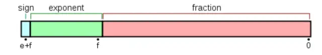

## BigDecimal一定不会丢失精度吗？
> 需要用到金钱的地方要用BigDecimal而不是其他，因为浮点型变量在进行计算的时候会出现丢失精度的问题。

如下一段代码：
```java
System.out.println(0.05 + 0.01);  
System.out.println(1.0 - 0.42);  
System.out.println(4.015 * 100);  
System.out.println(123.3 / 100);  
```
输出：
```java
0.060000000000000005
0.5800000000000001
401.49999999999994
1.2329999999999999
```
可以看到在Java中进行浮点数运算的时候，会出现丢失精度的问题。那么我们如果在进行商品价格计算的时候，就会出现问题。

很有可能造成我们手中有0.06元，却无法购买一个0.05元和一个0.01元的商品。
因为如上所示，他们两个的总和为0.060000000000000005。

所以就可以使用Java中的BigDecimal类来解决这类问题。

### API

- 构造器：
```java
构造器                   描述
BigDecimal(int)       创建一个具有参数所指定整数值的对象。
BigDecimal(double)    创建一个具有参数所指定双精度值的对象。
BigDecimal(long)      创建一个具有参数所指定长整数值的对象。
BigDecimal(String)    创建一个具有参数所指定以字符串表示的数值的对象。
```
- 函数：
```java
方法                    描述
add(BigDecimal)       BigDecimal对象中的值相加，然后返回这个对象。
subtract(BigDecimal)  BigDecimal对象中的值相减，然后返回这个对象。
multiply(BigDecimal)  BigDecimal对象中的值相乘，然后返回这个对象。
divide(BigDecimal)    BigDecimal对象中的值相除，然后返回这个对象。
toString()            将BigDecimal对象的数值转换成字符串。
doubleValue()         将BigDecimal对象中的值以双精度数返回。
floatValue()          将BigDecimal对象中的值以单精度数返回。
longValue()           将BigDecimal对象中的值以长整数返回。
intValue()            将BigDecimal对象中的值以整数返回。
```

### BigDecimal精度也丢失
我们在使用BigDecimal时，使用它的`BigDecimal(String)`构造器创建对象才有意义。其他的如`BigDecimal b = new BigDecimal(1)`这种，还是会发生精度丢失的问题。如下代码：
```java
BigDecimal a = new BigDecimal(1.01);
BigDecimal b = new BigDecimal(1.02);
BigDecimal c = new BigDecimal("1.01");
BigDecimal d = new BigDecimal("1.02");
System.out.println(a.add(b));
System.out.println(c.add(d));
```
输出：
```java
2.0300000000000000266453525910037569701671600341796875
2.03
```

可见论丢失精度BigDecimal显的更为过分。但是使用Bigdecimal的BigDecimal(String)构造器的变量在进行运算的时候却没有出现这种问题。

我们一般使用BigDecimal来解决商业运算上丢失精度的问题的时候，声明BigDecimal对象的时候一定要使用它构造参数为String的类型的构造器。
同时这个原则Effective Java和MySQL 必知必会中也都有提及。float和double只能用来做科学计算和工程计算。商业运算中我们要使用BigDecimal。

### 正确运用BigDecimal
另外，BigDecimal所创建的是对象，我们不能使用传统的+、-、*、/等算术运算符直接对其对象进行数学运算，而必须调用其相对应的方法。

```java
* The results of this constructor can be somewhat unpredictable.  
     * One might assume that writing {@codenew BigDecimal(0.1)} in  
     * Java creates a {@code BigDecimal} which is exactly equal to  
     * 0.1 (an unscaled value of 1, with a scale of 1), but it is  
     * actually equal to  
     * 0.1000000000000000055511151231257827021181583404541015625.  
     * This is because 0.1 cannot be represented exactly as a  
     * {@codedouble} (or, for that matter, as a binary fraction of  
     * any finite length).  Thus, the value that is being passed  
     * <i>in</i> to the constructor is not exactly equal to 0.1,  
     * appearances notwithstanding.  
       ……  
        * When a {@codedouble} must be used as a source for a  
     * {@code BigDecimal}, note that this constructor provides an  
     * exact conversion; it does not give the same result as  
     * converting the {@codedouble} to a {@code String} using the  
     * {@link Double#toString(double)} method and then using the  
     * {@link #BigDecimal(String)} constructor.  To get that result,  
     * use the {@codestatic} {@link #valueOf(double)} method.  
     * </ol>  
public BigDecimal(double val) {  
    this(val,MathContext.UNLIMITED);  
}  
```

第一段也说的很清楚它只能计算的无限接近这个数，但是无法精确到这个数。
第二段则说，如果要想准确计算这个值，那么需要把double类型的**参数转化为String类型的**。并且使用BigDecimal(String)这个构造方法进行构造。去获取结果。


## 为什么不能使用float存储金额
```java
public class FloatTest {
    public static void main(String[] args) {
        float f1 = 6.6f;
        float f2 = 1.3f;
        System.out.println(f1 + f2);
    }
}
```
输出结果 ：7.8999996

### 从计算机二进制角度计算 `6.6 + 1.3` 的过程

#### float底层存储
计算是由CPU来完成的，CPU表示浮点数由三部分组成 分为三个部分，符号位(sign)，指数部分(exponent)和有效部分(fraction, mantissa)。其中float总共占用32位，符号位，指数部分，有效部分各占1位，8位，23位。


#### 二进制的转化
对于实数，转化为二进制分为两部分，第一部分整数部分，第二部分是小数部分。

- 整数部分的计算：6转化为二进制为 `110`
- 小数部分的计算：将小数乘以2，取整数部分作为二进制的值，然后再将小数乘以2，再取整数部分，以此往复循环。
> 0.6转化为二进制为`0.10011001…`, 6.6转化为二进制为`110.10011001…`

#### 规约化
通过规约化将小数转为规约形式，类似科学计数法，就是保证小数点前面有一个有效数字。在二进制里面，就是保证整数位是一个1。`110.10011001`规约化为：`1.1010011001*2^2`

#### 指数偏移值
指数偏移值 = 固定值 + 规约化的指数值 

固定值=`2^(e-1)-1`，其中的`e`为存储指数部分的比特位数，前面提到的float为8位。所以float中规定化值为`127`.

6.6的二进制值规约化以后为`1.1010011001*2^2`，指数是2，所以偏移值就是`127+2=129`，转换为二进制就是`10000001`。

#### 拼接6.6
6.6为正数，符号位为0，指数部分为偏移值的二进制`10000001`，有效部分为规约形式的小数部分，取小数的前23位即`10100110011001100110011`，最后拼接到一起即 `01000000110100110011001100110011`。

> 到这里已经大致可以知道float为什么不精确了，首先在存储的时候就会造成精度损失了，在这里小数部分的二进制是循环的，但是仍然只能取前23位。double造成精度损失的原因也是如此。推荐阅读：金融系统中正确的金额计算及存储方式。


## 使用decimal存储类型的缺点

- 1、占用存储空间。

浮点类型在存储同样范围的值时，通常比decimal使用更少的空间

- 2、使用decimal计算效率不高  

因为使用decimal时间和空间开销较大，选用int作为数据库存储格式比较合适，可以同时避免浮点存储计算的不精确和decimal的缺点。对于存储数值较大或者保留小数较多的数字，数据库存储结构可以选择bigint。