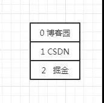
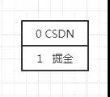

## 三种方法
- 使用Iterator的remove()方法
- 使用for循环正序遍历
- 使用for循环倒序遍历
> 详见https://mp.weixin.qq.com/s/796x_BU595R0vESbnl2KBA
### 1.使用Iterator的remove()方法
```java
public static void main(String[] args) {
    List<String> platformList = new ArrayList<>();
    platformList.add("博客园");
    platformList.add("CSDN");
    platformList.add("掘金");

    Iterator<String> iterator = platformList.iterator();
    while (iterator.hasNext()) {
        String platform = iterator.next();
        if (platform.equals("博客园")) {
            iterator.remove();
        }
    }

    System.out.println(platformList);
}
```

输出结果为：
```java
[CSDN, 掘金]
```

### 2.使用for循环正序遍历
```java
public static void main(String[] args) {
    List<String> platformList = new ArrayList<>();
    platformList.add("博客园");
    platformList.add("CSDN");
    platformList.add("掘金");

    for (int i = 0; i < platformList.size(); i++) {
        String item = platformList.get(i);

        if (item.equals("博客园")) {
            platformList.remove(i);
            i = i - 1;
        }
    }

    System.out.println(platformList);
}
```
这种实现方式比较好理解，就是通过数组的下标来删除，不过有个注意事项就是删除元素后，要修正下下标的值：`i = i - 1;`

> 为什么要修正下标的值呢？
> 
> 因为刚开始元素的下标是这样的：
>
> 
> 
> 第1次循环将元素"博客园"删除后，元素的下标变成了下面这样：
>
>  


### 使用for循环倒序遍历 -- 避免正序遍历修正下标问题
```java
public static void main(String[] args) {
    List<String> platformList = new ArrayList<>();
    platformList.add("博客园");
    platformList.add("CSDN");
    platformList.add("掘金");

    for (int i = platformList.size() - 1; i >= 0; i--) {
        String item = platformList.get(i);

        if (item.equals("掘金")) {
            platformList.remove(i);
        }
    }

    System.out.println(platformList);
}
```
