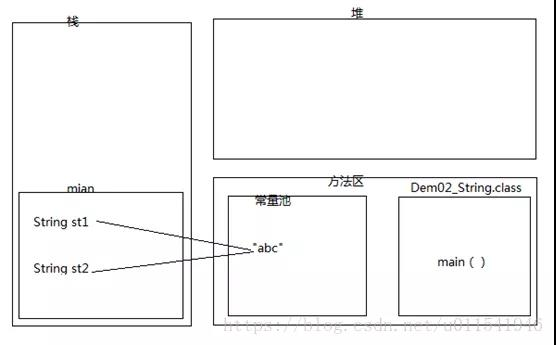
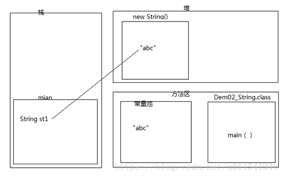
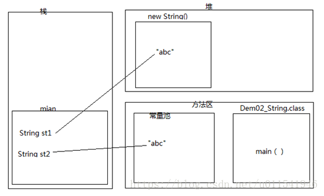
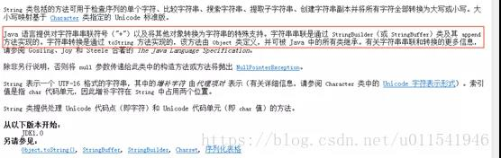

> 转自https://mp.weixin.qq.com/s/wgDcFiuMamttACxKGt2rHw

## 1.判定定义为String类型的st1和st2是否相等
```java
package string;

public class Demo2_String {
   public static void main(String[] args) {
     String st1 = "abc";
     String st2 = "abc";
     String st3 = new String("abc");
     System.out.println(st1 == st2);
     System.out.println(st1.equals(st2)); 
     System.out.println(st1 == st3);
     System.out.println(st1.equals(st3)); 
   }
}
```

输出结果：
```java
第一行：true
第二行：true
第三行：false
第四行：true
```

#### `st1 == st2`
java中，比较运算符`==`可以判断基本数据类型和引用数据类型是否相等。

- 基本数据类型：`==`比较的是**值是否相等**
- 引用数据类型：`==`比较的是两个**对象的内存地址是否相等**

字符串不属于8种基本数据类型，其属于引用数据类型，当把`"abc"`同时赋值给`st1`和`st2`两个字符串对象，指向的都是同一个地址，所以`st1 == st2`为`true`

#### `st1.equals(st2)`
`equals`是`Object`这个父类的方法，在`String`类中重写了这个`equals`方法，在JDK API 1.6文档中找到`String`类下的`equals`方法:**将此字符串与指定的对象比较。当且仅当该参数不为null，并且是与此对象表示相同字符序列的 String 对象时，结果才为 true**。

由于`st1`和`st2`的值都是`"abc"`，两者指向同一个对象，当前字符序列相同，所以`st1.equals(st2)`打印结果也为`true`。

内存图如下


过程大致如下：
- 运行先编译，然后当前类`Demo2_String.class`文件加载进入内存的方法区
- 第二步，`main`方法压入栈内存
- 常量池创建一个`"abc"`对象，产生一个内存地址
- 然后把`"abc"`内存地址赋值给`main`方法里的成员变量`st1`，这个时候`st1`根据内存地址，指向了常量池中的`"abc"`。
- 前面一篇提到，常量池有这个特点，如果发现已经存在，就不在创建重复的对象
- 运行到代码 `Stringst2 ="abc"`, 由于常量池存在`"abc"`，所以不会再创建，直接把`"abc"`内存地址赋值给了st2
- 最后`st1`和`st2`都指向了内存中同一个地址，所以两者是完全相同的。

#### String st3 = new String("abc");
通过对比`st3`就可以很明显的看出`==`和`equals()`的区别


## 2. 下面这句话在内存中创建了几个对象
`String st1 = new String("abc");`

答案是：在内存中创建两个对象，一个在堆内存，一个在常量池，堆内存对象是常量池对象的一个拷贝副本。


当看到关键字`new`，就要想到，`new`出来的对象都是**存储在堆内存**。

然后来解释堆中对象为什么是常量池的对象的拷贝副本。`"abc"`属于字符串常量（`String`），所以应该在常量池中创建，所以第一个创建的对象就是在常量池里的`"abc"`。

第二个对象在堆内存为啥是一个拷贝的副本呢，这个就需要在JDK API 1.6找到`String(String original)`这个构造方法的注释：初始化一个新创建的 `String` 对象，使其表示一个与参数相同的字符序列；换句话说，**新创建的字符串是该参数字符串的副本**。所以，答案就出来了，两个对象。


## 3.判定以下定义为String类型的st1和st2是否相等
```java
package string;
public class Demo2_String {
   public static void main(String[] args) {
     String st1 = new String("abc");
     String st2 = "abc";
     System.out.println(st1 == st2);  // false
     System.out.println(st1.equals(st2));  //true
   }
}
```
答案：false 和 true

`==`比较的`st1`和`st2`对象的内存地址，由于`st1`指向的是堆内存的地址，`st2`看到`"abc"`已经在常量池存在，就不会再新建，所以`st2`指向了常量池的内存地址，所以`==`判断结果输出`false`，两者不相等。

第二个`equals`比较，比较是两个字符串序列是否相等，由于就一个`"abc"`，所以完全相等。内存图如下



## 4. 判定以下定义为String类型的st1和st2是否相等
```java
package string;

public class Demo2_String {

   public static void main(String[] args) {
     String st1 = "a" + "b" + "c";
     String st2 = "abc";
     System.out.println(st1 == st2); //true
     System.out.println(st1.equals(st2)); // true
   }
}
```
答案是：true 和 true

`"a"`,`"b"`,`"c"`三个本来就是字符串常量，进行`+`符号拼接之后变成了`"abc"`，`"abc"`本身就是字符串常量（Java中有常量优化机制），所以常量池立马会创建一个`"abc"`的字符串常量对象，在进行`st2="abc"`,这个时候，常量池存在`"abc"`，所以不再创建。

所以，不管比较内存地址还是比较字符串序列，都相等。

## 5.判断以下st2和st3是否相等
```java
package string;

public class Demo2_String {

   public static void main(String[] args) {
     String st1 = "ab";
     String st2 = "abc";
     String st3 = st1 + "c";
     System.out.println(st2 == st3); //false
     System.out.println(st2.equals(st3)); //true 
   }
}
```

上面的答案第一个是`false`，第二个是`true`，第二个是`true`很好理解，因为比较一个是`"abc"`，另外一个是拼接得到的`"abc"`，所以`equals`比较，这个是输出`true`

那么第一个判断为什么是false？ 下面用API的注释说明和内存图来解释这个为什么不相等。

首先，打开JDK API 1.6中String的介绍。


关键点就在红圈这句话，我们知道任何数据和字符串进行加号（`+`）运算，最终得到是一个**新的拼接字符串**。上面注释说明了这个拼接的原理是由`StringBuilder`或者`StringBuffer`类和里面的`append`方法实现拼接，然后调用`toString()`把拼接的对象转换成字符串对象，最后把得到字符串对象的地址赋值给变量。


大致内存过程

- 常量池创建`"ab"`对象，并赋值给`st1`，所以`st1`指向了`"ab"`
- 常量池创建`"abc"`对象，并赋值给`st2`，所以`st2`指向了`"abc"`
- 由于`+`的拼接方法，所以第三步是使用`StringBuffer`类的`append`方法，得到了`"abc"`，这个时候内存0x0011表示的是一个`StringBuffer`对象，注意不是`String`对象。
- 调用了`Object`的`toString`方法把`StringBuffer`对象装换成了`String`对象。
- 把String对象（0x0022）赋值给`st3`

所以，`st3`和`st2`进行`==`判断结果是不相等，因为两个对象内存地址不同。