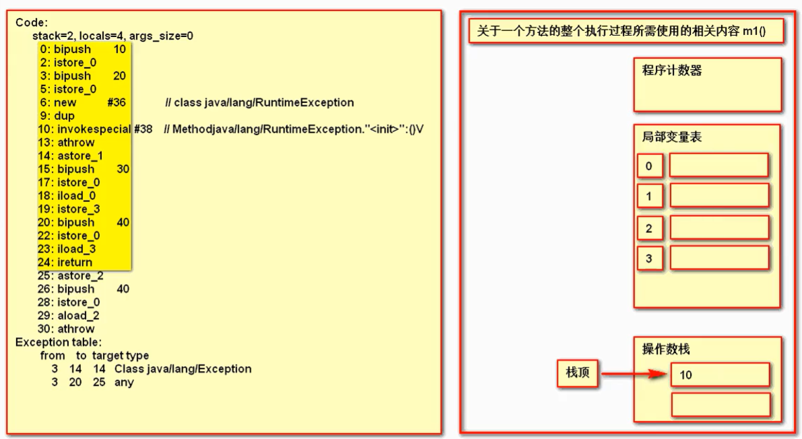

## Java中的finally一定会被执行吗？
肯定不是。

> 关于finally的一个问题
```java
public class TestByte{
    
    public static void main(String[] args) {
        int result = m1();
        System.out.println(result); // 输出30
    }

    public static int m1() {
        
        int a = 10;
        try {
            a = 20;
            throw new RuntimeException();
        } catch(Exception e) {
            a = 30;
            return a; // 将返回值保存，并没有结束方法
        } finally {
            a = 40;
        }
    }
}
```

`javap -verbose TestByte`查看字节码（关注m1方法）如下：
```java
  public static int m1();
    descriptor: ()I
    flags: ACC_PUBLIC, ACC_STATIC
    Code:
      stack=2, locals=4, args_size=0
         0: bipush        10    
         // 将10压入栈，  b-> byte,  i->int
         2: istore_0            
         // 将栈顶中的int值，保存在局部变量表下标0的位置（此时栈为空了），下标0
         3: bipush        20
         5: istore_0
         // 同上，但是此时 10 被20覆盖了 ，下标0
         6: new           #5                  // class java/lang/RuntimeException
         // RuntimeException入栈
         9: dup
         // 复制栈顶元素，压栈， 栈中有两个RuntimeException
        10: invokespecial #6                  // Method java/lang/RuntimeException."<init>":()V
        // 初始化栈顶对象，调用其构造方法，
        13: athrow
        // a -> 表示对象，  将初始化完毕的栈顶异常对象抛出（此时栈中只剩一个RuntimeException）
        14: astore_1
        // 将栈顶中的对象（剩下的那一个RuntimeException）保存在局部变量表，下标1
        15: bipush        30
        // 30 入栈
        17: istore_0
        // 30 出栈，放到局部变量表下标0（覆盖了原数20）
        18: iload_0
        // 将局部变量表下标0位置的值，加载到栈顶
        19: istore_2
        // 栈顶的值，保存到局部变量表下标2位置（值30）
        20: bipush        40
        22: istore_0
        // 值40放到下标0位置
        23: iload_2
        // 将存储了返回值的局部变量表中的值30加载到栈顶（下标2）
        24: ireturn
        // 结束当前方法，并携带栈顶中的int值返回
        25: astore_3
        26: bipush        40
        28: istore_0
        29: aload_3
        30: athrow
      Exception table: // 异常表，因异常而导致的分支流程
         from    to  target type
             3    14    14   Class java/lang/Exception
             // 考虑到的异常（try异常），如果3-14异常，跳至14运行
             3    20    25   any
             // 3-20未知异常（catch也可能发生异常），跳至25运行
```



JVM存储区域及JVM栈详解（栈帧结构）如下


----------------
----------------

1. 在执行`try`块之前直接`return`，我们发现`finally`块是不会执行的
```java
public class TryCatchTest {

  private static int total() {
    int i = 11;
    if (i == 11) {
      return i;
    }
    try {
      System.out.println("执行try");
    } finally {
      System.out.println("执行finally");
    }
    return 0;
  }

  public static void main(String[] args) {
    System.out.println("执行main：" + total());
  }
}
```


输出结果：
```执行main：11```

2. 在执行`try`块之前制造一个错误，直接爆红
```java
public class TryCatchTest {

  private static int total() {
    return 1 / 0;
    try {
      System.out.println("执行try");
    } finally {
      System.out.println("执行finally");
    }
    return 0;
  }

  public static void main(String[] args) {
    System.out.println("执行main：" + total());
  }
}
```

> 如果程序连`try`块都执行不到，那么`finally`块自然就不会执行到了。

## 如果执行了try块，finally块一定会执行吗？
```java
public class TryCatchTest {

  private static int total() {
    try {
      System.out.println("执行try");
      System.exit(0);
    } catch (Exception e) {
      System.out.println("执行catch");
    } finally {
      System.out.println("执行finally");
    }
    return 0;
  }

  public static void main(String[] args) {
    System.out.println("执行main：" + total());
  }
}
```
输出结果：`执行try`

- 在执行try块之中退出jvm，就没事了，都不执行了。当然这个情况是比较极端的，记住就行，没事不要乱整这个。

**不管是给try块中造了个异常，还是在`try`块中进行`return`，我们发现`finally`块还是会执行的。因为异常处理设计初衷就是让`finally`块始终执行。**

## finally执行时机探讨
- 常规情况：
```java
public class TryCatchTest {

  private static int total() {
    try {
      System.out.println("执行try");
      return 11;
    } finally {
      System.out.println("执行finally");
    }
  }

  public static void main(String[] args) {
    System.out.println("执行main：" + total());
  }
}
```

输出结果：
```java
	执行try
	执行finally
	执行main：11
```

- 给try块中造一个异常：
```java
public class TryCatchTest {

  private static int total() {
    try {
      System.out.println("执行try");
      return 1 / 0;
    } catch (Exception e) {
      System.out.println("执行catch");
      return 11;
    } finally {
      System.out.println("执行finally");
    }
  }

  public static void main(String[] args) {
    System.out.println("执行main：" + total());
  }
}
```

输出结果：
```java
	执行try
	执行catch
	执行finally
	执行main：11
```
> finally执行在return之前

## finally块中的返回值

1. `finally`块不含返回值，但是做改变变量值的操作
```java
public class TryCatchTest {

  private static int total() {
    int i = 0;
    try {
      System.out.println("执行try：" + i);
      return i;
    } finally {
      ++i;
      System.out.println("执行finally：" + i);
    }
  }

  public static void main(String[] args) {
    System.out.println("执行main：" + total());
  }
}
```
输出结果：
```java
执行try：0
执行finally：1
执行main：0
```

如果看完前面分析，会发现跟想象的不太一样。我们经过前面的分析，finally块的执行时机应该是return之前，那理论上我们应该先++i使得i等于1，在执行return i; 自然会返回1。

可是结果却返回了0，这是因为Java程序会把try或者catch块中的返回值保留，也就是暂时的确认了返回值，然后再去执行finally代码块中的语句。等到finally代码块执行完毕后，如果finally块中没有返回值的话，就把之前保留的返回值返回出去。

2. `finally`中含有返回值
```java
public class TryCatchTest {

  private static int total() {
    try {
      System.out.println("执行try");
      return 1;
    } finally {
      System.out.println("执行finally");
      return 2;
    }
  }

  public static void main(String[] args) {
    System.out.println("执行main：" + total());
  }
}
```

输出结果：
```java
执行try
执行finally
执行main：2
```

```java
public class TryCatchTest {

  private static int total() {
    int i = 1;
    try {
      System.out.println("执行try：" + i);
      return i;
    } finally {
      ++i;
      System.out.println("执行finally：" + i);
      return i;
    }
  }

  public static void main(String[] args) {
    System.out.println("执行main：" + total());
  }
}
```

输出结果：
```java
执行try：1
执行finally：2
执行main：2
```

```java
public class TryCatchTest {

  private static int total() {
    int i = 1;
    try {
      System.out.println("执行try：" + i);
    } finally {
      ++i;
      System.out.println("执行finally：" + i);
    }
    return i;
  }

  public static void main(String[] args) {
    System.out.println("执行main：" + total());
  }
}
```

执行结果：
```java
执行try：1
执行finally：2
执行main：2
```

这三个示例都说明了一点，在分析含有`finally`块的方法返回值时，要对于`return`出现的地方进行具体分析。在`finally`块中进行`return`操作的话，则方法整体的返回值就是`finally`块中的`return`返回值。如果在`finally`块之后的方法内`return`，则`return`的值就是进行完上面的操作后的`return`值。