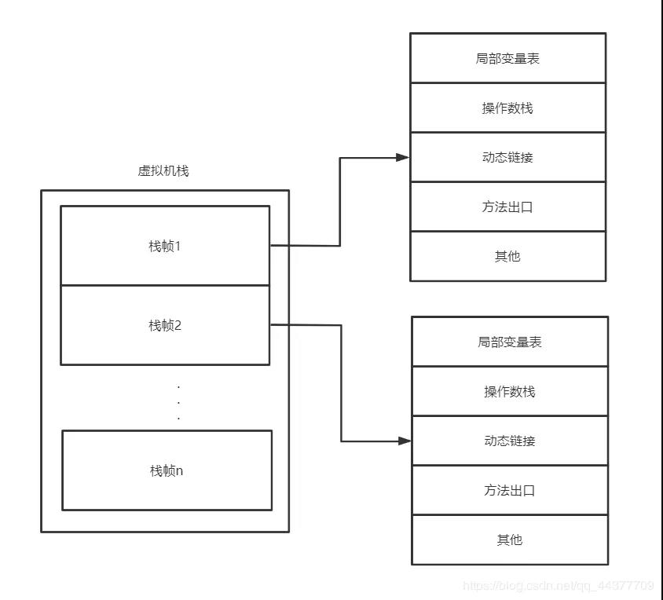
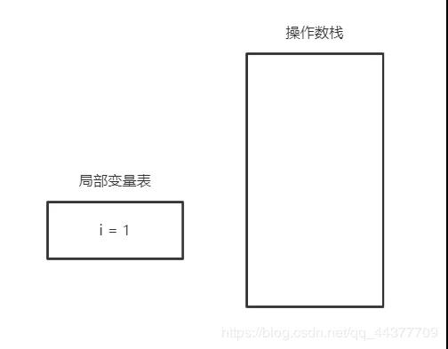
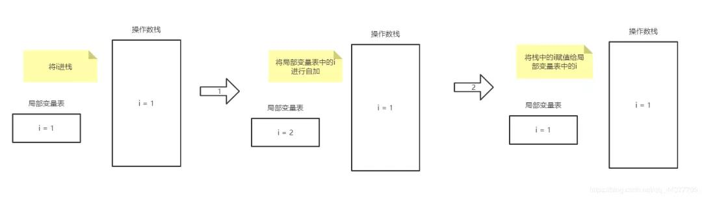
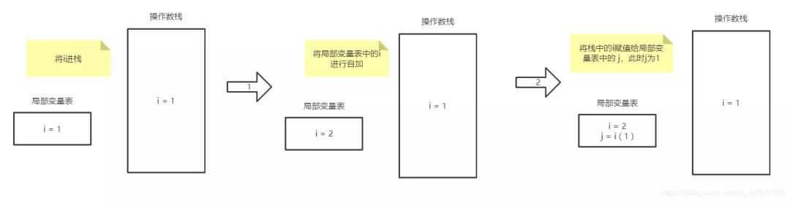
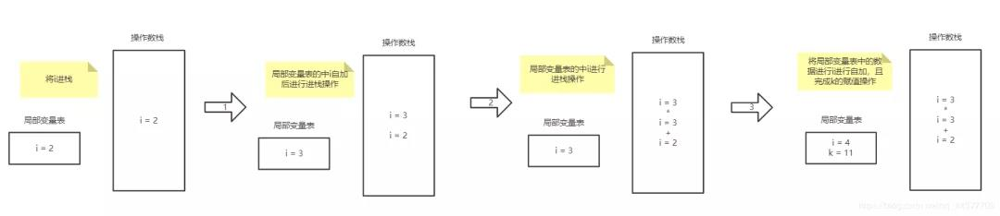

```java
// 题目

public class test01 {
    public static void main(String[] args) {
        int i = 1;
        i = i++;
        int j = i++;
        int k = i + ++i * i++;
        System.out.println("i="+i);
        System.out.println("j="+j);
        System.out.println("k="+k);
    }
}
```

## 分析

#### JVM内存结构

- 一个方法对应一个栈帧结构



#### 1. `int i=1;`



#### 2. `i = i++`



> i还是等于1；

#### 3. `j = i++`



> j为1；i为2

#### 4. `int k = i + ++i * i++`



#### `i = ++i`

` i` 变量先在局部变量表中进行自增，然后再将` i `进栈，然后再把栈中的数据返回给我们的变量 `i `。