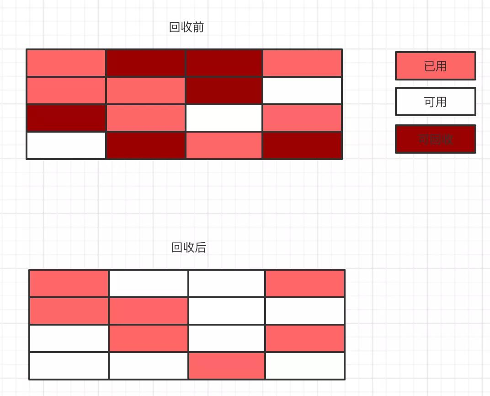

## java GC

### 目标
内存是有限的，随着程序中创建的对象越来越多，如果进行回收就会导致内存越来越大，最后程序就会出现异常。既然目的是为了回收内存，那么哪些对象可以被回收呢？什么时候进行回收呢？怎么回收呢？

### 哪些对象可以被回收？  -- 无用的对象
如何定义对象是无用的
- 引用计数

如果一个对象被别的对象进行了一次引用，那么该对象会有一个引用计数器，这个计数器+1；如果被释放一下，计数器会减一。当引用计数器的计数值为0时，这个对象就是无用的，此时就可以对其回收。

但是，这只是表面上的合理。当遇到循环引用问题时，如对象A引用了对象B，并且对象B也引用了对象A，那么这两个对象的计数器都不会是0，可是这两个对象都没有被其他对象引用，理论上应该是要被回收的。

- 可达性分析

可达性分析说的是从 GCRoots 的点作为起点，向下搜索，当找不到任何引用链的时候表示该对象为垃圾对象。那么**哪些对象可以被认为是 Roots 节点**呢？有 **Java 栈中的对象**，方法区的**静态属性**和**常量**以及**本地方法栈中的对象**。从这几种对象依次向下搜索，如果没有能达到 Roots 节点的对象就是垃圾对象，就说明可以被回收。

如下图所有，对象 A，B，C都能找到与 Roots 节点的联系，但是对象 D，E，F 三个并不能找到与 Roots 节点的联系，也就是不可达，所以 DEF 这三个对象就是垃圾对象。

### 什么时候能回收？
在排除人为调用的时候，**垃圾回收都是发生在为新生对象进行内存分配的时候**，这个时候**如果内存空间不足就会触发 GC 进行垃圾回收**。

### 怎么回收？

垃圾回收根据实现的方式不同有多种不同的算法实现。比如有标记清除算法，复制算法，标记整理算法，分代回收算法。

#### 1.标记清除算法
主要就是执行两个动作，一个是标记，另一个是对进行标记的对象内存进行清除回收。

算法的缺点就是会出现内存碎片化严重。从上图中可以看到，在进行内存回收后出现了严重的内存碎片化，这就导致在分配某些大对象的时候仍然会出现内存不够的情况，但是总体内存确是够的。

#### 2.复制算法
复制算法的实现方式比较简洁明了，就是霸道的把内存分成两部分，在平时使用的时候只用其中的固定一份，在当需要进行 GC 的时候，把存活的对象复制到另一部分中，然后将已经使用的内存全部清理掉。

虽然解决了标记清除的内存碎片化问题，但是很明显复制算法的内存的使用率大大下降，能使用的内存只有原来的一半了。

#### 3.标记整理算法
既然标记清除和复制算法各有优缺点，那自然的我们就想到是否可以把这两种算法结合起来，于是就出现了标记整理算法。标记阶段是标记清除算法一样，先标记出需要回收的部分，不过清除阶段不是直接清除，而是把存活的对象往内存的一端进行移动，然后清除剩下的部分。

标记整理的算法虽然可以解决上面两个算法的一些问题，但是还是需要先进行标记，然后进行移动，整个效率还是偏低的。

#### 4.分代回收算法
分代回收算法是目前使用较多的一种算法，这个不是一个新的算法，只是将内存进行的划分，不同区域的内存使用不同的算法。根据对象的存活时间将内存的划分为新生代和老年代，其中新生代包含 Eden 区和 S0，S1。在新生代中使用是复制算法，在进行对象内存分配的时候只会使用 Eden 和 S0 区，当发生 GC 的时候，会将存活的对象复制到 S1 区，然后循环往复进行复制。当某个对象在进行了 15 次GC 后依旧存活，那这个对象就会进入老年代。老年代因为每次回收的对象都会比较少，因此使用的是标记整理算法。

## 垃圾回收器
每一种垃圾回收器都是不同时代的不同产物，都有其独特性。

- Serial 垃圾收集器(单线程、复制算法)
- ParNew垃圾收集器(Serial+多线程)
- Parallel Scavenge 收集器(多线程复制算法、高效)
- SerialOld收集器(单线程标记整理算法)
- ParallelOld收集器(多线程标记整理算法)
- CMS收集器(多线程标记清除算法)
- G1收集器