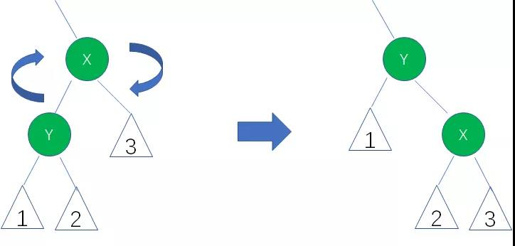

> https://mp.weixin.qq.com/s/Tbx-VZxca8Z2U8VpXl6GoA

## 需要注意在AVL树平衡被打破时（插入/删除操作），四种恢复平衡的情况

- 左旋转

**逆时针**旋转AVL树的两个结点X和Y，使得父结点被自己的右孩子取代，而自己成为自己的左孩子。说起来有些绕，见下图（标号1,2,3的三角形，是结点X和Y的子树）：

图中，身为右孩子的Y取代了X的位置，而X变成了自己的左孩子。此为左旋转。

- 右旋转

**顺时针**旋转AVL树的两个结点X和Y，使得父结点被自己的左孩子取代，而自己成为自己的右孩子。见下图：

图中，身为左孩子的Y取代了X的位置，而X变成了自己的右孩子。此为右旋转。

### case 1：左左（LL）

### case 2：右右（RR）

### case 3：左右（LR）

- 先将下面调整，至LL情况

- 再LL

### case 4：右左（RL）
> 同case3，先调整最底部至RR情况

