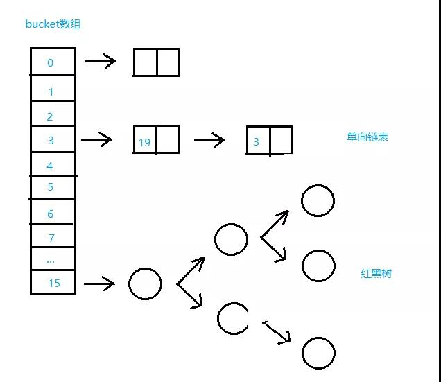
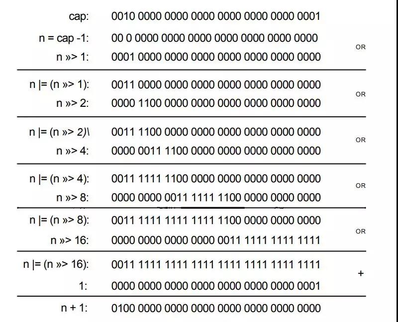

## HashMap

> https://mp.weixin.qq.com/s/z67aglf11bsjqVDbqVhCtw

### 1. 简介

HashMap最早出现在JDK1.2中，底层基于散列算法实现。HashMap 允许 null 键和 null 值，是非线程安全类，在多线程环境下可能会存在问题。

1.8版本的HashMap数据结构：



- 默认链表长度大于8时转为红黑树

### 2. 结构

#### Node

是HashMap中的一个静态内部类 ：

```java
/**
 * Basic hash bin node, used for most entries.  (See below for
 * TreeNode subclass, and in LinkedHashMap for its Entry subclass.)
 */
// Node是单向链表，实现了Map.Entry接口
static class Node<K,V> implements Map.Entry<K,V> {
    final int hash;
    final K key;
    V value;
    Node<K,V> next;

    Node(int hash, K key, V value, Node<K,V> next) {
        this.hash = hash;
        this.key = key;
        this.value = value;
        this.next = next;
    }

    public final K getKey()        { return key; }
    public final V getValue()      { return value; }
    public final String toString() { return key + "=" + value; }

    public final int hashCode() {
        return Objects.hashCode(key) ^ Objects.hashCode(value);
    }

    public final V setValue(V newValue) {
        V oldValue = value;
        value = newValue;
        return oldValue;
    }

    public final boolean equals(Object o) {
        if (o == this)
            return true;
        if (o instanceof Map.Entry) {
            Map.Entry<?,?> e = (Map.Entry<?,?>)o;
            if (Objects.equals(key, e.getKey()) &&
                Objects.equals(value, e.getValue()))
                return true;
        }
        return false;
    }
}
```

#### TreeNode 

是红黑树的数据结构。

```java
/**
 * Entry for Tree bins. Extends LinkedHashMap.Entry (which in turn
 * extends Node) so can be used as extension of either regular or
 * linked node.
 */
static final class TreeNode<K,V> extends LinkedHashMap.Entry<K,V> {
    TreeNode<K,V> parent;  // red-black tree links
    TreeNode<K,V> left;
    TreeNode<K,V> right;
    TreeNode<K,V> prev;    // needed to unlink next upon deletion
    boolean red;
    TreeNode(int hash, K key, V val, Node<K,V> next) {
        super(hash, key, val, next);
    }

    /**
     * Returns root of tree containing this node.
     */
    final TreeNode<K,V> root() {
        for (TreeNode<K,V> r = this, p;;) {
            if ((p = r.parent) == null)
                return r;
            r = p;
        }
    }
}
```

### 3. 类定义

```java
public class HashMap<K,V> extends AbstractMap<K,V>
    implements Map<K,V>, Cloneable, Serializable
```

### 4. 变量

```java
/**
 * 默认初始容量16(必须是2的幂次方)
 */
static final int DEFAULT_INITIAL_CAPACITY = 1 << 4;

/**
 * 最大容量，2的30次方
 */
static final int MAXIMUM_CAPACITY = 1 << 30;

/**
 * 默认加载因子，用来计算threshold
 */
static final float DEFAULT_LOAD_FACTOR = 0.75f;

/**
 * 链表转成树的阈值，当桶中链表长度大于8时转成树 
   threshold = capacity * loadFactor
 */
static final int TREEIFY_THRESHOLD = 8;

/**
 * 进行resize操作时，若桶中数量少于6则从树转成链表
 */
static final int UNTREEIFY_THRESHOLD = 6;

/**
 * 桶中结构转化为红黑树对应的table的最小大小

 当需要将解决 hash 冲突的链表转变为红黑树时，
 需要判断下此时数组容量，
 若是由于数组容量太小（小于　MIN_TREEIFY_CAPACITY　）
 导致的 hash 冲突太多，则不进行链表转变为红黑树操作，
 转为利用　resize() 函数对　hashMap 扩容
 */
static final int MIN_TREEIFY_CAPACITY = 64;
/**
 保存Node<K,V>节点的数组
 该表在首次使用时初始化，并根据需要调整大小。 分配时，
 长度始终是2的幂。
 */
transient Node<K,V>[] table;

/**
 * 存放具体元素的集
 */
transient Set<Map.Entry<K,V>> entrySet;

/**
 * 记录 hashMap 当前存储的元素的数量
 */
transient int size;

/**
 * 每次更改map结构的计数器(fast-fail)
 */
transient int modCount;

/**
 * The next size value at which to resize (capacity * load factor).
 */
int threshold;

/**
 * The load factor for the hash table.
 */
final float loadFactor;
```

### 5. 构造方法

```java
/**
 * 传入初始容量大小和负载因子 来初始化HashMap对象
 *
 * @param  initialCapacity the initial capacity
 * @param  loadFactor      the load factor
 * @throws IllegalArgumentException if the initial capacity is negative
 *         or the load factor is nonpositive
 */
public HashMap(int initialCapacity, float loadFactor) {
    // 初始容量不能小于0，否则报错
    if (initialCapacity < 0)
        throw new IllegalArgumentException("Illegal initial capacity: " +initialCapacity);
    // 初始容量不能大于最大值，否则为最大值   
    if (initialCapacity > MAXIMUM_CAPACITY)
        initialCapacity = MAXIMUM_CAPACITY;
    // 负载因子不能小于或等于0，不能为非数字  
    if (loadFactor <= 0 || Float.isNaN(loadFactor))
        throw new IllegalArgumentException("Illegal load factor: " + loadFactor);
    // 初始化负载因子 
    this.loadFactor = loadFactor;
    // 初始化threshold大小
    this.threshold = tableSizeFor(initialCapacity);
}

/**
 * 传入初始容量大小，使用默认负载因子值(0.75)来初始化HashMap对象
 *
 * @param  initialCapacity the initial capacity.
 * @throws IllegalArgumentException if the initial capacity is negative.
 */
public HashMap(int initialCapacity) {
    this(initialCapacity, DEFAULT_LOAD_FACTOR);
}

/**
 * 默认容量(16)和负载因子(0.75)
 */
public HashMap() {
    this.loadFactor = DEFAULT_LOAD_FACTOR; // all other fields defaulted
}

/**
 * Constructs a new <tt>HashMap</tt> with the same mappings as the
 * specified <tt>Map</tt>.  The <tt>HashMap</tt> is created with
 * default load factor (0.75) and an initial capacity sufficient to
 * hold the mappings in the specified <tt>Map</tt>.
 *
 * @param   m the map whose mappings are to be placed in this map
 * @throws  NullPointerException if the specified map is null
 */
public HashMap(Map<? extends K, ? extends V> m) {
    this.loadFactor = DEFAULT_LOAD_FACTOR;
    putMapEntries(m, false);
}

```

```java

/**
 * 找到大于或等于 cap 的最小2的整数次幂的数。
 */
static final int tableSizeFor(int cap) {
    int n = cap - 1;
    n |= n >>> 1;
    n |= n >>> 2;
    n |= n >>> 4;
    n |= n >>> 8;
    n |= n >>> 16;
    return (n < 0) ? 1 : (n >= MAXIMUM_CAPACITY) ? MAXIMUM_CAPACITY : n + 1;
}
```

- tableSizeFor方法详解：

用位运算找到大于或等于 cap 的最小2的整数次幂的数。比如10，则返回16

1. 让cap-1再赋值给n的目的是使得找到的目标值大于或等于原值。例如二进制`0100`,十进制是4,若不减1而直接操作，答案是`0001 0000`十进制是16，明显不符合预期。
2. 对n右移1位：001xx…xxx，再位或：011xx…xxx
3. 对n右移2位：00011…xxx，再位或：01111…xxx
4. 对n右移4位…
5. 对n右移8位…
6. 对n右移16位,因为int最大就`2^32`所以移动1、2、4、8、16位并取位或,会**将最高位的1后面的位全变为1**。
7. 再让结果n+1，即得到了2的整数次幂的值了。



### 6. loadFactor 负载因子

对于 HashMap 来说，负载因子是一个很重要的参数，该参数反应了 HashMap 桶数组的使用情况。通过调节负载因子，可使 HashMap 时间和空间复杂度上有不同的表现。

当我们调低负载因子时，HashMap 所能容纳的键值对数量变少。扩容时，重新将键值对存储新的桶数组里，键的键之间产生的碰撞会下降，链表长度变短。此时，HashMap 的增删改查等操作的效率将会变高，这里是典型的拿空间换时间。

相反，如果增加负载因子（负载因子可以大于1），HashMap 所能容纳的键值对数量变多，空间利用率高，但碰撞率也高。这意味着链表长度变长，效率也随之降低，这种情况是拿时间换空间。至于负载因子怎么调节，这个看使用场景了。

一般情况下，我们用默认值就可以了。大多数情况下0.75在时间跟空间代价上达到了平衡所以不建议修改。

> [**为什么HashMap的加载因子是0.75**](../../为什么HashMap的加载因子是0.75.md)

### 7. 查找

```java
public V get(Object key) {
    Node<K,V> e;
    return (e = getNode(hash(key), key)) == null ? null : e.value;
}

// 获取hash值
static final int hash(Object key) {
    int h;
    // 拿到key的hash值后与其五符号右移16位取与
    // 通过这种方式，让高位数据与低位数据进行异或，以此加大低位信息的随机性，变相的让高位数据参与到计算中。
    return (key == null) ? 0 : (h = key.hashCode()) ^ (h >>> 16);
}

/**
 * Implements Map.get and related methods
 *
 * @param hash hash for key
 * @param key the key
 * @return the node, or null if none
 */
final Node<K,V> getNode(int hash, Object key) {
    Node<K,V>[] tab; Node<K,V> first, e; int n; K k;
    // 定位键值对所在桶的位置
    if ((tab = table) != null && (n = tab.length) > 0 &&
        (first = tab[(n - 1) & hash]) != null) {
        // 判断桶中第一项(数组元素)相等
        if (first.hash == hash && // always check first node
            ((k = first.key) == key || (key != null && key.equals(k))))
            return first;
        // 桶中不止一个结点
        if ((e = first.next) != null) {
            // 是否是红黑树，是的话调用getTreeNode方法
            if (first instanceof TreeNode)
                return ((TreeNode<K,V>)first).getTreeNode(hash, key);
            // 不是红黑树的话，在链表中遍历查找  
            do {
                if (e.hash == hash &&
                    ((k = e.key) == key || (key != null && key.equals(k))))
                    return e;
            } while ((e = e.next) != null);
        }
    }
    return null;
}
```

### 8. 添加

```java
public V put(K key, V value) {
     // 调用hash(key)方法来计算hash 
    return putVal(hash(key), key, value, false, true);
}

/**
 * Implements Map.put and related methods
 */
final V putVal(int hash, K key, V value, boolean onlyIfAbsent,
               boolean evict) {
    Node<K,V>[] tab; Node<K,V> p; int n, i;
    // 容量初始化：当table为空，则调用resize()方法来初始化容器
    if ((tab = table) == null || (n = tab.length) == 0)
        n = (tab = resize()).length;
    // 确定元素存放在哪个桶中，桶为空，新生成结点放入桶中
    if ((p = tab[i = (n - 1) & hash]) == null)
        tab[i] = newNode(hash, key, value, null);
    else {
        Node<K,V> e; K k;
        // 比较桶中第一个元素(数组中的结点)的hash值相等，key相等
        if (p.hash == hash &&
            ((k = p.key) == key || (key != null && key.equals(k))))
            //如果键的值以及节点 hash 等于链表中的第一个键值对节点时，则将 e 指向该键值对
            e = p;
        // 如果桶中的引用类型为 TreeNode，则调用红黑树的插入方法
        else if (p instanceof TreeNode)
            // 放入树中
            e = ((TreeNode<K,V>)p).putTreeVal(this, tab, hash, key, value);
        else {
            // 对链表进行遍历，并统计链表长度
            for (int binCount = 0; ; ++binCount) {
                 // 到达链表的尾部
                if ((e = p.next) == null) {
                    // 在尾部插入新结点
                    p.next = newNode(hash, key, value, null);
                    // 如果结点数量达到阈值，转化为红黑树
                    if (binCount >= TREEIFY_THRESHOLD - 1) // -1 for 1st
                        treeifyBin(tab, hash);
                    break;
                }
                // 判断链表中结点的key值与插入的元素的key值是否相等
                if (e.hash == hash &&
                    ((k = e.key) == key || (key != null && key.equals(k))))
                    break;
                p = e;
            }
        }
        // 判断要插入的键值对是否存在 HashMap 中
        if (e != null) { // existing mapping for key
            V oldValue = e.value;
            // onlyIfAbsent 表示是否仅在 oldValue 为 null 的情况下更新键值对的值
            if (!onlyIfAbsent || oldValue == null)
                e.value = value;
            afterNodeAccess(e);
            return oldValue;
        }
    }
    ++modCount;
    // 键值对数量超过阈值时，则进行扩容
    if (++size > threshold)
        resize();
    afterNodeInsertion(evict);
    return null;
}
```

事实上，`new HashMap();`完成后，如果没有`put`操作，是不会分配存储空间的。

1. 当桶数组 table 为空时，通过扩容的方式初始化 table
2. 查找要插入的键值对是否已经存在，存在的话根据条件判断是否用新值替换旧值
3. 如果不存在，则将键值对链入链表中，并根据链表长度决定是否将链表转为红黑树
4. 判断键值对数量是否大于阈值，大于的话则进行扩容操作

### 9. 扩容机制

在 HashMap 中，桶数组的长度均是2的幂，阈值大小为桶数组长度与负载因子的乘积。当 HashMap 中的键值对数量超过阈值时，进行扩容。

HashMap 按当前桶数组长度的2倍进行扩容，阈值也变为原来的2倍（如果计算过程中，阈值溢出归零，则按阈值公式重新计算）。**扩容之后，要重新计算键值对的位置，并把它们移动到合适的位置上去**。

- 整体步骤：

1. 计算新桶数组的容量 newCap 和新阈值 newThr
2. 根据计算出的 newCap 创建新的桶数组，桶数组 table 也是在这里进行初始化的
3. 将键值对节点重新映射到新的桶数组里。如果节点是 TreeNode 类型，则需要拆分红黑树。如果是普通节点，则节点按原顺序进行分组。

- 总结起来，一共有三种**扩容方式**：

1. 使用默认构造方法初始化HashMap。从前文可以知道HashMap在一开始初始化的时候会返回一个空的table，并且thershold为0。因此第一次扩容的容量为默认值`DEFAULT_INITIAL_CAPACITY`也就是16。同时`threshold = DEFAULT_INITIAL_CAPACITY * DEFAULT_LOAD_FACTOR = 12`。
2. 指定初始容量的构造方法初始化`HashMap`。那么从下面源码可以看到初始容量会等于`threshold`，接着`threshold = 当前的容量（threshold） * DEFAULT_LOAD_FACTOR`。
3. HashMap不是第一次扩容。如果`HashMap`已经扩容过的话，那么每次table的容量以及`threshold`量为原有的两倍。

为什么要判断loadFactor为0呢？

> loadFactor小数位为 0，整数位可被2整除且大于等于8时，在某次计算中就可能会导致 newThr 溢出归零。

## HashMap夺命问

### 1.HashMap 的数据结构？

- **JDK1.7及之前：数组+链表**
- **JDK1.8：数组+链表+红黑树**，当链表长度超过 8 时，链表转换为红黑树。

### 2.HashMap 的工作原理？

HashMap 底层是 hash 数组和单向链表实现，数组中的每个元素都是链表，由 Node 内部类（实现 Map.Entry接口）实现，HashMap 通过 put & get 方法存储和获取。

- 存储对象时，将 K/V 键值传给 put() 方法：

**1、**调用 hash(K) 方法计算 K 的 hash 值，然后结合数组长度，计算得数组下标；
**2、**调整数组大小（当容器中的元素个数大于 capacity * loadfactor 时，容器会进行扩容resize 为 2n）；
**3、**i.如果 K 的 hash 值在 HashMap 中不存在，则执行插入，若存在，则发生碰撞；
ii.如果 K 的 hash 值在 HashMap 中存在，且它们两者 equals 返回 true，则更新键值对；iii. 如果 K 的 hash 值在 HashMap 中存在，且它们两者 equals 返回 false，则插入链表的尾部（尾插法）或者红黑树中（树的添加方式）。

> （JDK 1.7 之前使用头插法、JDK 1.8 使用尾插法） 
>
> （注意：当碰撞导致链表大于 TREEIFY_THRESHOLD = 8 时，就把链表转换成红黑树）

- 获取对象时，将 K 传给 get() 方法：①、调用 hash(K) 方法（计算 K 的 hash 值）从而获取该键值所在链表的数组下标；②、顺序遍历链表，equals()方法查找相同 Node 链表中 K 值对应的 V 值。

### 3.当两个对象的 hashCode 相同会发生什么？

>  结合问题1的数据结构理解。

因为 hashCode 相同，不一定就是相等的（equals方法比较），所以两个对象所在数组的下标相同，"碰撞"就此发生。又因为 HashMap 使用链表存储对象，这个 Node 会存储到链表中。

### 4.hash 的实现？为什么？

JDK 1.8 中，是通过 hashCode() 的高 16 位异或低 16 位实现的：`(h = k.hashCode()) ^ (h >>> 16)`，主要是从速度，功效和质量来考虑的，减少系统的开销，也不会造成因为高位没有参与下标的计算，从而引起的碰撞。

### 5.为什么要用异或运算符？

保证了对象的 hashCode 的 32 位值只要有一位发生改变，整个 hash() 返回值就会改变。尽可能的减少碰撞。

### 6.HashMap 的 table 的容量如何确定？loadFactor 是什么？该容量如何变化？这种变化会带来什么问题？

**1、**table 数组大小是由 capacity 这个参数确定的，默认是16，也可以构造时传入，最大限制是1<<30；
**2、**loadFactor 是装载因子，主要目的是用来确认table 数组是否需要动态扩展，默认值是0.75，比如table 数组大小为 16，装载因子为 0.75 时，threshold 就是12，当 table 的实际大小超过 12 时，table就需要动态扩容；
**3、**扩容时，调用 `resize()` 方法，将 table 长度变为原来的两倍（注意是 table 长度，而不是 threshold）
**4、**如果数据很大的情况下，扩展时将会带来性能的损失，在性能要求很高的地方，这种损失很可能很致命。

### 7.HashMap中put方法的过程？

调用哈希函数获取Key对应的hash值，再计算其数组下标；

**1、**如果没有出现哈希冲突，则直接放入数组；如果出现哈希冲突，则以链表的方式放在链表后面；
**2、**如果链表长度超过阀值( TREEIFY THRESHOLD==8)，就把链表转成红黑树，链表长度低于6，就把红黑树转回链表;
**3、**如果结点的key已经存在，则替换其value即可；
**4、**如果集合中的键值对大于12，调用resize方法进行数组扩容。

### 8.数组扩容的过程？

创建一个新的数组，其容量为旧数组的**两倍**，并重新计算旧数组中结点的存储位置。结点在新数组中的位置只有两种，原下标位置或原下标+旧数组的大小。

### 9.拉链法导致的链表过深问题为什么不用二叉查找树代替，而选择红黑树？为什么不一直使用红黑树？

之所以选择红黑树是为了解决二叉查找树的缺陷，**二叉查找树在特殊情况下会变成一条线性结构**（这就跟原来使用链表结构一样了，造成很深的问题），遍历查找会非常慢。

而红黑树在插入新数据后可能需要通过左旋，右旋、变色这些操作来保持平衡，引入红黑树就是为了查找数据快，解决链表查询深度的问题，我们知道红黑树属于平衡二叉树，但是为了保持“平衡”是需要付出代价的，但是该代价所损耗的资源要比遍历线性链表要少，**所以当长度大于8的时候，会使用红黑树，如果链表长度很短的话，根本不需要引入红黑树，引入反而会慢**。

### 10.对红黑树的见解？

**1、**每个节点非红即黑
**2、**根节点总是黑色的
**3、**如果节点是红色的，则它的子节点必须是黑色的（反之不一定）
**4、**每个叶子节点都是黑色的空节点（NIL节点）
**5、**从根节点到叶节点或空子节点的每条路径，必须包含相同数目的黑色节点（即相同的黑色高度）

### 11.jdk8中对HashMap做了哪些改变？

**1、**在java 1.8中，如果链表的长度超过了8，那么链表将转换为红黑树。（桶的数量必须大于64，小于64的时候只会扩容）
**2、**发生hash碰撞时，java 1.7 会在链表的头部插入，而java 1.8会在链表的尾部插入
**3、**在java 1.8中，Entry被Node替代(换了一个马甲)。

### 12.HashMap，LinkedHashMap，TreeMap 有什么区别？

HashMap 参考其他问题；

LinkedHashMap 保存了记录的插入顺序，在用 Iterator 遍历时，先取到的记录肯定是先插入的；遍历比 HashMap 慢；

TreeMap 实现 SortMap 接口，能够把它保存的记录根据键排序（默认按键值升序排序，也可以指定排序的比较器）

### 13.HashMap & TreeMap & LinkedHashMap 使用场景？

一般情况下，使用最多的是 HashMap。HashMap：在 Map 中插入、删除和定位元素时；TreeMap：在需要按自然顺序或自定义顺序遍历键的情况下；LinkedHashMap：在需要输出的顺序和输入的顺序相同的情况下。

### 14.HashMap 和 HashTable 有什么区别？

**1、**HashMap 是线程不安全的，HashTable 是线程安全的；
**2、**由于线程安全，所以 HashTable 的效率比不上 HashMap；
**3、**HashMap最多只允许一条记录的键为null，允许多条记录的值为null，而 HashTable不允许；
**4、**HashMap 默认初始化数组的大小为16，HashTable 为 11，前者扩容时，扩大两倍，后者扩大两倍+1；
**5、**HashMap 需要重新计算 hash 值，而 HashTable 直接使用对象的 hashCode

### 15.Java 中的另一个线程安全的与 HashMap 极其类似的类是什么？同样是线程安全，它与 HashTable 在线程同步上有什么不同？

ConcurrentHashMap 类（是 Java并发包 java.util.concurrent 中提供的一个线程安全且高效的 HashMap 实现）。

HashTable 是使用 synchronize 关键字加锁的原理（就是对对象加锁）；

而针对 ConcurrentHashMap，在 JDK 1.7 中采用 分段锁的方式；JDK 1.8 中直接采用了CAS（无锁算法）+ synchronized。