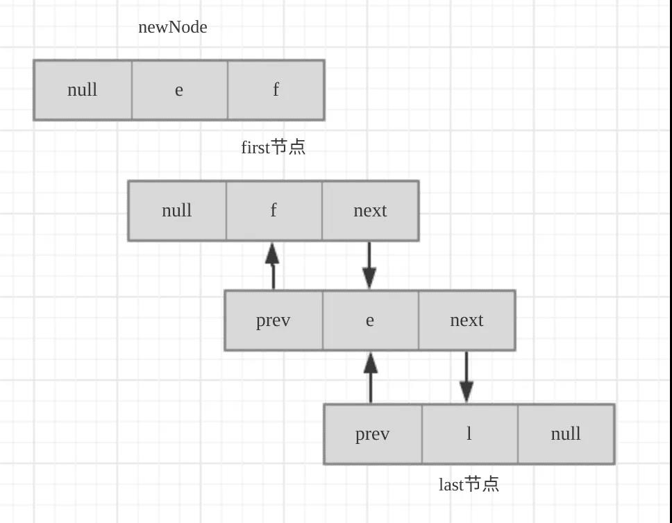
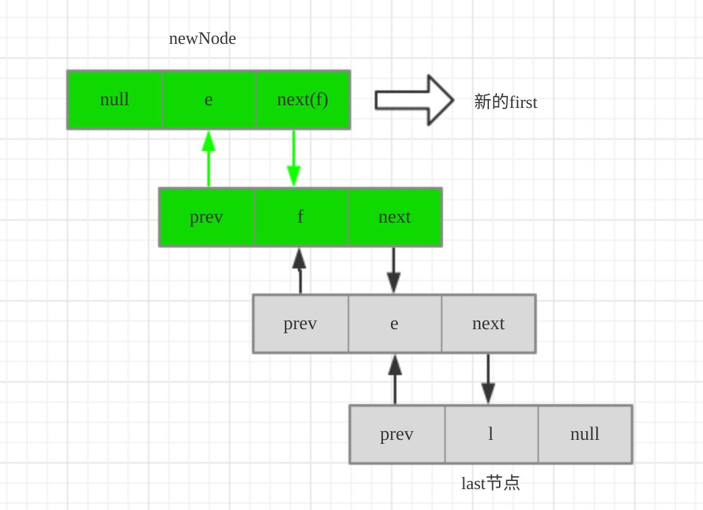
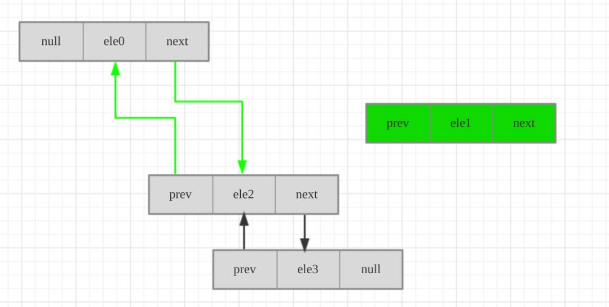

> 注：引自https://mp.weixin.qq.com/s/6pYhfoPL6jg7IxHmkQiFEQ

## 一、概述

LinkedList是一种可以在任何位置进行高效地插入和移除操作的有序序列，它是基于双向链表实现的，是线程不安全的，允许元素为null的双向链表。


## 二、源码分析

### 1. 变量

```java
/**
 * 元素数量
 */
transient int size = 0;

/**
 * 指向第一个节点
 * Pointer to first node.
 * Invariant: (first == null && last == null) ||
 *            (first.prev == null && first.item != null)
 */
transient Node<E> first;

/**
 * 指向最后一个节点
 * Pointer to last node.
 * Invariant: (first == null && last == null) ||
 *            (last.next == null && last.item != null)
 */
transient Node<E> last;
```

### 2. 构造方法

```java
/**
 * 无参构造方法
 * Constructs an empty list.
 */
public LinkedList() {
}

/**
 * 有参构造方法，将集合c中所有元素插入链表
 * Constructs a list containing the elements of the specified
 * collection, in the order they are returned by the collection's
 * iterator.
 *
 * @param  c the collection whose elements are to be placed into this list
 * @throws NullPointerException if the specified collection is null
 */
public LinkedList(Collection<? extends E> c) {
    this();
    addAll(c);
}
```

### 3. Node节点

```java
private static class Node<E> {
    // 值
    E item;
    // 后继
    Node<E> next;
    // 前驱
    Node<E> prev;

    Node(Node<E> prev, E element, Node<E> next) {
        this.item = element;
        this.next = next;
        this.prev = prev;
    }
}
```

> Node既有prev也有next,所以证明它是一个双向链表。

### 4. 添加元素

- `addAll(Collection<? extends E> c)`
- `addAll(int index, Collection<? extends E> c)`

将集合c添加到链表，如果不传`index`，则默认是添加到尾部，调用`addAll(size, c);`。如果调用`addAll(int index, Collection<? extends E> c)`方法，则添加到index后面。

> fail-fast快速失效机制，https://blog.csdn.net/zymx14/article/details/78394464

```java
    /**
     * Appends all of the elements in the specified collection to the end of
     * this list, in the order that they are returned by the specified
     * collection's iterator.  The behavior of this operation is undefined if
     * the specified collection is modified while the operation is in
     * progress.  (Note that this will occur if the specified collection is
     * this list, and it's nonempty.)
     *
     * @param c collection containing elements to be added to this list
     * @return {@code true} if this list changed as a result of the call
     * @throws NullPointerException if the specified collection is null
     */
    public boolean addAll(Collection<? extends E> c) {
        return addAll(size, c);
    }

    /**
     * Inserts all of the elements in the specified collection into this
     * list, starting at the specified position.  Shifts the element
     * currently at that position (if any) and any subsequent elements to
     * the right (increases their indices).  The new elements will appear
     * in the list in the order that they are returned by the
     * specified collection's iterator.
     *
     * @param index index at which to insert the first element
     *              from the specified collection
     * @param c collection containing elements to be added to this list
     * @return {@code true} if this list changed as a result of the call
     * @throws IndexOutOfBoundsException {@inheritDoc}
     * @throws NullPointerException if the specified collection is null
     */
    public boolean addAll(int index, Collection<? extends E> c) {
        // 判断下标index是否合法，即index >= 0 && index <= size;
        checkPositionIndex(index);

        // 拿到目标集合数组
        Object[] a = c.toArray();
        // 新增元素的数量
        int numNew = a.length;
        // 如果新增元素数量为0，则不增加，并返回false
        if (numNew == 0)
            return false;
        
		//定义index节点的前置节点，后置节点
        Node<E> pred, succ;
        // 判断是否是链表尾部，如果是：在链表尾部追加数据
        // 尾部的后置节点一定是null，前置节点是队尾
        if (index == size) {
            succ = null;
            pred = last;
        } else {
            // 如果不在链表末端(而在中间部位)
            // 取出index节点，并作为后继节点
            succ = node(index);
            // index节点的前节点 作为前驱节点
            pred = succ.prev;
        }
		
        // 链表批量增加，是靠for循环遍历原数组，依次执行插入节点操作
        for (Object o : a) {
            // 类型转换
            @SuppressWarnings("unchecked") E e = (E) o;
            // 前置节点为pred，后置节点为null，当前节点值为e的节点newNode
            Node<E> newNode = new Node<>(pred, e, null);
            // 如果前置节点为空， 则newNode为头节点，否则为pred的next节点
            if (pred == null)
                first = newNode;
            else
                pred.next = newNode;
            pred = newNode;
        }
		
        // 循环结束后，如果后置节点是null，说明此时是在队尾追加的
        if (succ == null) {
            // 设置尾节点
            last = pred;
        } else {
            // 否则是在队中插入的节点 ，更新前置节点 后置节点
            pred.next = succ;
            succ.prev = pred;
        }
		
        // 修改数量size
        size += numNew;
        // 修改modCount，该值用于记录list被修改的次数，从而提供fail-fast保证！！！
        modCount++;
        return true;
    }
	
	// 检测index位置是否合法
	private void checkPositionIndex(int index) {
        if (!isPositionIndex(index))
            throw new IndexOutOfBoundsException(outOfBoundsMsg(index));
    }

	/**
     * Tells if the argument is the index of a valid position for an
     * iterator or an add operation.
     */
    private boolean isPositionIndex(int index) {
        return index >= 0 && index <= size;
    }

	/**
	 * 取出index节点
     * Returns the (non-null) Node at the specified element index.
     */
    Node<E> node(int index) {
        // assert isElementIndex(index);
		
        // 如果index 小于 size/2,则从头部开始找
        if (index < (size >> 1)) {
            // 把头节点赋值给x
            Node<E> x = first;
            for (int i = 0; i < index; i++)
                // x=x的下一个节点
                x = x.next;
            return x;
        } else {
            // 如果index 大与等于 size/2，则从后面开始找
            Node<E> x = last;
            for (int i = size - 1; i > index; i--)
                x = x.prev;
            return x;
        }
    }
```

- `addFirst(E e)`

```java
/**
 * Inserts the specified element at the beginning of this list.
 *
 * @param e the element to add
 */
public void addFirst(E e) {
    linkFirst(e);
}

/**
* 将e链接成列表的第一个元素
* Links e as first element.
*/
private void linkFirst(E e) {
	final Node<E> f = first;
    // 前驱为空，值为e，后继为f
	final Node<E> newNode = new Node<>(null, e, f);
    first = newNode;
    // 若f为空，则表明列表中还没有元素，last也应该指向newNode
    if (f == null)
       	last = newNode;
    else
        //否则，前first的前驱指向newNode
        f.prev = newNode;
    size++;
    modCount++;
}
```





- `addLast(E e)`

```java
/**
 * Appends the specified element to the end of this list.
 *
 * <p>This method is equivalent to {@link #add}.
 *
 * @param e the element to add
 */
public void addLast(E e) {
    linkLast(e);
}

/**
* 将e链接成列表的last元素
* Links e as last element.
*/
void linkLast(E e) {
    final Node<E> l = last;
    // 前驱为前last，值为e，后继为null
    final Node<E> newNode = new Node<>(l, e, null);
    last = newNode;
    // 最后一个节点为空，说明列表中无元素 
    if (l == null)
        // first同样指向此节点
       	first = newNode;
    else
        // 否则，前last的后继指向当前节点
        l.next = newNode;
    size++;
    modCount++;
}
```

- `add(E e)`：在尾部追加元素e。

```java
/**
 * Appends the specified element to the end of this list.
 *
 * <p>This method is equivalent to {@link #addLast}.
 *
 * @param e element to be appended to this list
 * @return {@code true} (as specified by {@link Collection#add})
 */
public boolean add(E e) {
    linkLast(e);
    return true;
}
```

- `add(int index, E element)`：在链表的index处添加元素element

```java
/**
 * Inserts the specified element at the specified position in this list.
 * Shifts the element currently at that position (if any) and any
 * subsequent elements to the right (adds one to their indices).
 *
 * @param index index at which the specified element is to be inserted
 * @param element element to be inserted
 * @throws IndexOutOfBoundsException {@inheritDoc}
 */
public void add(int index, E element) {
    checkPositionIndex(index);

    if (index == size)
        // 尾部添加
        linkLast(element);
    else
        linkBefore(element, node(index));
}

/**
 * 在succ节点前增加元素e(succ不能为空)
 * Inserts element e before non-null Node succ.
 */
void linkBefore(E e, Node<E> succ) {
    // assert succ != null;
    // 拿到succ的前驱
    final Node<E> pred = succ.prev;
    // 新new节点：前驱为pred，值为e，后继为succ
    final Node<E> newNode = new Node<>(pred, e, succ);
    // 将succ的前驱指向当前节点
    succ.prev = newNode;
    // pred为空，说明此时succ为首节点
    if (pred == null)
        // 指向当前节点
        first = newNode;
    else
        // 否则，将succ之前的前驱的后继指向当前节点
        pred.next = newNode;
    size++;
    modCount++;
}
```

`linkBefore(E e, Node<E> succ)`方法步骤：

1. 拿到succ的前驱节点
2. 新new节点：前驱为pred，值为e，后继为succ : `Node<>(pred, e, succ);`
3. 将succ的前驱指向当前节点
4. pred为空，说明此时succ为首节点,first指向当前节点;否则，将succ之前的前驱的后继指向当前节点

### 5. 获取/查询元素

- `get(int index)`：根据索引获取链表中的元素。

```java
/**
 * Returns the element at the specified position in this list.
 *
 * @param index index of the element to return
 * @return the element at the specified position in this list
 * @throws IndexOutOfBoundsException {@inheritDoc}
 */
public E get(int index) {
    checkElementIndex(index);
    // 根据index获取元素
    return node(index).item;
}
```

- `getFirst()`

```java
/**
 * Returns the first element in this list.
 *
 * @return the first element in this list
 * @throws NoSuchElementException if this list is empty
 */
public E getFirst() {
    final Node<E> f = first;
    if (f == null)
        throw new NoSuchElementException();
    return f.item;
}
```

- `getLast() `

```java
/**
 * Returns the last element in this list.
 *
 * @return the last element in this list
 * @throws NoSuchElementException if this list is empty
 */
public E getLast() {
    final Node<E> l = last;
    if (l == null)
        throw new NoSuchElementException();
    return l.item;
}
```

### 6. 删除元素

- `remove()`：无参时是删除头节点

```java
	/**
 	* Retrieves and removes the head (first element) of this list.
 	*
 	* @return the head of this list
 	* @throws NoSuchElementException if this list is empty
 	* @since 1.5
 	*/
	public E remove() {
    	return removeFirst();
	}

	/**
     * Removes and returns the first element from this list.
     *
     * @return the first element from this list
     * @throws NoSuchElementException if this list is empty
     */
    public E removeFirst() {
        final Node<E> f = first;
        if (f == null)
            throw new NoSuchElementException();
        return unlinkFirst(f);
    }
```

- `remove(int index)`
- `remove(Object o)`

```java
	/**
     * Removes the element at the specified position in this list.  Shifts any
     * subsequent elements to the left (subtracts one from their indices).
     * Returns the element that was removed from the list.
     *
     * @param index the index of the element to be removed
     * @return the element previously at the specified position
     * @throws IndexOutOfBoundsException {@inheritDoc}
     */
    public E remove(int index) {
        checkElementIndex(index);
        return unlink(node(index));
    }

	/**
     * Removes the first occurrence of the specified element from this list,
     * if it is present.  If this list does not contain the element, it is
     * unchanged.  More formally, removes the element with the lowest index
     * {@code i} such that
     * <tt>(o==null&nbsp;?&nbsp;get(i)==null&nbsp;:&nbsp;o.equals(get(i)))</tt>
     * (if such an element exists).  Returns {@code true} if this list
     * contained the specified element (or equivalently, if this list
     * changed as a result of the call).
     *
     * @param o element to be removed from this list, if present
     * @return {@code true} if this list contained the specified element
     */
    public boolean remove(Object o) {
        if (o == null) {
            for (Node<E> x = first; x != null; x = x.next) {
                if (x.item == null) {
                    unlink(x);
                    return true;
                }
            }
        } else {
            for (Node<E> x = first; x != null; x = x.next) {
                if (o.equals(x.item)) {
                    unlink(x);
                    return true;
                }
            }
        }
        return false;
    }
```

其主要调用`unlink(Node<E> x)`方法

```java
/**
 * Unlinks non-null node x.
 */
E unlink(Node<E> x) {
    // assert x != null;
    // 保存x的元素值
    final E element = x.item;
    // 保存x的后继
    final Node<E> next = x.next;
    // 保存x的前驱
    final Node<E> prev = x.prev;
	
    // 如果前驱为null，说明x为首节点，first指向x的后继
    if (prev == null) {
        first = next;
    } else {
        // x的前驱的后继指向x的后继，即略过了x
        prev.next = next;
        // x.prev已无用处，置空引用
        x.prev = null;
    }
	
    // 后继为null，说明x为尾节点
    if (next == null) {
        // last指向x的前驱
        last = prev;
    } else {
        // x的后继的前驱指向x的前驱，即略过了x
        next.prev = prev;
        // x.next已无用处，置空引用
        x.next = null;
    }
	
    // 引用置空
    x.item = null;
    size--;
    modCount++;
    // 返回所删除的节点的元素值
    return element;
}
```

1. 遍历链表查找 item==null 并执行unlink(x)方法删除
2. 如果前驱为null，说明x为首节点，first指向x的后继,x的前驱的后继指向x的后继，即略过了x.
3. 如果后继为null，说明x为尾节点，last指向x的前驱；否则x的后继的前驱指向x的前驱，即略过了x，置空x.next
4. 引用置空：`x.item = null`
5. 图解:



- `removeFirst()`

```java
	/**
     * Removes and returns the first element from this list.
     *
     * @return the first element from this list
     * @throws NoSuchElementException if this list is empty
     */
    public E removeFirst() {
        final Node<E> f = first;
        if (f == null)
            throw new NoSuchElementException();
        return unlinkFirst(f);
    }

	/**
     * Unlinks non-null first node f.
     */
    private E unlinkFirst(Node<E> f) {
        // assert f == first && f != null;
        
        // 取出首节点中的元素，和后继节点
        final E element = f.item;
        final Node<E> next = f.next;
        f.item = null;
        f.next = null; // help GC
        // first指向前first的后继，也就是列表中的2号位
        first = next;
        // 如果此时2号位为空，那么列表中此时已无节点
        if (next == null)
            last = null;
        else
            // 首节点无前驱 
            next.prev = null;
        size--;
        modCount++;
        return element;
    }
```

- `removeLast()`

```java
	/**
     * Removes and returns the last element from this list.
     *
     * @return the last element from this list
     * @throws NoSuchElementException if this list is empty
     */
    public E removeLast() {
        final Node<E> l = last;
        if (l == null)
            throw new NoSuchElementException();
        return unlinkLast(l);
    }
```

### 7. 修改元素

```java
/**
 * Replaces the element at the specified position in this list with the
 * specified element.
 *
 * @param index index of the element to replace
 * @param element element to be stored at the specified position
 * @return the element previously at the specified position
 * @throws IndexOutOfBoundsException {@inheritDoc}
 */
public E set(int index, E element) {
    checkElementIndex(index);
    // 获取到需要修改元素的节点，for循环遍历找到index位置
    Node<E> x = node(index);
    // 保存之前的值
    E oldVal = x.item;
    // 执行修改
    x.item = element;
    // 返回旧值
    return oldVal;
}
```

## 三、与ArrayList的对比

优点：

1. 不需要扩容和预留空间,空间效率高
2. 增删效率高

缺点：

1. 随机访问时间效率低
2. 改查效率低