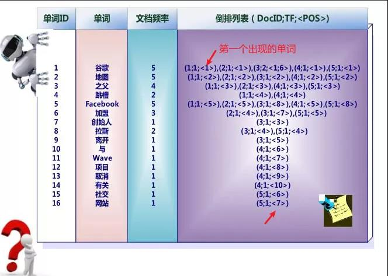

# 腾讯面试题： 百度/google的搜索为什么那么快？ -- 搜素引擎的原理
> https://mp.weixin.qq.com/s?__biz=MzIyODkxOTAwMg==&mid=2247484089&idx=1&sn=58d285664f46d2c400217a7716876a5d&source=41#wechat_redirect

**百度肯定是有爬虫**，到处爬取网页，进行**某种处理**。然后通过你输入的关键词进行**某种计算**再返回给你的.

## 某种处理
百度爬取了海量网页后，使用**文档集合**存放网页（即文档），**类似的文档放在一个集合中**。

- **类似的文档？** ： 文档中有相同关键字

举例说明：假设全世界只有下面5个文档（网页），文档内容也很简单，就一句话（注意是内容，不是标题）

处理过程： 爬虫 -> 文档编号 -> 分词 -> **倒排**
> 百度爬取后，将他们进行编号，然后**对文档进行扫描分词**，因为百度内部有词库，匹配上的词将被切分，所以文档1号将被切分为【谷歌，地图，之父，跳槽，FaceBook】，后面的文档也一样，然后对切分出来的单词进行倒排处理，形成**倒排列表**

- **倒排处理** : 倒排列表所做的，就是**保存对应单词所出现过的文档编号**
> 啥是倒排处理？右边这堆杂乱无章的数字咋来的？别急，仔细看，1号单词“谷歌”是不是在1,2,3,4,5号文档都出现过？9号单词“离开”是不是只在3号文档出现过？

例如： 当我们搜索“**谷歌**”的时候，他就会获得“**谷歌**”这一单词对应的**倒排列表**，知道哪些文档包含他，然后将这些文档提取出来返回给你，这就是一种**单词映射文档**的方法。

但是，仅仅这样做还不行： 在一篇博客上把所有的单词都写上，这样杂乱无章的文章岂不是要被推荐给全体中国人？？？

### 所以倒排列表还要保存文档中频率信息：

即：保留的信息变成了二元组，比如16号单词“网站”的(5:1)，5表示出现的文档编号，1表示出现的次数，也就是说，有了这个信息，如果一个**单词在文档中频率越高(英文缩写TF)**，搜素引擎就可以把他排在前面推给你

### 除了频率，还要保存位置信息
比如”谷歌“就是在1号文档中出现了一次的单词，位置在第一个，用<1>表示

你的关键词 -> 在倒排列表中找到文档集合 -> 出现的频率和位置 -> 返回排序后的文档
> 搜素引擎就可以**根据你的关键词**在倒排列表中**找到**含有这个关键词的**文档集合**，然后根据关键词在文档集合中各个文档出现的**频率和位置**综合判断返回给你**排序后的文档**

### 其他参考的评价指标
实际上很多搜索引擎基本就是这样做的，只不过各家还有别的参考标准，比如百度还会参考热度，你的搜索记录，还有网站给的钱（你懂的）等等综合打分，按评分高低返回搜索结果的排序

## 某种计算
**上面的所以记录处理好后都会存放在磁盘中**，然后等你关键词来后再调入内存。但实际上，世界上有亿万个文档，此时，问题的性质已经变了，不是找不找得到的问题，而是**怎么找更快**，**更准**的问题，这需要算法，也就是我们上面提到的**某种计算**。

### 哈希
首先需要计算机识别这些词，可以使用hash方法等，也可以使用别的数据结构代替，比如红黑树，b树等。

就可以通过关键词获得他的Id,然后得到所建立的倒排列表了，比如“谷歌”

### 文档数量大
由于文档的数量庞大，我们获取的文档往往编号位数都很多，而不像上图那样1,2,3,4,5,导致倒排列表无谓的扩大，所以我们这里进行作差

> 就是后面的文档编号减去前面的，在取文档（从磁盘中读取）的时候加回来即可

### 读取文档
可以有两种方法从磁盘中读取文档

#### 两次遍历法
第一遍，扫描文档集合，找到文档数量N, 文档集合内所包含的不同单词数M,和每个单词出现的频率DF（如下图），以及一些别的必要信息，这些东西所占内存加起来，得到需要开辟的内存空间，

同时这个空间是以单词为单位划分，比如“谷歌”一词有5篇文档
- 第一遍主要就是确定要开辟多大的内存空间来显示文档
- 第二遍扫描，就是边扫描，匹配对应的文档编号（三元组中的第一个数），载入内存
> 但是这个方法有一个问题，那就是文档集合有多大，内存就有多大，所以，很可能内存会溢出，不过都放在内存中速度也很快，这是一种空间换时间的方法

#### 排序法
现在我们只用固定大小的内存，如何从上图中的倒排列表得知每个单词对应的文章集合所需要的内存空间有多少呢？

我们需要解析文档，构造（单词ID,文档ID，单词频率）三元组，然后进行排序，按单词ID,文档ID,单词频率先后排，最后如果规定的内存满了，就将这些三元组通通写入一个临时文件A中

为什么要这样呢？想想看，如果我们最后拿到了一个（单词A,文档A，单词频率），我们就可以很轻松的知道一个单词对应哪个文档，和对应的频率，

也就是一个三元组告诉我们单词A对应的文档A，另一个三元组告诉我们单词A对应文档B……，这些三元组加起来我们就知道了单词A对应的文档集合，就可以知道他需要多少内存空间来填补这些文档了

可能解析50个文档后规定的内存就满了，然后把这些三元组们写入磁盘临时文件A，就可以再读下一篇50个文档了，注意，词典是不断增加的，比如前50个文档只有上面7个单词，后50个文档可能出现了别的单词，此时要插入词典中，词典一直在内存

这样，只用固定大小的内存就可以50一批的解析完所有文档，写入了一个个的临时文件A,B,C,D，再将这些临时文件合并，就是把他们分别读入内存中的缓冲区，合成最终索引后再写入磁盘，这样通过最终索引就知道有哪些单词对应多少文档，还有频率，然后根据这些开辟内存空间读取进入内存返回给你即可
